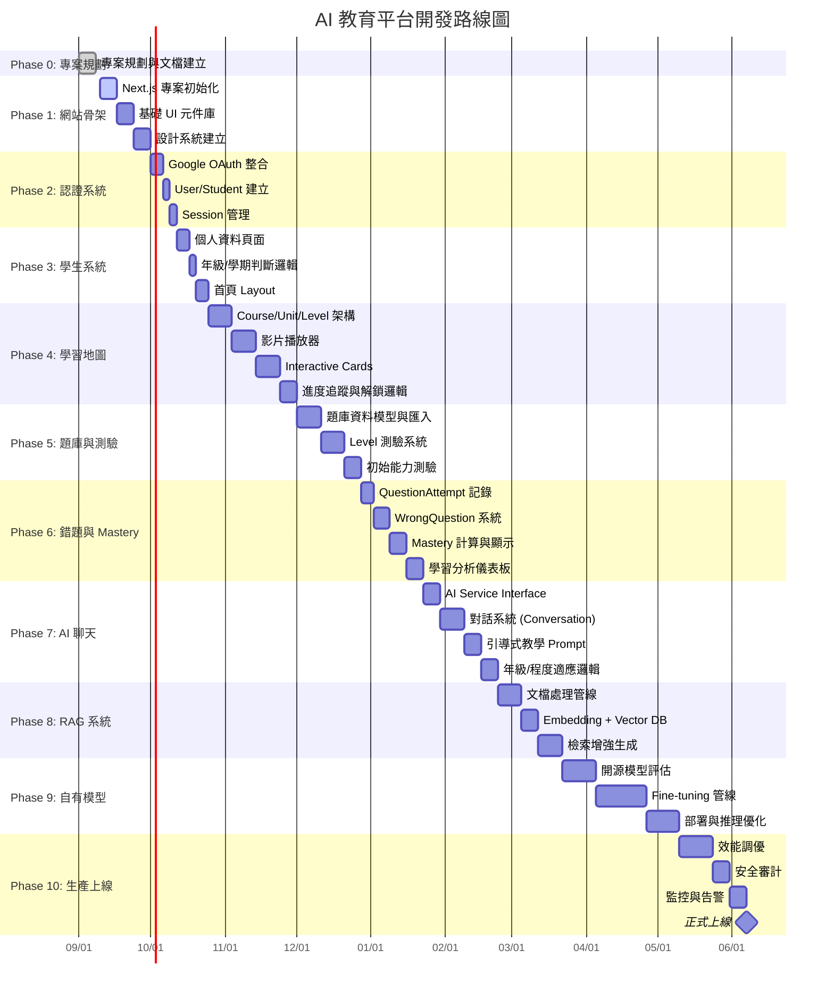

# AI 教育平台 - 專案儀表板

> [!IMPORTANT]
> **專案狀態**：規劃階段 (Planning Phase)
> **最後更新**：2026-09-10
> **核心團隊**：數學教學團隊 + AI 工程團隊

---

## 🎯 專案概覽

| 項目 | 內容 |
|------|------|
| **產品名稱** | AI 解題工具 / AI 教育平台 (暫定) |
| **核心定位** | 以 AI 為核心的個人化數學教學平台 |
| **目標用戶** | 學生 (B2C) |
| **第一階段範圍** | 數學完整學習系統 |
| **技術棧方向** | Next.js + React + TypeScript + Tailwind + PostgreSQL + Prisma |
| **認證方式** | Google OAuth |

---

## 📁 快速導航

### 核心架構文檔
- [[08_Database/Database Architecture|資料庫架構]]
- [[08_Database/ER Diagram|ER 圖]]
- [[08_Database/Schema|Schema 定義]]
- [[12_Development/Roadmap|開發路線圖]]
- [[07_Website/Tech Stack|技術棧決策]]

### 產品與功能
- [[01_Product/B2C Strategy|B2C 策略]]
- [[02_Features/Student Registration Flow|學生註冊流程]]
- [[02_Features/Initial Assessment|初始能力測驗]]
- [[02_Features/Learning Map|學習地圖系統]]
- [[02_Features/Level System|Level 互動式學習]]
- [[02_Features/Wrong Question System|錯題系統]]
- [[02_Features/Mastery System|Mastery 掌握度]]
- [[02_Features/AI Chat|AI 問答系統]]
- [[02_Features/Student Memory|學生 AI 記憶]]

### 數學教學核心
- [[03_Math_Teaching/Math Curriculum|數學課綱架構]]
- [[03_Math_Teaching/Math Reasoning|數學推理解析]]
- [[03_Math_Teaching/Operation Decomposition|運算拆解]]
- [[03_Math_Teaching/Error Pattern|錯誤類型分類]]

### AI 與 RAG
- [[04_AI/AI Model Strategy|AI 模型策略]]
- [[04_AI/Student Memory|學生記憶系統]]
- [[04_AI/AI Teaching Principles|AI 教學原則]]
- [[05_RAG/RAG Architecture|RAG 架構]]
- [[05_RAG/RAG vs Question DB|RAG 與題庫分離]]

### 決策與研究
- [[13_Decisions/Decision Log|決策日誌]] ✅ 22 項已確認
- [[13_Decisions/TBD|待決定事項]] 🔄 持續更新
- [[13_Decisions/Deprecated Decisions|已取消決策]]
- [[14_Research/|研究區]]

### 原始資料
- [[99_Raw_Data/225 Questions|225 題原始問題索引]]

---

## ✅ 已確認核心決策 (CONFIRMED)

| # | 決策 | 影響範圍 |
|---|------|----------|
| 1 | 第一階段採 B2C 模式 | 整體架構、資料庫、商業模式 |
| 2 | 取消補習班選擇/後台/教師後台 | 註冊流程、資料表、權限系統 |
| 3 | 第一階段完整學習地圖只做數學 | 課綱、Level、題庫、AI 教學 |
| 4 | 其他科目未來擴充，目前僅 AI 問答 | 多學科架構預留 |
| 5 | 初始能力測驗只在第一次使用 | 註冊流程、評估系統 |
| 6 | 能力測驗不阻擋學習地圖進入 | 用戶體驗、流程設計 |
| 7 | Level 採一關一關制 (Course → Unit → Level) | 學習地圖結構、解鎖邏輯 |
| 8 | Level 包含影片 + Interactive Cards | 內容製作、播放器、互動設計 |
| 9 | 影片完成 + Level 測驗通過 = 解鎖下一 Level | 進度系統、測驗邏輯 |
| 10 | Level 測驗可無限重考 | 學習體驗、Mastery 計算 |
| 11 | Level 出題：內容定義 + 題庫抽題 | 題庫系統、出題演算法 |
| 12 | 記錄所有錯題 (QuestionAttempt + WrongQuestion) | 錯題本、錯誤分析、AI 個人化 |
| 13 | 建立 Wrong Question Bank | 複習系統、相似題推薦 |
| 14 | AI 採引導式教學 (蘇格拉底式) | Prompt 設計、對話流程 |
| 15 | AI 依年級、程度、歷程個人化 | 用戶建模、Context 注入 |
| 16 | 每個學生獨立 AI Memory (Conversation + Message) | 隔離性、隱私、個人化 |
| 17 | AI 核心模型目標：自訓練/微調開源模型 | 模型策略、GPU、部署 |
| 18 | 可使用可商業化開源模型 (Llama, Qwen, etc.) | License 研究、合規 |
| 19 | 擁有授權教學資料 (課本、習作、試題、講義、影片) | 訓練資料、RAG 知識庫 |
| 20 | 資料量約數 TB，格式多樣 (PDF, TXT, 圖片, Word, 影片) | 資料管線、處理架構 |
| 21 | RAG 獨立於題庫系統 | 架構分離、檢索策略 |
| 22 | 以數學為第一階段核心 MVP | 所有功能優先級 |

> 完整決策記錄請見 [[13_Decisions/Decision Log|決策日誌]]

---

## 🔄 待決定事項 (TBD) - 高優先級

| ID | 議題 | 狀態 | 決策者 | 影響文檔 |
|----|------|------|--------|----------|
| TBD-01 | 能力測驗題數、每單元題數、難度、評分公式 | RESEARCH | 產品+教學 | [[02_Features/Initial Assessment]] |
| TBD-02 | Mastery 計算公式 | RESEARCH | 教學+數據 | [[02_Features/Mastery System]] |
| TBD-03 | Level 測驗題數、通過分數、難度比例、抽題演算法 | RESEARCH | 教學+工程 | [[02_Features/Level System]] |
| TBD-04 | AI 關鍵句觸發機制 (完整解答) | TBD | 產品+AI | [[02_Features/AI Chat]] |
| TBD-05 | Credits 積分制度 / 定價方案 | TBD | 商業+產品 | [[10_Business_Model/Credits]], [[10_Business_Model/Pricing]] |
| TBD-06 | AI 最終模型選擇 / License / GPU 數量 / 訓練成本 | RESEARCH | AI+工程+財務 | [[04_AI/AI Model Strategy]] |
| TBD-07 | RAG Vector DB 選擇 / Embedding Model / Chunk Size | RESEARCH | AI+工程 | [[05_RAG/RAG Architecture]] |
| TBD-08 | AI Memory 保存策略 (完整 vs 摘要 vs 向量) | RESEARCH | AI+工程+隱私 | [[04_AI/Student Memory]] |
| TBD-09 | 學生學習狀態頁面正式名稱 | TBD | 產品+UX | [[02_Features/Learning Analysis]] |
| TBD-10 | 首頁 Button 完整清單 (錯題本、學習分析等) | TBD | 產品+UX | [[02_Features/Homepage]] |

> 完整 TBD 清單請見 [[13_Decisions/TBD|待決定事項管理]]

---

## 🗺️ 開發階段路線圖

---

## 📊 目前進度追蹤

| 階段 | 狀態 | 完成度 | 下一步行動 |
|------|------|--------|------------|
| Phase 0: 專案規劃 | ✅ 完成 | 100% | 文檔已建立完成 |
| Phase 1: 網站骨架 | 🔄 進行中 | 0% | 初始化 Next.js 專案 |
| Phase 2: 認證系統 | ⏳ 等待 | 0% | - |
| Phase 3: 學生系統 | ⏳ 等待 | 0% | - |
| Phase 4: 學習地圖 | ⏳ 等待 | 0% | - |
| Phase 5: 題庫與測驗 | ⏳ 等待 | 0% | - |
| Phase 6: 錯題與 Mastery | ⏳ 等待 | 0% | - |
| Phase 7: AI 聊天 | ⏳ 等待 | 0% | - |
| Phase 8: RAG 系統 | ⏳ 等待 | 0% | - |
| Phase 9: 自有模型 | ⏳ 等待 | 0% | - |
| Phase 10: 生產上線 | ⏳ 等待 | 0% | - |

---

## 🔗 關鍵架構圖快速連結

### 系統完整流程圖
- [[08_Database/System Flowchart|完整系統流程圖 (Mermaid)]]

### 資料庫 ER 圖
- [[08_Database/ER Diagram|ER Diagram (Mermaid)]]

### 架構總覽
- [[07_Website/Architecture Overview|系統架構總覽]]

---

## 📝 給新進工程師的快速入門

1. **先閱讀**：[[13_Decisions/Decision Log|決策日誌]] - 理解所有已確認的核心決策
2. **再查看**：[[13_Decisions/TBD|待決定事項]] - 了解哪些還不能動工
3. **理解架構**：[[08_Database/Database Architecture|資料庫架構]] + [[07_Website/Architecture Overview|系統架構]]
4. **看流程**：[[08_Database/System Flowchart|系統流程圖]] - 從註冊到學習的完整路徑
5. **開始開發**：從 [[12_Development/Roadmap|路線圖]] Phase 1 開始

---

## ⚠️ 重要提醒

> [!WARNING]
> **嚴禁自行決定 TBD 項目** - 所有標記為 TBD、RESEARCH 的項目必須經由產品/教學/工程三方確認後，透過 [[13_Decisions/Decision Log|決策日誌]] 正式記錄才能實作

> [!IMPORTANT]
> **狀態分類嚴格區分**：
> - `CONFIRMED` = 已由相關利害關係人確認
> - `TBD` = 明確知道要決定但還沒決定
> - `RESEARCH` = 需要技術調研才能決定
> - `PROPOSED` = 團隊成員提出的建議方案
> - `DEPRECATED` = 曾經確認但已取消

> [!NOTE]
> 本 Vault 採用 **Wiki Links** 互聯，請善用 `[[` 自動完成跳轉。所有 Mermaid 圖表在 Obsidian 中可直接渲染。