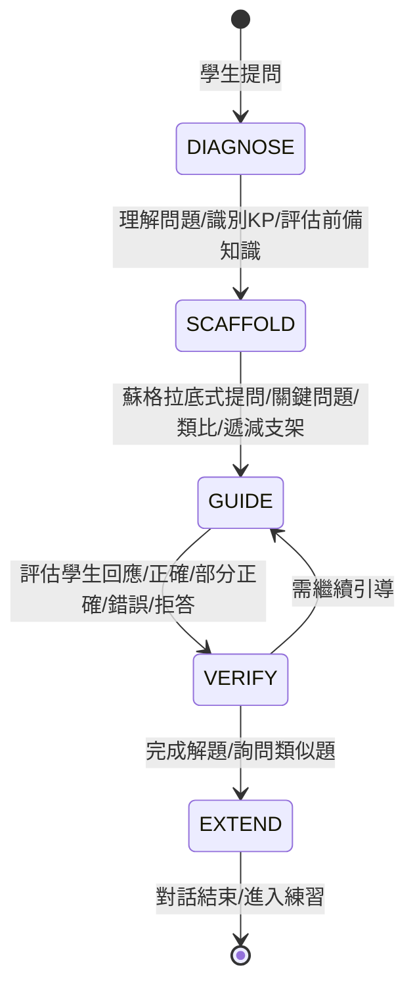
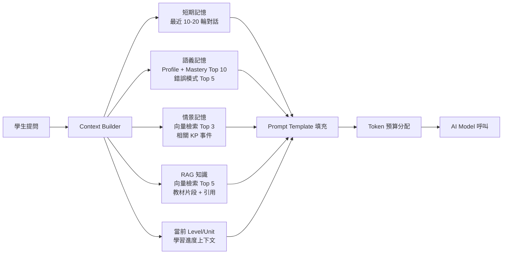

# AI 問答系統

> [!IMPORTANT]
> **狀態**：CONFIRMED - [[13_Decisions/Decision Log#DEC-20260910-016|DEC-016]], [[13_Decisions/Decision Log#DEC-20260910-017|DEC-017]]
> **最後更新**：2026-09-10

---

## 系統定位

> **核心定位**：AI 個人化數學老師，**不直接給答案**，採用**蘇格拉底式引導教學**
> **核心流程**：理解學生 → 引導思考 → 驗證理解 → 延伸練習

---

## 教學流程標準化 (5 階段)



### 階段 1: 診斷
- 理解學生提問的真實意圖 (學習 vs 複習 vs 作業協助)
- 識別涉及的 Knowledge Points (RAG + 關鍵字)
- 評估學生前備知識 (從 Mastery/Profile 讀取)
- 判斷教學切入點

### 階段 2: 支架搭建
- 設定本輪教學目標
- 選擇切入點 (從學生已知連結到未知)
- 準備支架序列 (遞減：概念釐清 → 引導問題 → 類比 → 步驟示範)

### 階段 3: 引導
- **關鍵問題**: 將大問題拆解為可回答的小問題
- **類比/生活例子**: 連結學生既有經驗
- **反例/認知衝突**: 挑戰錯誤直覺
- **遞減支架**: 隨學生掌握逐步撤除支援

### 階段 4: 驗證
| 學生回應類型 | AI 行動 |
|--------------|---------|
| **正確** | 肯定 + 深化/延伸問題 |
| **部分正確** | 肯定正確部分 + 聚焦缺口 + 針對性支架 |
| **錯誤** | 診斷錯誤類型 (Error Pattern) → 給予對應支架 |
| **拒答/離題** | 情感支持 + 重新引導 + 降低難度 |

### 階段 5: 延伸
- 總結解題關鍵步驟
- 詢問：「需要類似題練習嗎？」
- 是 → 依 KP + 程度 + 錯題 + 當前題 → 相似題生成/檢索 (TBD-20)
- 否 → 結束對話，記錄學習成果

---

## Context Building 管線 (每輪對話)



### Token 預算分配
| 記憶來源 | Token 配額 | 選擇策略 | 優先級 |
|----------|------------|----------|--------|
| System Prompt | 2,000 | 固定 | P0 |
| 短期記憶 | 3,000 | 最近 N 輪，優先保留完整輪次 | P0 |
| 語義記憶 | 2,000 | Top Weak/Strong KP + 錯誤模式摘要 | P1 |
| 情景記憶 | 1,000 | 向量相似度 Top 3 (與當前問題相關) | P2 |
| RAG 知識 | 2,000 | 向量檢索 Top 5 + 重排序 | P1 |
| 學習進度 | 500 | 當前 Level/Unit/影片進度 | P0 |
| **總計** | **~10,500** | 預留給模型生成 | - |

---

## 個人化適應規則

### 年齡/程度適應參數表
| 參數 | 國一 (G7) | 國二 (G8) | 國三 (G9) | 高一 (G10) | 高二 (G11) | 高三 (G12) |
|------|-----------|-----------|-----------|------------|------------|------------|
| **用語難度** | 生活化、具體 | 半抽象 | 抽象符號 | 正式數學語言 | 進階符號 | 競賽/學測語言 |
| **步驟細緻度** | 極細 (每微步驟) | 細 (關鍵步驟) | 標準 | 關鍵步驟 | 概略 | 僅關鍵洞察 |
| **先備知識假設** | 最低 (從零建構) | 基礎四則運算 | 國一二完整 | 高中基礎 | 微積分基礎 | 全高中知識 |
| **支架密度** | 高 (每步都有) | 中高 | 中 | 中低 | 低 | 極低 |
| **類比傾向** | 生活/遊戲 | 生活/簡單物理 | 數學內部類比 | 數學結構類比 | 抽象結構 | 無類比 |

### Mastery 弱項適應
```typescript
interface AdaptationRules {
  weakKP: {        // Mastery < 40
    scaffoldDensity: "MAX";
    stepGranularity: "MICRO";
    analogyCount: 3;
    verificationFrequency: "EVERY_STEP";
  };
  developingKP: {  // Mastery 40-70
    scaffoldDensity: "MEDIUM";
    stepGranularity: "STANDARD";
    analogyCount: 1-2;
    verificationFrequency: "KEY_STEPS";
  };
  strongKP: {      // Mastery > 70
    scaffoldDensity: "MINIMAL";
    stepGranularity: "MACRO";
    analogyCount: 0;
    verificationFrequency: "FINAL_ONLY";
    challengeMode: true;
  };
}
```

---

## 禁止行為清單 (Hard Constraints)

| 禁止行為 | 違例範例 | 替代做法 |
|----------|----------|----------|
| 直接給最終答案 | 「答案是 x=4」 | 「讓我們一步步來看...」 |
| 給出完整解題步驟 | 「第一步...第二步...第三步...」 | 「第一步你覺得可以怎麼做？」 |
| 跳過驗證直接結束 | 「對了，下一題」 | 「你覺得這個答案合理嗎？試著代入看看」 |
| 使用超出年級的數學工具 | 國一用二次公式 | 「我們用移項的方法來解」 |
| 忽略學生情緒/挫折 | 連續錯誤仍繼續難題 | 「這題有點挑戰性，我們先回顧一下基礎」 |
| 重複相同支架 | 連續 3 次給同樣提示 | 升級支架層級 / 換類比 / 降低難度 |

---

## 關鍵句觸發機制 (TBD-04 待決定)

> **場景**: 學生有時確實需要標準解答 (考前複習、時間壓力)
> **問題**: 什麼關鍵句讓 AI 直接給完整解答？如何防濫用？

| 方案 | 說明 | 優缺點 |
|------|------|--------|
| **明確關鍵字** | 「給我完整解答」、「直接告訴我答案」、「show me solution」 | 簡單、但易被濫用 |
| **意圖識別** | AI 判斷學生真正需求 (學習 vs 複習 vs 趕作業) | 智能、但需高準確率 |
| **次數限制** | 每日/每 Level 限制完整解答次數 | 可控、但需計數機制 |
| **階段解鎖** | 完成 Level 測驗後才開放該 Level 完整解答 | 符合教學邏輯、但較嚴格 |
| **不提供** | 堅持引導式，拒絕直接給答 | 最純粹、但可能挫敗感強 |

> **決策待定**: TBD-04

---

## AI Service Architecture

### Provider Pattern (支援多模型切換)
```typescript
interface AIProvider {
  readonly name: string;
  readonly model: string;
  readonly maxTokens: number;
  readonly supportsStreaming: boolean;
  readonly supportsFunctions: boolean;
  
  chatCompletion(request: ChatRequest): Promise<ChatResponse>;
  streamChatCompletion(request: ChatRequest): AsyncIterable<ChatChunk>;
  countTokens(messages: Message[]): number;
}

// 實作: OpenAIProvider, AnthropicProvider, LocalVLLMProvider, MockProvider
```

### Prompt Template 系統
```
[SYSTEM PROMPT]
角色: 資深數學老師
教學原則: [核心原則]
學生畫像: {{studentProfile}}
目前程度: {{masterySnapshot}}
學習歷程: {{recentHistory}}
錯誤模式: {{errorPatterns}}
對話歷史: {{recentMessages}}

[FEW-SHOT EXAMPLES]
範例 1: 國一學生問一元一次方程式 → 引導移項
範例 2: 高二學生問二次函數頂點 → 引導配方法
...

[CURRENT CONTEXT]
學生問題: {{userMessage}}
相關知識點: {{relevantKPs}}
RAG 參考資料: {{ragCitations}}

[TASK]
請依教學原則回應，輸出格式:
{
  "phase": "DIAGNOSE|SCAFFOLD|GUIDE|VERIFY|EXTEND",
  "response": "給學生的回應 (Markdown+LaTeX)",
  "internalReasoning": "教師內心獨白: 為什麼這樣回應",
  "nextAction": "預期下一步",
  "scaffoldUsed": ["關鍵問題", "類比", "遞減支架"],
  "kpAddressed": ["KP_CODE"],
  "verificationNeeded": true/false
}
```

---

## 對話品質指標

| 指標 | 定義 | 目標值 | 測量方式 |
|------|------|--------|----------|
| **引導完成率** | 學生在 AI 引導下完成解題 | > 80% | 對話標註 |
| **平均引導輪數** | 從提問到完成的輪數 | 5-8 輪 | 自動統計 |
| **支架遞減率** | 支架層級隨輪數遞減 | 正相關 | 層級追蹤 |
| **學生主動回應率** | 學生非單字回應比例 | > 70% | NLP 分析 |
| **錯誤診斷準確率** | AI 識別錯誤類型正確 | > 85% | 人工抽樣 |
| **學生滿意度** | 事後評分/繼續使用率 | > 4.2/5 | 問卷/行為 |

---

## 相關文檔

- [[04_AI/AI Teaching Principles|AI 教學原則]]
- [[04_AI/Student Memory|學生記憶系統]]
- [[04_AI/AI Model Strategy|AI 模型策略]]
- [[05_RAG/RAG Architecture|RAG 架構]]
- [[03_Math_Teaching/Error Pattern|錯誤類型分類]]
- [[03_Math_Teaching/Operation Decomposition|運算拆解]]
- [[13_Decisions/TBD#TBD-04|TBD-04: 關鍵句觸發]]
- [[13_Decisions/TBD#TBD-08|TBD-08: Memory 策略]]
- [[13_Decisions/TBD#TBD-20|TBD-20: 相似題生成]]

---

## 更新記錄

| 日期 | 版本 | 變更 | 作者 |
|------|------|------|------|
| 2026-09-10 | v1.0 | 初始系統設計 | AI 系統架構師 |