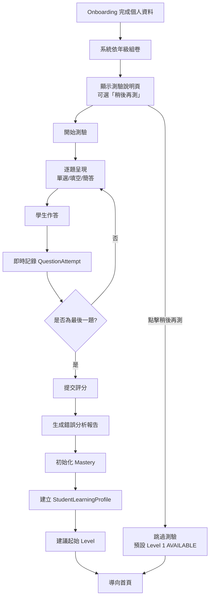

# 初始能力測驗

> [!IMPORTANT]
> **狀態**：DESIGN - TBD-01 核心參數待決定
> **最後更新**：2026-09-10
> **核心決策**：[[13_Decisions/Decision Log#DEC-20260910-007|DEC-007]], [[13_Decisions/Decision Log#DEC-20260910-008|DEC-008]]

---

## 測驗定位

> **目的**：了解學生目前程度、找出弱項、初始化 Mastery
> **時機**：註冊/第一次使用時 **僅觸發一次** (DEC-007)
> **阻擋性**：**不阻擋** 學習地圖進入 (DEC-008)
> **科目**：第一階段**僅數學** (DEC-022)

---

## 測驗範圍設計

### 年級對應測驗範圍

| 學生年級 | 測驗涵蓋範圍 | 說明 |
|----------|--------------|------|
| 國一 (G7) | 國一上學期 | 基礎整數、因數倍數、一元一次方程式基礎 |
| 國二 (G8) | 國一全學期 + 國二上學期 | 含國一所有單元、國二平方根、因式分解 |
| 國三 (G9) | 國一~國二全學期 + 國三上學期 | 含國三平方根、二次函數、相似 |
| 高一 (G10) | 國中全學期 + 高一上學期 | 銜接高中數學 |
| 高二 (G11) | 高中全學期 (至高一下) | 微積分基礎 |
| 高三 (G12) | 高中全學期 | 學測/指考範圍 |

> **原則**：測驗範圍 = **該年級已學完內容 + 當前學期已教內容**

---

## 測驗參數 (TBD-01 待決定)

| 參數 | 狀態 | 決策依據 | 候選方案 |
|------|------|----------|----------|
| **總題數** | TBD | 平衡精度與疲勞 | 20/30/40 題 |
| **每單元題數** | TBD | 依單元權重分配 | 固定 2-3 題 / 加權分配 |
| **難度分佈** | TBD | 區分度最大化 | 簡:中:難 = 2:6:2 / 3:5:2 |
| **題型比例** | TBD | 兼顧效率與深度 | 選擇題 70% + 非選 30% |
| **時間限制** | TBD | 避免壓力過大 | 無限制 / 每題 2 分鐘 / 總計 30 分鐘 |
| **評分公式** | TBD | 信度效度平衡 | 總分制 / IRT 三參數 / 加權 |
| **Mastery 初始化算法** | TBD | 映射至 0-100 | 直接換算 / BKT 先驗 / 專家映射 |

---

## 測驗執行流程



---

## 題目來源與組卷策略

### 題庫篩選條件
```sql
SELECT * FROM questions
WHERE grade_level <= student_grade
  AND subject = 'MATH'
  AND unit_code IN (目標年級單元代碼清單)
  AND is_active = true
ORDER BY difficulty, RANDOM()
LIMIT 目標題數;
```

### 組卷原則
1. **覆蓋度**: 每個目標單元至少 1 題
2. **難度梯度**: 簡單→中等→困難 穿插
3. **題型多樣**: 選擇題為主、適度穿插填空/簡答
4. **無重複**: 同一學生不重複出題 (首次測驗自然不重複)

---

## 結果分析與輸出

### 輸出物：StudentLearningProfile
```json
{
  "studentId": "stu_123",
  "gradeLevel": 8,
  "assessedAt": "2026-09-10T10:30:00Z",
  "unitMastery": {
    "INTEGER_OPERATIONS": {"mastery": 85, "status": "STRONG"},
    "LINEAR_EQUATIONS": {"mastery": 45, "status": "WEAK"},
    "FACTORIZATION": {"mastery": 30, "status": "WEAK"}
  },
  "knowledgePointMastery": {
    "DISTRIBUTIVE_LAW": {"mastery": 40, "confidence": 0.6},
    "TRANSPOSITION": {"mastery": 55, "confidence": 0.7}
  },
  "errorPatterns": {
    "ALG_DIST_01": 3,
    "ALG_TRANS_01": 2
  },
  "weakAreas": [
    {"unitId": "LINEAR_EQUATIONS", "kpIds": ["TRANSPOSITION", "DIVISION_PROPERTY"], "reason": "移項與係數歸一錯誤率高"},
    {"unitId": "FACTORIZATION", "kpIds": ["FACTORIZATION_CROSS"], "reason": "十字相乘法不熟練"}
  ],
  "strongAreas": [
    {"unitId": "INTEGER_OPERATIONS", "kpIds": ["INTEGER_MULTIPLICATION", "ABSOLUTE_VALUE"]}
  ],
  "suggestedStartLevel": "LINEAR_EQUATIONS_Level_1"
}
```

### 首頁顯示建議
- **能力分析頁** (名稱 TBD-09): 雷達圖、弱項標記、建議學習路徑
- **首頁 Banner**: 「我們發現你在一元一次方程式需要加強，建議從 Level 1 開始」

---

## 跳過測驗的處理

| 情況 | 處理方式 | Mastery 初始化 |
|------|----------|----------------|
| 學生點擊「稍後再測」 | 直接進入首頁、Level 1 設為 AVAILABLE | 全部 KP mastery = 50 (中性)、confidence = 0.1 |
| 學生關閉瀏覽器 | 下次登入提醒「完成測驗可獲得更精準建議」 | 同上 |
| 學生中途離開 | 保存進度、下次可選擇續作或重新開始 | 部分完成者：已作答題目更新 Mastery |

---

## 相關文檔

- [[02_Features/Student Registration Flow|學生註冊流程]]
- [[02_Features/Mastery System|Mastery 系統]]
- [[02_Features/Learning Map|學習地圖]]
- [[03_Math_Teaching/Math Curriculum|數學課綱架構]]
- [[13_Decisions/TBD#TBD-01|TBD-01: 能力測驗參數]]
- [[13_Decisions/TBD#TBD-02|TBD-02: Mastery 公式]]

---

## 更新記錄

| 日期 | 版本 | 變更 | 作者 |
|------|------|------|------|
| 2026-09-10 | v1.0 | 初始設計 | 產品架構師 |