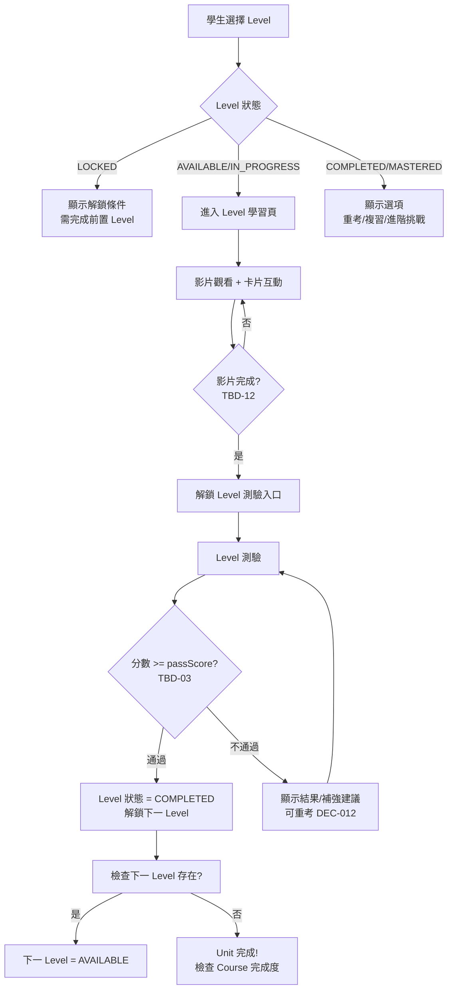

# 學習地圖系統

> [!IMPORTANT]
> **狀態**：CONFIRMED - [[13_Decisions/Decision Log#DEC-20260910-009|DEC-009]], [[13_Decisions/Decision Log#DEC-20260910-011|DEC-011]]
> **最後更新**：2026-09-10

---

## 系統定位

> **核心體驗**：一關一關的闖關式學習旅程
> **結構**：Course (課程) → Unit (單元) → Level (關卡)
> **解鎖邏輯**：影片完成 + Level 測驗通過 = 解鎖下一 Level (DEC-011)

---

## 三層架構

```
數學 (Subject)
└── Course (課程)          # 如：國中數學 7上 (MATH_JH_1)
    └── Unit (單元)        # 如：一元一次方程式 (LINEAR_EQUATION)
        ├── Level 1        # 基礎概念
        ├── Level 2        # 進階應用
        ├── Level 3        # 綜合練習
        └── Level 4        # 挑戰題
```

### 對應資料模型
| 層級 | Model | 關鍵欄位 |
|------|-------|----------|
| Course | `Course` | code, name, gradeLevel, semester, sortOrder |
| Unit | `Unit` | courseId, code, name, knowledgePoints[], sortOrder |
| Level | `Level` | unitId, levelNumber, videoId, passScore, questionCount |

---

## 視覺化設計

### Course 列表頁 (入口)
- 卡片網格，依年級/學期分組
- 顯示：課程名稱、進度環 (完成 Units/總 Units)、預估時數
- 操作：點擊進入 Course 詳情

### Unit 節點圖 (核心視覺)
- **技術**: D3.js / React Flow / Canvas
- **呈現**: 
  - 節點 = Level (圓形/六邊形)
  - 邊 = 先後順序關係
  - 顏色編碼狀態 (見下表)
- **互動**:
  - 滑鼠懸停: 顯示 Level 名稱、狀態、預估時間
  - 點擊節點: 進入 Level 學習頁
  - 拖曳/縮放: 大地圖導航
  - 進度環: 單元整體完成度

### Level 狀態色碼
| 狀態 | 顏色 | 圖示 | 定義 | 可操作 |
|------|------|------|------|--------|
| **LOCKED** | 灰色 #9E9E9E | 🔒 | 前置 Level 未完成 | 僅顯示解鎖條件 |
| **AVAILABLE** | 藍色 #2196F3 | 📍 | 可開始學習 | 點擊進入 |
| **IN_PROGRESS** | 橙色 #FF9800 | ▶️ | 影片觀看中/卡片進行中 | 繼續學習 |
| **COMPLETED** | 綠色 #4CAF50 | ✅ | 影片完成 + 測驗通過 | 重考/複習 |
| **MASTERED** | 金色 #FFD700 | ⭐ | Mastery 達標 + 複習完成 | 進階挑戰 |

---

## 解鎖邏輯 (核心規則)



### 解鎖條件細節
| 條件 | 說明 | 例外 |
|------|------|------|
| **前置 Level COMPLETED** | 嚴格序列：Level 1 → 2 → 3 → 4 | 無 |
| **影片觀看完成** | 定義見 TBD-12 (建議 90% + 所有卡片完成) | 可設定 |
| **Level 測驗通過** | 分數 >= passScore (TBD-03) | 無 |
| **能力測驗結果** | **不影響** 解鎖 (DEC-008) | 預設 Level 1 AVAILABLE |

---

## 進度追蹤

### LearningProgress 狀態機
```
LOCKED → AVAILABLE (前置 Level COMPLETED)
AVAILABLE → IN_PROGRESS (學生開始影片)
IN_PROGRESS → COMPLETED (影片完成 + 測驗通過)
COMPLETED → MASTERED (Mastery 達標 + 複習完成) - 可選
任何狀態 → IN_PROGRESS (重新學習)
```

### 進度資料結構 (LearningProgress)
```json
{
  "studentId": "stu_123",
  "levelId": "lvl_linear_eq_1",
  "status": "IN_PROGRESS",
  "videoProgress": 0.65,
  "cardsCompleted": ["card_001", "card_003"],
  "startedAt": "2026-09-10T10:00:00Z",
  "completedAt": null,
  "testAttempts": 0
}
```

---

## 預設解鎖 (能力測驗跳過/未完成)

| 情況 | 預設解鎖策略 |
|------|--------------|
| **未做能力測驗** | Level 1 設為 AVAILABLE，其餘 LOCKED |
| **能力測驗未完成** | 同上 |
| **能力測驗完成** | 依 weakAreas 建議起始 Level，但 **所有 Level 1 至少 AVAILABLE** |

---

## Unit/Course 完成判定

| 層級 | 完成條件 | 觸發行動 |
|------|----------|----------|
| **Level** | 影片完成 + 測驗通過 | 解鎖下一 Level、更新進度 |
| **Unit** | 所有 Levels COMPLETED | Unit 節點綠色、檢查 Course |
| **Course** | 所有 Units 完成 | Course 進度 100%、慶祝動畫、建議下學期/高中 |

---

## 視覺化技術細節

### D3.js 節點圖關鍵配置
```javascript
// 節點半徑依狀態變化
const radius = {
  LOCKED: 24,
  AVAILABLE: 28,
  IN_PROGRESS: 30,
  COMPLETED: 28,
  MASTERED: 32
};

// 連線動畫：完成時從灰變綠
link.transition()
  .duration(500)
  .attr("stroke", d => d.target.completed ? "#4CAF50" : "#E0E0E0");

// 節點點擊事件
node.on("click", (event, d) => {
  if (d.status !== "LOCKED") {
    navigateToLevel(d.levelId);
  } else {
    showUnlockRequirement(d);
  }
});
```

### 響應式斷點
| 裝置 | 版面 | 節點大小 | 導航 |
|------|------|----------|------|
| **Mobile** (<640px) | 單欄垂直流 | 28px 固定 | 底部進度條 |
| **Tablet** (640-1024px) | 兩欄 (側邊單元列表 + 主圖) | 24-32px | 側邊導航 |
| **Desktop** (>1024px) | 三欄 (左單元/中地圖/右詳情) | 24-36px | 完整互動 |

---

## 相關文檔

- [[02_Features/Level System|Level 互動式學習]]
- [[02_Features/Initial Assessment|初始能力測驗]]
- [[03_Math_Teaching/Math Curriculum|數學課綱架構]]
- [[08_Database/Schema|資料庫 Schema: Course/Unit/Level]]
- [[13_Decisions/Decision Log|核心決策]]
- [[13_Decisions/TBD#TBD-03|TBD-03: Level 測驗參數]]
- [[13_Decisions/TBD#TBD-12|TBD-12: 影片完成判定]]

---

## 更新記錄

| 日期 | 版本 | 變更 | 作者 |
|------|------|------|------|
| 2026-09-10 | v1.0 | 初始系統設計 | 產品架構師 |