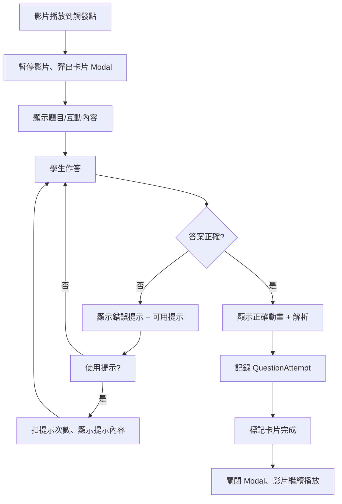

# Level 互動式學習系統

> [!IMPORTANT]
> **狀態**：CONFIRMED - [[13_Decisions/Decision Log#DEC-20260910-009|DEC-009]] 至 [[13_Decisions/Decision Log#DEC-20260910-013|DEC-013]]
> **最後更新**：2026-09-10

---

## Level 核心結構

每個 Level 包含三大核心元素：
```
Level
├── 影片
├── 互動卡片
└── Level 測驗
```

---

## 1. 影片播放系統

### 播放器需求
| 功能 | 說明 | 優先級 |
|------|------|--------|
| 自適應串流 | Mux / Cloudflare Stream / HLS | P0 |
| 進度追蹤 | 10秒間隔 heartbeat 送後端 | P0 |
| 時間點觸發卡片 | Video timeupdate event → 卡片 Modal | P0 |
| 播放速度 | 0.5x / 0.75x / 1x / 1.25x / 1.5x / 2x | P1 |
| 畫質切換 | Auto / 1080p / 720p / 480p | P1 |
| 全螢幕 / PIP | 瀏覽器原生支援 | P1 |
| 字幕/逐字稿 | WebVTT、可切換顯示 | P1 |
| 章節標記 | 影片時間軸標記章節/卡片點 | P1 |

### 觀看完成判定 (TBD-12)
| 方案 | 定義 | 優缺點 |
|------|------|--------|
| **方案 A** | 觀看進度 >= 90% | 簡單、但可快轉跳過 |
| **方案 B** | 進度 >= 90% + 所有必填卡片完成 | 較完整、確保互動 |
| **方案 C** | 進度 >= 95% + 關鍵卡片完成 | 平衡 |
| **方案 C (推薦)** | 進度 >= 95% + 所有卡片完成 (含非必填) | 最完整 |

> **決策待定**: TBD-12

---

## 2. 互動卡片系統

### 卡片類型
| 類型 | 代碼 | 說明 | 範例 |
|------|------|------|------|
| **思考問題** | `THOUGHT_QUESTION` | 開放式引導思考，無標準答案 | 「你覺得為什麼要先展開括號？」 |
| **問答** | `QNA` | 選擇題/填空/簡答，有標準答案 | 「2(x+3) 展開後是？」 |
| **小問題** | `MINI_PROBLEM` | 簡短計算/判斷，即時回饋 | 「2×3 = ?」 |
| **教學互動** | `TEACHING_INTERACTION` | 拖拉/點擊/繪圖/排序等視覺化操作 | 「將步驟拖拉到正確順序」 |

### 卡片觸發機制
- **時間點觸發**: 影片播放到特定秒數 → 自動暫停 → 彈出 Modal
- **手動觸發**: 學生點擊影片時間軸上的卡片標記 → 開啟
- **前置條件**: 前一張卡片完成 (可設定是否強制序列)

### 卡片內容結構
```json
{
  "cardId": "card_linear_eq_1_1",
  "videoId": "vid_linear_eq_1",
  "triggerTimeSeconds": 45,
  "type": "QNA",
  "content": {
    "stem": "2(x+3) 展開後正確的是？",
    "options": [
      {"id": "A", "text": "2x+3", "isCorrect": false},
      {"id": "B", "text": "2x+6", "isCorrect": true},
      {"id": "C", "text": "2x+5", "isCorrect": false}
    ],
    "hints": [
      "提示 1: 分配律 a(b+c)=ab+ac",
      "提示 2: 2 要乘給括號裡的每一項"
    ],
    "explanation": "分配律：2(x+3) = 2x + 6",
    "knowledgePoints": ["DISTRIBUTIVE_LAW"]
  },
  "sortOrder": 1,
  "isRequired": true
}
```

### 學生作答流程


### 卡片作答記錄 (QuestionAttempt)
```json
{
  "questionId": "card_linear_eq_1_1",
  "studentAnswer": "B",
  "isCorrect": true,
  "attemptNumber": 1,
  "hintsUsed": 0,
  "timeSpentSeconds": 15,
  "errorAnalysis": null
}
```

---

## 3. Level 測驗系統

### 測驗參數 (TBD-03 待決定)
| 參數 | 狀態 | 候選方案 |
|------|------|----------|
| **題數** | TBD | 固定 10 題 / 依 KP 數動態 (每 KP 1-2 題) |
| **通過分數** | TBD | 70% / 75% / 80% |
| **難度比例** | TBD | 簡:中:難 = 3:5:2 / 2:6:2 |
| **時間限制** | TBD | 無 / 每題 2 分鐘 / 總計 20 分鐘 |
| **抽題演算法** | TBD | 依 LevelQuestion 篩選 + 隨機 + 重考去重 |

### 測驗組卷邏輯
```sql
-- Level 定義的題目範圍 (LevelQuestion)
SELECT q.* FROM questions q
JOIN level_questions lq ON q.id = lq.question_id
WHERE lq.level_id = $levelId
  AND q.is_active = true
ORDER BY RANDOM()
LIMIT $questionCount;
```

### 重考機制 (DEC-012)
- **無限次重考**: 學生可無限次重考直到通過
- **去重機制**: 排除近 3 次測驗中出現過的題目
- **間隔限制**: 可選設定「重考需間隔 10 分鐘」防刷題

### 測驗介面規格
| 元素 | 規格 |
|------|------|
| **題目顯示** | 單題模式、支援 LaTeX 渲染、圖片支援 |
| **導航** | 題號列表 (可跳轉)、進度條、剩餘時間 |
| **操作** | 選項點選/文字輸入、標記複習、上一題/下一題 |
| **提交** | 確認對話框、未作答提醒 |
| **結果頁** | 分數、通過/不通過、逐題解析、錯誤分析、補強建議 |

### 不通過時的補強流程 (TBD-13 待決定)
| 選項 | 說明 |
|------|------|
| **重看影片** | 直接跳轉到 Level 影片頁 |
| **針對性微課** | 依錯誤 KP 推薦 2-3 分鐘微課影片 |
| **錯題複習** | 進入錯題本複習相關題目 |
| **AI 1-on-1 輔導** | 直接開啟 AI 聊天、帶入錯誤上下文 |

---

## Level 通過判定 (DEC-011 確認)

```
影片觀看完成 (TBD-12)
    AND
Level 測驗分數 >= passScore (TBD-03)
    =
解鎖下一 Level
```

### 通過後的處理
1. `LearningProgress.status = COMPLETED`
2. `completedAt = now()`
3. 觸發事件: `level.completed`
   - 解鎖下一 Level (設為 AVAILABLE)
   - 更新 Unit/Course 進度
   - 觸發慶祝動畫/徽章
4. 檢查 Unit/Course 是否完成

---

## 相關文檔

- [[02_Features/Learning Map|學習地圖]]
- [[02_Features/Wrong Question System|錯題系統]]
- [[02_Features/Mastery System|Mastery 系統]]
- [[03_Math_Teaching/Math Curriculum|數學課綱架構]]
- [[08_Database/Schema|資料庫 Schema: Level/Video/InteractiveCard]]
- [[13_Decisions/Decision Log|核心決策]]
- [[13_Decisions/TBD#TBD-03|TBD-03: Level 測驗參數]]
- [[13_Decisions/TBD#TBD-11|TBD-11: 卡片類型細節]]
- [[13_Decisions/TBD#TBD-12|TBD-12: 影片完成判定]]
- [[13_Decisions/TBD#TBD-13|TBD-13: 補強機制]]

---

## 更新記錄

| 日期 | 版本 | 變更 | 作者 |
|------|------|------|------|
| 2026-09-10 | v1.0 | 初始系統設計 | 產品架構師 |