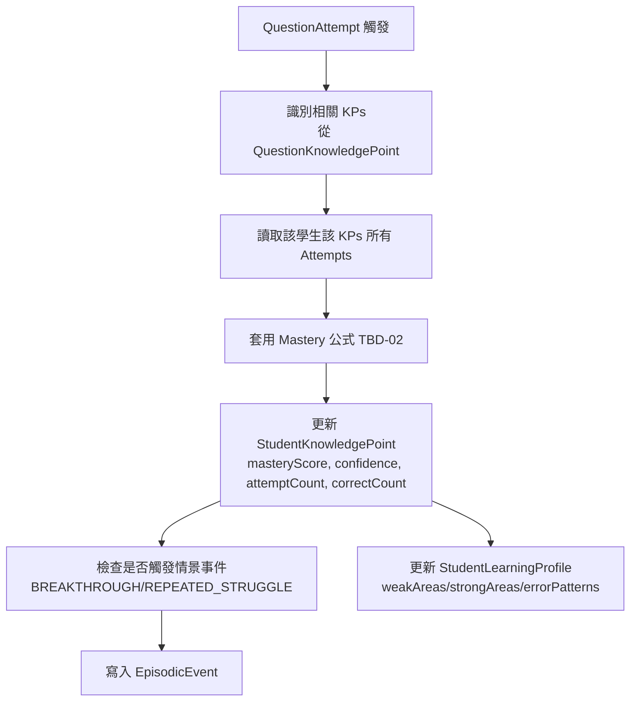
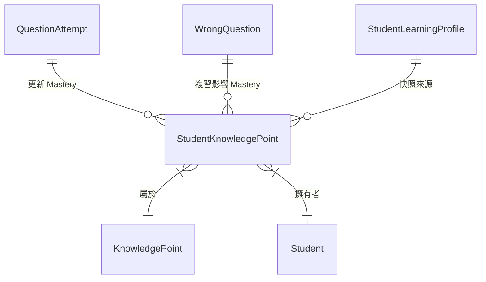

# Mastery 掌握度系統

> [!IMPORTANT]
> **狀態**：DESIGN - TBD-02 核心公式待決定
> **最後更新**：2026-09-10
> **關鍵原則**：**Mastery 不直接控制 Level 解鎖** (DEC-011)，僅供 AI 個人化、學習分析、相似題推薦

---

## 系統定位

> **核心價值**：量化學生對每個 Knowledge Point 的掌握程度 (0-100)
> **獨立性**: 
> - 不控制 Level 解鎖 (Level 解鎖僅依影片完成 + 測驗通過)
> - 供 AI 個人化、學習分析儀表板、相似題推薦、弱項識別

---

## 資料模型

### StudentKnowledgePoint (核心表)
```prisma
model StudentKnowledgePoint {
  studentId         String
  student           Student @relation(fields: [studentId], references: [id], onDelete: Cascade)
  knowledgePointId  String
  knowledgePoint    KnowledgePoint @relation(fields: [knowledgePointId], references: [id], onDelete: Cascade)
  masteryScore      Float  @default(0)   // 0-100
  confidence        Float  @default(0)   // 0-1, 樣本數信心度
  attemptCount      Int    @default(0)
  correctCount      Int    @default(0)
  lastAttemptAt     DateTime?
  updatedAt         DateTime @updatedAt

  @@id([studentId, knowledgePointId])
  @@index([studentId, masteryScore])
}
```

### 欄位語義
| 欄位 | 定義 | 更新觸發 |
|------|------|----------|
| `masteryScore` | 掌握度分數 0-100 | 每次 QuestionAttempt 後重算 (TBD-02) |
| `confidence` | 信心度 0-1 (基於嘗試次數、一致性) | 同步更新 |
| `attemptCount` | 總作答次數 (含卡片、測驗、能力測驗) | 每次作答 +1 |
| `correctCount` | 正確作答次數 | 答對 +1 |
| `lastAttemptAt` | 最近作答時間 | 每次作答更新 |

---

## Mastery 計算公式 (TBD-02 待決定)

### 候選方案比較

| 方案 | 原理 | 優點 | 缺點 | 適用場景 |
|------|------|------|------|----------|
| **加權移動平均 (WMA)** | 近期表現權重高、答對/錯/提示/時間加權 | 簡單、可解釋、即時更新 | 需手動調參、不考慮題目難度 | MVP、快速驗證 |
| **貝葉斯知識追蹤 (BKT)** | 隱馬可夫模型、P(Learned)、P(Guess)、P(Slip) | 理論紮實、處理猜測/失誤 | 單一技能、參數需預估/學習 | 技能獨立、數據充足 |
| **深度知識追蹤 (DKT)** | LSTM/Transformer 序列建模 | 捕捉長期依賴、多技能共學 | 黑盒、需大量數據、訓練複雜 | 大規模、長序列 |
| **IRT 三參數模型** | 項目反應理論、區分度/難度/猜測 | 科學測量標準、題目校準 | 需大量數據校準參數 | 標準化測驗 |
| **綜合評分模型 (推薦 MVP)** | 基礎分 + 難度加權 + 時效衰減 + 提示懲罰 | 可調參、可解釋、即時 | 需設計合理權重 | **推薦 Phase 1** |

### 推薦 MVP 綜合評分模型
```typescript
function calculateMastery(attempts: QuestionAttempt[], kpId: string): MasteryResult {
  let score = 50;  // 先驗分數 (中性)
  let totalWeight = 0;
  let weightedSum = 0;
  
  for (const attempt of attempts) {
    // 1. 基礎權重: 依題目難度、時間衰減
    const timeDecay = Math.exp(-(Date.now() - attempt.createdAt.getTime()) / (30 * 24 * 3600 * 1000)); // 30天半衰期
    const difficultyWeight = 1 + (attempt.question.difficulty - 3) * 0.1; // 難度 1-5
    const hintPenalty = Math.max(0, 1 - attempt.hintsUsed * 0.15); // 每提示 -15%
    const speedBonus = attempt.timeSpentSeconds < 30 ? 1.1 : 1.0; // 快速答對加分
    
    const weight = timeDecay * difficultyWeight * hintPenalty * speedBonus;
    
    // 2. 答對/錯得分
    let points = attempt.isCorrect ? 100 : 0;
    
    // 3. 部分分 (非選擇題有步驟分)
    if (!attempt.isCorrect && attempt.errorAnalysis) {
      const correctSteps = attempt.errorAnalysis.filter(e => !e.isError).length;
      const totalSteps = attempt.errorAnalysis.length;
      points = (correctSteps / totalSteps) * 50; // 最多得 50 分
    }
    
    weightedSum += points * weight;
    totalWeight += weight;
  }
  
  // 3. 加權平均 + 先驗平滑
  const priorWeight = 10; // 相當於 10 次中性觀測
  const finalScore = (weightedSum + 50 * priorWeight) / (totalWeight + priorWeight);
  
  // 4. 信心度: 基於樣本數、一致性、時間跨度
  const confidence = Math.min(1, attempts.length / 20) * consistencyFactor(attempts);
  
  return {masteryScore: clamp(finalScore, 0, 100), confidence};
}
```

### 關鍵參數 (需調參)
| 參數 | 初始值 | 調整方向 |
|------|--------|----------|
| 先驗權重 | 10 | 數據多時降低 |
| 時間衰減半衰期 | 30 天 | 依學科特性調整 |
| 提示懲罰係數 | 0.15/次 | 依提示品質調整 |
| 難度權重係數 | 0.1/級 | 依 IRT 校準調整 |
| 先驗分數 | 50 | 依學生群體調整 |

---

## Mastery 更新機制

### 觸發時機
| 事件 | 更新範圍 | 延遲 |
|------|----------|------|
| QuestionAttempt 新增 (卡片/測驗/能力測驗) | 相關 KPs 增量更新 | 即時 (<1s) |
| WrongQuestion 變更 (複習正確/錯誤) | 相關 KPs 重算 | 近即時 |
| 定時批次 | 全量重算 (修正漂移) | 每日 03:00 |

### 更新流程


---

## Mastery 用途 (不控制 Level 解鎖)

| 用途 | 說明 | 介面 |
|------|------|------|
| **AI Context 注入** | 取得 Top 10 Weak/Strong KPs 注入 Prompt | AI Chat API |
| **學習分析儀表板** | 雷達圖、熱力圖、趨勢線、弱項排行 | 學習分析頁 |
| **相似題推薦權重** | 弱項 KP 權重高、強項權重低 | AI 推薦/錯題複習 |
| **學習路徑建議** | 弱項優先安排補強、強項可跳過/加速 | 學習地圖/首頁建議 |
| **家長/教師報表** | 掌握度變化趨勢、預測薄弱點 | 週報/月報 |

---

## 視覺化設計

### Mastery 雷達圖 (學習分析頁)
- **軸向**: Domain (ALGEBRA, GEOMETRY, STATISTICS, NUMBER, FUNCTION)
- **數值**: 該 Domain 下所有 KPs 平均 Mastery
- **顏色**: 紅 (0-40) → 黃 (40-70) → 綠 (70-100)

### Mastery 熱力圖 (單元層級)
- **X 軸**: Units (依教學順序)
- **Y 軸**: KPs (依難度/教學順序)
- **格子顏色**: Mastery 分數色階
- **互動**: 滑鼠懸停顯示 KP 名稱、分數、趨勢

### 趨勢線
- **X 軸**: 時間 (週/月)
- **Y 軸**: Mastery 平均 / Weak KP 數量 / 錯誤率
- **多線**: 整體、各 Domain、Top 3 Weak KPs

---

## 與 WrongQuestion/Mastery 關係圖



---

## 相關文檔

- [[02_Features/Wrong Question System|錯題系統]]
- [[02_Features/Level System|Level 系統]]
- [[02_Features/AI Chat|AI 問答]]
- [[02_Features/Learning Analysis|學習分析]]
- [[03_Math_Teaching/Error Pattern|錯誤類型分類]]
- [[08_Database/Schema|資料庫 Schema]]
- [[13_Decisions/TBD#TBD-02|TBD-02: Mastery 公式]]
- [[13_Decisions/TBD#TBD-19|TBD-19: 間隔重複算法]]

---

## 更新記錄

| 日期 | 版本 | 變更 | 作者 |
|------|------|------|------|
| 2026-09-10 | v1.0 | 初始系統設計 | 產品架構師 |