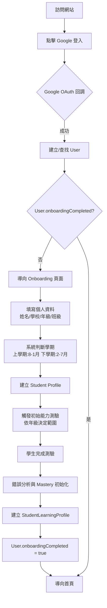

# 學生註冊流程

> [!IMPORTANT]
> **狀態**：CONFIRMED - [[13_Decisions/Decision Log#DEC-20260910-002|DEC-002]], [[13_Decisions/Decision Log#DEC-20260910-007|DEC-007]], [[13_Decisions/Decision Log#DEC-20260910-008|DEC-008]]
> **最後更新**：2026-09-10

---

## 流程總覽



---

## 詳細步驟

### 1. Google 登入
- 僅支援 Google OAuth 2.0 (OpenID Connect)
- Scope: `openid email profile`
- Access Type: `offline` (取得 Refresh Token)
- Prompt: `consent` (強制顯示同意畫面)

### 2. User 建立/查找
```typescript
// 邏輯
if (googleId 存在) {
  // 回流用戶：更新 lastLoginAt、avatarUrl
  return existingUser;
} else {
  // 新用戶：建立 User + 觸發 Onboarding
  const user = await createUser({email, name, googleId, avatarUrl});
  return user;
}
```

### 3. Onboarding 個人資料 (Step 1)
| 欄位 | 類型 | 驗證規則 | 必填 | 備註 |
|------|------|----------|------|------|
| 姓名 | Text | 1-20 字、中英文數字 | ✅ | 顯示用 |
| 學校 | Search/Select | 學校資料庫 / 手動輸入 | ✅ | 統計用 |
| 年級 | Radio Group | 國一~高三 (G7-G12) | ✅ | 決定課綱範圍 |
| 班級 | Text | 1-3 字 | ❌ | 顯示用 |
| 學期 | Auto/Select | 依當月自動判斷 (可手動覆蓋) | ✅ | 決定學期課綱 |

**學期判斷邏輯**:
- 1-7 月 → 下學期 (Semester 2)
- 8-12 月 → 上學期 (Semester 1)
- 可手動覆蓋，但需確認

### 4. 初始能力測驗 (Step 2)
- **觸發時機**: Onboarding Step 1 完成後自動觸發
- **測驗範圍**: 依學生年級決定
  - 國一 (G7): 國一上學期內容
  - 國二 (G8): 國一 + 國二上學期
  - 國三 (G9): 國一 + 國二 + 國三上學期
  - 高中同理
- **可跳過**: 永遠顯示「稍後再測」按鈕 (DEC-008)
- **參數**: 題數、難度、評分公式均為 TBD-01

### 5. 能力測驗執行
- 題目逐題呈現 (單選/填空/簡答)
- 即時評分、顯示解析
- 記錄每題 QuestionAttempt (含錯誤分析)
- 提交後計算分數、生成錯誤分析報告

### 6. 結果分析與 Mastery 初始化
- 識別弱項 Knowledge Points
- 初始化 StudentKnowledgePoint (masteryScore, confidence)
- 建立 StudentLearningProfile (unitMastery, errorPatterns, weakAreas)
- 依結果建議起始 Level (但不阻擋進入任何 AVAILABLE Level)

### 7. 完成 Onboarding
- `User.onboardingCompleted = true`
- 導向首頁 Dashboard

---

## 關鍵決策對照

| 決策 | 內容 | 影響 |
|------|------|------|
| DEC-001 | B2C 模式 | 無 Organization/Teacher/Class |
| DEC-002 | 取消補習班選擇 | 註冊流程簡化 |
| DEC-007 | 能力測驗僅第一次 | 無定期重測機制 |
| DEC-008 | 能力測驗不阻擋地圖 | 預設 Level 1 AVAILABLE |
| DEC-022 | 數學為核心 | 能力測驗僅含數學 |

---

## 例外處理

| 異常情況 | 處理方式 |
|----------|----------|
| Google OAuth 失敗 | 顯示錯誤訊息、引導重試、記錄日誌 |
| Email 已被其他帳號綁定 | 提示「此信箱已註冊，請直接登入」 |
| 學生關閉瀏覽器中斷 Onboarding | 下次登入自動導回未完成步驟 |
| 能力測驗中途離開 | 保存進度、下次可續作或重新開始 |
| 年齡 < 13 歲 (COPPA) | 觸發家長同意流程 (未來擴充) |

---

## 相關文檔

- [[02_Features/Initial Assessment|初始能力測驗]]
- [[02_Features/Homepage|首頁設計]]
- [[08_Database/Schema|資料庫 Schema: User/Student]]
- [[11_Security/Authentication Security|認證安全]]
- [[13_Decisions/Decision Log|核心決策]]
- [[13_Decisions/TBD#TBD-01|TBD-01: 能力測驗參數]]

---

## 更新記錄

| 日期 | 版本 | 變更 | 作者 |
|------|------|------|------|
| 2026-09-10 | v1.0 | 初始流程設計 | 產品架構師 |