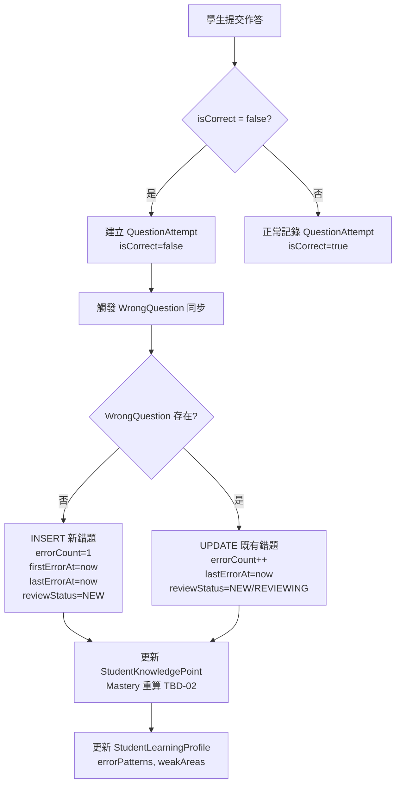
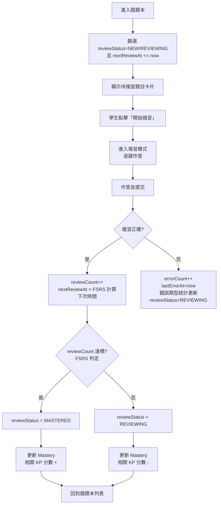

# 錯題系統

> [!IMPORTANT]
> **狀態**：CONFIRMED - [[13_Decisions/Decision Log#DEC-20260910-014|DEC-014]], [[13_Decisions/Decision Log#DEC-20260910-015|DEC-015]]
> **最後更新**：2026-09-10

---

## 系統定位

> **核心價值**：將每一次錯誤轉化為精準學習資產
> **雙層架構**：
> - **QuestionAttempt**: 每一次作答的完整軌跡
> - **WrongQuestion**: 學生-題目層級的錯誤匯總與複習管理

---

## 雙層資料模型

### 1. QuestionAttempt (作答軌跡層)
> **用途**: 完整保留每一次作答細節，供 AI 分析、Mastery 計算、錯誤定位

| 欄位 | 說明 |
|------|------|
| `studentId` | 學生 ID (冗餘便於查詢) |
| `assessmentAttemptId` | 所屬測驗嘗試 |
| `questionId` | 題目 ID |
| `studentAnswer` | 學生答案 (文字/LaTeX/選項 ID) |
| `isCorrect` | 是否正確 |
| `attemptNumber` | 該測驗中第幾次作答此題 (重考計數) |
| `hintsUsed` | 使用提示次數 |
| `timeSpentSeconds` | 作答耗時 |
| `errorAnalysis` | 錯誤步驟、錯誤類型、相關 KP (JSON) |
| `createdAt` | 作答時間 |

### 2. WrongQuestion (錯題匯總層)
> **用途**: 學生個人錯題庫、複習排程、統計分析、AI Context

| 欄位 | 說明 |
|------|------|
| `studentId` | 學生 ID |
| `questionId` | 題目 ID |
| `errorCount` | 累積錯誤次數 |
| `firstErrorAt` | 第一次錯誤時間 |
| `lastErrorAt` | 最近錯誤時間 |
| `reviewStatus` | `NEW` / `REVIEWING` / `MASTERED` / `ARCHIVED` |
| `reviewCount` | 複習次數 |
| `nextReviewAt` | 下次複習時間 (間隔重複算法 TBD-19) |
| `errorPatterns` | 歷次錯誤類型統計 (JSON) |
| **唯一約束** | `(studentId, questionId)` |

---

## 同步機制



### 同步觸發方式
| 方式 | 優點 | 缺點 | 採用建議 |
|------|------|------|----------|
| **資料庫 Trigger** | 保證一致性、無漏寫 | 測試較難、業務邏輯在 DB | 可考慮 |
| **應用層服務** | 彈性高、易測試、可擴展 | 需保證事務一致性 | **推薦** |
| **訊息佇列** | 解耦、可重試、峰值緩衝 | 架構複雜、最終一致性 | Phase 2+ |

> **建議**: Phase 1 採用應用層同步服務 (事務內完成)，Phase 2+ 遷移至訊息佇列。

---

## 錯題本介面設計

### 列表頁 (錯題本首頁)
| 功能 | 規格 |
|------|------|
| **篩選器** | 單元 (多選)、時間範圍、複習狀態、錯誤類型 |
| **排序** | 最近錯誤、錯誤次數、下次複習時間、單元順序 |
| **搜尋** | 題目關鍵字、知識點代碼 |
| **列表項** | 題目縮圖/文字預覽、單元標籤、錯誤次數、最後錯誤時間、複習狀態標籤 |
| **批次操作** | 全選、批次設為複習中/歸檔、匯出 |

### 詳情頁 (點擊進入)
```typescript
interface WrongQuestionDetail {
  // 題目資訊
  question: {
    stem: string;           // 題目 LaTeX
    options: Option[];      // 選項 (如適用)
    answer: string;         // 標準答案
    solutionSteps: SolutionStep[];  // 詳細解析步驟
    knowledgePoints: KP[];  // 相關知識點
  };
  
  // 學生作答歷程
  attempts: Array<{
    attemptedAt: DateTime;
    studentAnswer: string;
    isCorrect: boolean;
    hintsUsed: number;
    timeSpent: number;
    errorAnalysis: {
      step: number;
      errorType: string;      // ALG_DIST_01 等
      kpId: string;
    }[];
  }>;
  
  // 統計摘要
  stats: {
    errorCount: number;
    firstErrorAt: DateTime;
    lastErrorAt: DateTime;
    reviewCount: number;
    reviewStatus: "NEW" | "REVIEWING" | "MASTERED" | "ARCHIVED";
    nextReviewAt: DateTime | null;
    errorPatternStats: Record<string, number>; // 錯誤代碼 -> 次數
  };
  
  // 相似題推薦
  similarQuestions: Question[];  // TBD-20
  
  // 操作按鈕
  actions: ["開始複習", "標記已掌握", "歸檔", "分享給 AI 老師"];
}
```

---

## 複習模式

### 間隔重複算法 (TBD-19 待決定)
| 算法 | 特點 | 適用性 |
|------|------|--------|
| **SM-2 (SuperMemo 2)** | 經典、參數少、易實作 | 基礎版 |
| **FSRS (Free Spaced Repetition Scheduler)** | 現代、機率模型、參數可學習 | **推薦** |
| **自訂規則** | 固定間隔 (1天/3天/1周/1月) | 簡單但不精準 |

### 複習流程


### 複習模式類型
| 模式 | 適用場景 | 題目來源 |
|------|----------|----------|
| **到期複習** | 日常例行 | `nextReviewAt <= now` 且 `status != MASTERED` |
| **專項練習** | 針對特定 KP/錯誤類型 | 依 KP/錯誤代碼篩選 |
| **考前衝刺** | 考試前 | 近期錯誤 + 弱項 KP + 模擬題 |
| **AI 推薦** | AI 對話中觸發 | AI 依對話上下文推薦 |

---

## 錯誤類型統計與分析

### 學生錯誤畫像
```json
{
  "studentId": "stu_123",
  "totalErrors": 147,
  "byDomain": {
    "ALG": 89,
    "FUN": 23,
    "GEO": 15,
    "STA": 12,
    "NUM": 8
  },
  "topErrorCodes": [
    {"code": "ALG_DIST_01", "count": 23, "trend": "DECREASING"},
    {"code": "ALG_TRANS_01", "count": 18, "trend": "STABLE"},
    {"code": "ALG_COEFF_01", "count": 15, "trend": "INCREASING"}
  ],
  "weakKnowledgePoints": [
    {"kpId": "DISTRIBUTIVE_LAW", "mastery": 35, "errorCount": 23},
    {"kpId": "TRANSPOSITION", "mastery": 48, "errorCount": 18}
  ]
}
```

### 錯誤趨勢視覺化
- **時間序列**: 每週錯誤數趨勢圖
- **錯誤類型熱力圖**: Domain × Error Code 矩陣
- **Mastery 關聯**: 錯誤多的 KP ↔ Mastery 低驗證

---

## 相關文檔

- [[02_Features/Level System|Level 系統]]
- [[02_Features/Mastery System|Mastery 系統]]
- [[02_Features/AI Chat|AI 問答]]
- [[03_Math_Teaching/Error Pattern|錯誤類型分類]]
- [[04_AI/Student Memory|學生記憶系統]]
- [[08_Database/Schema|資料庫 Schema: QuestionAttempt/WrongQuestion]]
- [[13_Decisions/TBD#TBD-19|TBD-19: 間隔重複算法]]
- [[13_Decisions/TBD#TBD-20|TBD-20: 相似題生成]]

---

## 更新記錄

| 日期 | 版本 | 變更 | 作者 |
|------|------|------|------|
| 2026-09-10 | v1.0 | 初始系統設計 | 產品架構師 |