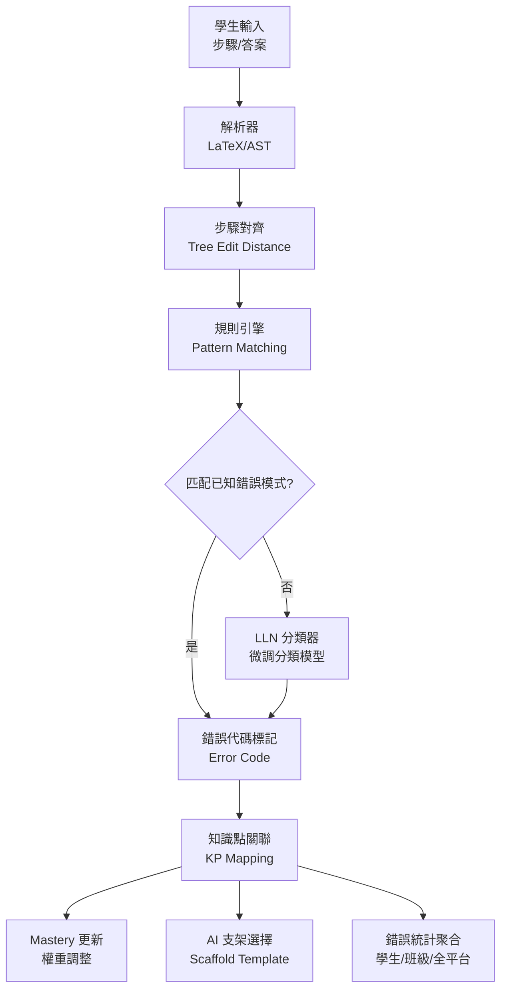

# 錯誤類型分類體系

> [!IMPORTANT]
> **狀態**：RESEARCH - TBD-18，核心研究項目，需教學專家 + AI 團隊共同建構
> **最後更新**：2026-09-10

---

## 分類設計原則

1. **多層級**：領域 → 類別 → 具體錯誤代碼
2. **可計算**：每個錯誤代碼可自動/半自動偵測
3. **可教學**：每個錯誤對應教學支架
4. **可追蹤**：學生錯誤模式歷史可統計分析

---

## 三層分類架構

### Layer 1: Domain (領域)
| Domain Code | 領域名稱 | 範例 |
|-------------|----------|------|
| ALG | 代數運算 | 分配律、移項、因式分解 |
| FUN | 函數與圖形 | 函數代入、頂點座標、圖形性質 |
| GEO | 幾何推理 | 合同/相似判定、角度計算、圓性質 |
| STA | 統計與機率 | 平均數、標準差、條件機率、貝氏 |
| NUM | 數感與運算 | 分數運算、根號運算、指數對數 |
| LOG | 邏輯與證明 | 分情況討論、反證法、數學歸納法 |

### Layer 2: Category (類別) - 代數領域範例

| Category Code | 類別名稱 | 說明 |
|---------------|----------|------|
| ALG_DIST | 分配律錯誤 | 展開/因式分解相關 |
| ALG_TRANS | 移項錯誤 | 符號變換、運算錯誤 |
| ALG_COEFF | 係數處理錯誤 | 忘記除係數、係數運算錯 |
| ALG_SIGN | 正負號錯誤 | 負號遺漏、雙重負號 |
| ALG_FRAC | 分數運算錯誤 | 通分、約分、分數方程 |
| ALG_ROOT | 根號運算錯誤 | 開根號、根號方程 |
| ALG_ABS | 絕對值錯誤 | 去絕對值、分情況 |
| ALG_FACT | 因式分解錯誤 | 方法選擇、展開驗算 |
| ALG_QUAD | 二次方程式錯誤 | 判別式、公式代入、配方法 |
| ALG_SYS | 聯立方程式錯誤 | 消元法、代入法、圖形法 |

### Layer 3: Error Code (具體錯誤代碼) - 完整表

#### ALG_DIST: 分配律錯誤
| Error Code | 錯誤名稱 | 學生範例 | 標準形式 | 偵測規則 |
|------------|----------|----------|----------|----------|
| ALG_DIST_01 | 遺漏項次乘法 | 2(x+3)=2x+3 | 2x+6 | 乘法節點子樹數量不符 |
| ALG_DIST_02 | 符號分配錯誤 | -2(x-3)=-2x-6 | -2x+6 | 負號未分配至第二項 |
| ALG_DIST_03 | 係數遺漏(隱性1) | (x+3)=x+3 | 1x+3 | 缺少隱性係數 1 |
| ALG_DIST_04 | 運算順序錯誤 | 2(x+3)=2x+3*2 | 2x+6 | 先加後乘 vs 先乘後加 |
| ALG_DIST_05 | 多層括號遺漏 | 2[3(x+1)]=6x+1 | 6x+6 | 內層括號未展開 |

#### ALG_TRANS: 移項錯誤
| Error Code | 錯誤名稱 | 學生範例 | 標準形式 | 偵測規則 |
|------------|----------|----------|----------|----------|
| ALG_TRANS_01 | 移項不變號 | 2x+6=14 → 2x=14+6 | 2x=8 | 等式兩邊操作符號未翻轉 |
| ALG_TRANS_02 | 僅移一邊 | 2x+6=14 → 2x=8 (過程缺失) | 2x=8 | 缺少中間步驟記錄 |
| ALG_TRANS_03 | 移項運算錯誤 | 2x+6=14 → 2x=20 | 2x=8 | 常數運算結果錯誤 |
| ALG_TRANS_04 | 移項方向反向 | 2x=8 → 2x+6=14 | 2x=8 | 解題方向與目標不符 |
| ALG_TRANS_05 | 跨等號移項遺漏 | x+3=2x-1 → x+3+1=2x | 3+1=2x-x | 變數項移項處理錯誤 |

#### ALG_COEFF: 係數處理錯誤
| Error Code | 錯誤名稱 | 學生範例 | 標準形式 | 偵測規則 |
|------------|----------|----------|----------|----------|
| ALG_COEFF_01 | 忘記除以係數 | 2x=8 → x=8 | x=4 | 係數節點未處理 |
| ALG_COEFF_02 | 除法運算錯誤 | 2x=8 → x=6 | x=4 | 除法結果計算錯誤 |
| ALG_COEFF_03 | 除以零 | 0x=5 → x=5/0 | 無解 | 係數為零未檢測 |
| ALG_COEFF_04 | 符號係數錯誤 | -2x=8 → x=4 | x=-4 | 負係數除法符號錯誤 |

#### ALG_SIGN: 正負號錯誤
| Error Code | 錯誤名稱 | 學生範例 | 標準形式 | 偵測規則 |
|------------|----------|----------|----------|----------|
| ALG_SIGN_01 | 負號遺漏 | -x=3 → x=3 | x=-3 | 負號未帶入解 |
| ALG_SIGN_02 | 雙重負號錯誤 | -(-x)=3 → -x=3 | x=3 | 負負得正未應用 |
| ALG_SIGN_03 | 減法分配錯誤 | 5-(x-2)=5-x-2 | 7-x | 減號未分配至括號內 |

#### ALG_FRAC: 分數運算錯誤
| Error Code | 錯誤名稱 | 學生範例 | 標準形式 | 偵測規則 |
|------------|----------|----------|----------|----------|
| ALG_FRAC_01 | 通分錯誤 | 1/2 + 1/3 = 2/5 | 5/6 | 分母直接相加 |
| ALG_FRAC_02 | 約分錯誤 | 4/6 = 2/3 (正確) vs 3/4 | 2/3 | 非最大公因數約分 |
| ALG_FRAC_03 | 分數方程通分遺漏 | x/2 = 3 → x=3 | x=6 | 未兩邊同乘分母 |
| ALG_FRAC_04 | 分母為零未檢測 | 1/(x-2)=3, x=2 | x≠2 | 定義域條件缺失 |

#### ALG_ROOT: 根號運算錯誤
| Error Code | 錯誤名稱 | 學生範例 | 標準形式 | 偵測規則 |
|------------|----------|----------|----------|----------|
| ALG_ROOT_01 | 開根號遺漏± | x²=9 → x=3 | x=±3 | 平方根非負性誤解 |
| ALG_ROOT_02 | 根號內運算錯誤 | √(9+16)=√9+√16=7 | 5 | √(a+b)≠√a+√b |
| ALG_ROOT_03 | 根號方程副根未檢 | √(x+1)=x-1 → x=0,3 | x=3 | 未驗證原方程 |
| ALG_ROOT_04 | 根號分母有理化錯 | 1/√2 = √2/2 (正確) vs 1/2 | √2/2 | 乘法運算錯誤 |

#### ALG_ABS: 絕對值錯誤
| Error Code | 錯誤名稱 | 學生範例 | 標準形式 | 偵測規則 |
|------------|----------|----------|----------|----------|
| ALG_ABS_01 | 去絕對值遺漏分支 | \|x-2\|=3 → x-2=3 | x=5, x=-1 | 僅考慮正分支 |
| ALG_ABS_02 | 定義域條件遺漏 | \|x\|=x → 恆真 | x≥0 | 未標註條件 |

#### ALG_FACT: 因式分解錯誤
| Error Code | 錯誤名稱 | 學生範例 | 標準形式 | 偵測規則 |
|------------|----------|----------|----------|----------|
| ALG_FACT_01 | 公式辨識錯誤 | x²-4=(x-2)² | (x-2)(x+2) | 差平方誤判為完全平方 |
| ALG_FACT_02 | 十字相乘排列錯 | 2x²+7x+3=(2x+3)(x+1) | (2x+1)(x+3) | 係數排列組合錯誤 |
| ALG_FACT_03 | 未提取公因式 | 2x²+4x=2x(x+2) (正確) vs x(2x+4) | 2x(x+2) | 公因式未最大化提取 |
| ALG_FACT_04 | 分解後未驗算 | (x+2)(x+3)=x²+5x+6 | 展開驗算 | 缺乏驗算習慣 |

#### ALG_QUAD: 二次方程式錯誤
| Error Code | 錯誤名稱 | 學生範例 | 標準形式 | 偵測規則 |
|------------|----------|----------|----------|----------|
| ALG_QUAD_01 | 判別式計算錯 | b²-4ac 算錯 | 正確 Δ | 平方/乘法運算錯誤 |
| ALG_QUAD_02 | 公式代入錯誤 | -b±√Δ/2a 代錯 | 正確代入 | 符號/括號位置錯誤 |
| ALG_QUAD_03 | 配方法常數項錯 | x²+6x → (x+3)² | (x+3)²-9 | 常數項補償遺漏 |
| ALG_QUAD_04 | 根公式分母遺漏 | (-b±√Δ)/a | /2a | 2a 遺漏 |

---

## 錯誤偵測管線架構



---

## 錯誤嚴重度分級

| Severity | 定義 | 對 Mastery 影響 | AI 回應優先級 |
|----------|------|-----------------|---------------|
| CRITICAL | 核心概念缺失，導致後續步驟全錯 | -10 到 -15 | 最高：立即介入支架 |
| MAJOR | 關鍵步驟錯誤，但可局部修正 | -5 到 -8 | 高：主動引導修正 |
| MINOR | 計算疏失，概念正確 | -1 到 -3 | 中：輕微提示 |
| COSMETIC | 格式/書寫問題，數學正確 | 0 | 低：忽略或輕微提醒 |

---

## 學生錯誤畫像

```json
{
  "studentId": "stu_123",
  "errorProfile": {
    "totalErrors": 147,
    "byDomain": {
      "ALG": 89,
      "FUN": 23,
      "GEO": 15,
      "STA": 12,
      "NUM": 8
    },
    "topErrorCodes": [
      {"code": "ALG_DIST_01", "count": 23, "trend": "DECREASING"},
      {"code": "ALG_TRANS_01", "count": 18, "trend": "STABLE"},
      {"code": "ALG_COEFF_01", "count": 15, "trend": "INCREASING"},
      {"code": "ALG_SIGN_01", "count": 12, "trend": "DECREASING"}
    ],
    "weakKnowledgePoints": [
      {"kpId": "DISTRIBUTIVE_LAW", "mastery": 35, "errorCount": 23},
      {"kpId": "TRANSPOSITION", "mastery": 48, "errorCount": 18},
      {"kpId": "DIVISION_PROPERTY", "mastery": 52, "errorCount": 15}
    ],
    "errorPatterns": {
      "carelessArithmetic": 0.35,
      "conceptualGap": 0.45,
      "proceduralFluency": 0.20
    }
  }
}
```

---

## 錯誤類型演進機制

1. **新錯誤發現** → 人工標註 → 新增 Error Code
2. **錯誤合併** → 相似度分析 → 合併/拆分代碼
3. **機率更新** → 貝氏更新 → 偵測閾值調整
4. **支架優化** → A/B Test → 模板版本迭代

---

## 相關文檔

- [[03_Math_Teaching/Math Reasoning|數學推理解析]]
- [[03_Math_Teaching/Operation Decomposition|運算拆解]]
- [[03_Math_Teaching/Math Curriculum|數學課綱架構]]
- [[02_Features/Wrong Question System|錯題系統]]
- [[04_AI/AI Teaching Principles|AI 教學原則]]
- [[13_Decisions/TBD#TBD-18|TBD-18: 錯誤類型分類]]
- [[06_Data/Training Data|訓練資料格式]]

---

## 更新記錄

| 日期 | 版本 | 變更 | 作者 |
|------|------|------|------|
| 2026-09-10 | v1.0 | 初始分類體系框架 | AI 系統架構師 |