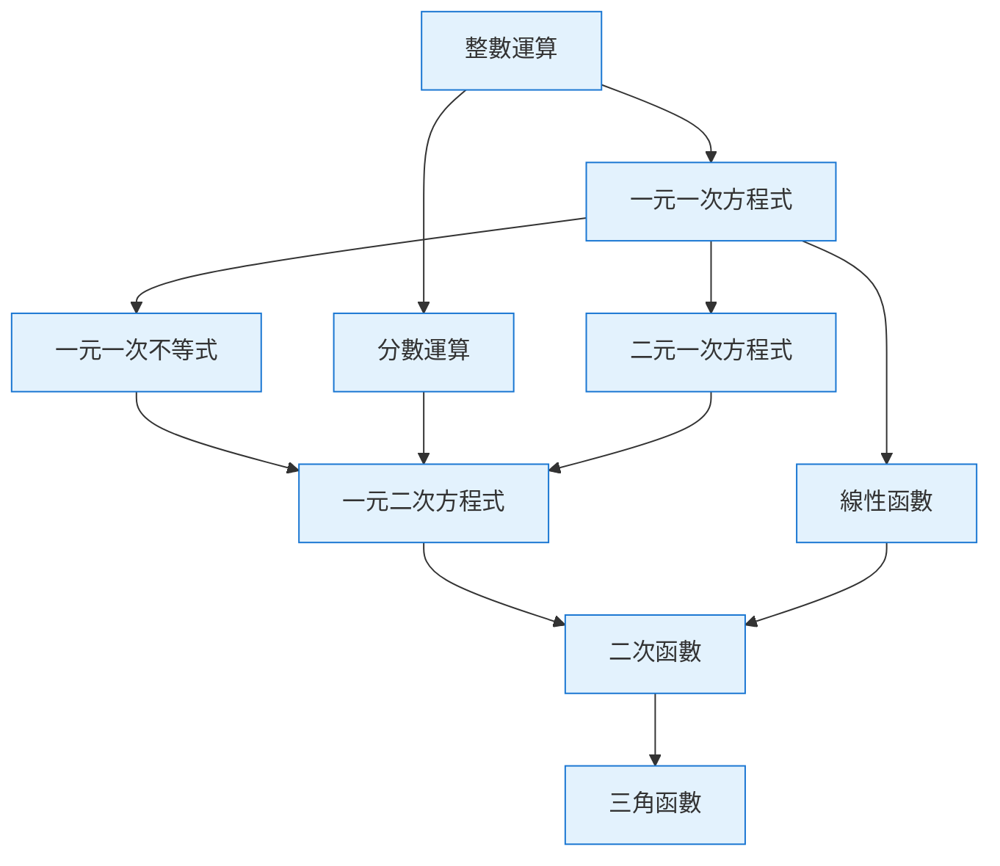

# 數學課綱架構

> [!IMPORTANT]
> **狀態**：PROPOSED - 系統架構就緒，**教學內容尚未確定**
> **最後更新**：2026-09-10
> **核心原則**：只建立系統架構，具體單元/Level 內容待教學團隊定案

---

## ⚠️ 重要宣告

> [!WARNING]
> **教學內容目前尚未確定，只先建立系統架構。**
> 
> 本文檔定義「架構骨架」，具體課綱內容（單元名稱、Level 細節、知識點體系）需由教學專家團隊填入。

---

## 課綱三層架構

```
數學 (Subject)
├── Course (國中數學 7年級上 / 國中數學 7年級下 / ...)
│   ├── Unit (一元一次方程式 / 二次函數 / ...)
│   │   ├── Level 1: 基礎概念
│   │   ├── Level 2: 進階應用
│   │   ├── Level 3: 綜合練習
│   │   └── Level 4: 挑戰題
│   └── Unit (...)
└── Course (...)
```

### 對應資料模型
- **Course**: 年級 + 學期的完整課程 (如 `MATH_JH_1` = 國中數學 7上)
- **Unit**: 單元主題 (如 `LINEAR_EQUATION` = 一元一次方程式)
- **Level**: 該單元的 4 個難度層級

---

## 國中數學課綱骨架 (依 108 課綱)

### 7 年級 (國一)

| 學期 | Course Code | Units (單元) |
|------|-------------|--------------|
| 上學期 | `MATH_JH_1` | 1. 整數與基本運算<br>2. 因數與倍數<br>3. 一元一次方程式<br>4. 幾何基礎：平面圖形 |
| 下學期 | `MATH_JH_2` | 5. 分數與基本運算<br>6. 一元一次不等式<br>7. 資料統計與機率<br>8. 幾何：立體圖形 |

### 8 年級 (國二)

| 學期 | Course Code | Units (單元) |
|------|-------------|--------------|
| 上學期 | `MATH_JH_3` | 1. 平方根與立方根<br>2. 多項式乘法因式分解<br>3. 二元一次方程式<br>4. 幾何：三角形合同 |
| 下學期 | `MATH_JH_4` | 5. 因式分解應用<br>6. 一元二次方程式<br>7. 線性函數<br>8. 幾何：四邊形與圓 |

### 9 年級 (國三)

| 學期 | Course Code | Units (單元) |
|------|-------------|--------------|
| 上學期 | `MATH_JH_5` | 1. 平方根運算與應用<br>2. 二次函數<br>3. 相似三角形<br>4. 三角比 |
| 下學期 | `MATH_JH_6` | 5. 圓與弦的性質<br>6. 統計與機率進階<br>7. 幾何證明綜合<br>8. 國三複習與銜接高中 |

---

## 高中數學課綱骨架 (依 108 課綱)

### 高一 (10 年級)

| 學期 | Course Code | Units |
|------|-------------|-------|
| 上學期 | `MATH_SH_1` | 1. 函數與極限<br>2. 導函數與應用<br>3. 三角函數<br>4. 向量 |
| 下學期 | `MATH_SH_2` | 5. 排列組合與機率<br>6. 統計推論<br>7. 複數<br>8. 空間向量與立體幾何 |

### 高二 (11 年級)

| 學期 | Course Code | Units |
|------|-------------|-------|
| 上學期 | `MATH_SH_3` | 1. 定積分<br>2. 微分方程<br>3. 多變數函數<br>4. 線性代數基礎 |
| 下學期 | `MATH_SH_4` | 5. 數列與級數<br>6. 機率論進階<br>7. 數值分析<br>8. 綜合應用 |

### 高三 (12 年級)

| 學期 | Course Code | Units |
|------|-------------|-------|
| 上學期 | `MATH_SH_5` | 綜合複習：考古題精選、模擬考、弱項強化 |
| 下學期 | `MATH_SH_6` | 學測/指考衝刺、考前模擬、心態調適 |

---

## Level 設計原則 (每 Unit 4 Levels)

| Level | 定位 | 影片長度 | 卡片數 | 測驗題數 | 通過分數 |
|-------|------|----------|--------|----------|----------|
| Level 1 | **基礎概念** - 定義、性質、基本例題 | 8-12 min | 3-5 | TBD-03 | TBD-03 |
| Level 2 | **進階應用** - 變化題型、應用題建模 | 10-15 min | 4-6 | TBD-03 | TBD-03 |
| Level 3 | **綜合練習** - 多知識點串聯、易混淆點 | 12-18 min | 5-7 | TBD-03 | TBD-03 |
| Level 4 | **挑戰題** - 競賽題、創新題型、跨單元 | 15-20 min | 3-5 | TBD-03 | TBD-03 |

> **所有參數標記 TBD-03**，待教學團隊決定

---

## 知識點 (Knowledge Point) 體系設計

### 三層分類
```
Domain (領域) → Topic (主題) → Skill (技能/知識點)
```

### 代數領域 範例
```
ALGEBRA
├── 多項式運算
│   ├── DISTRIBUTIVE_LAW (分配律)
│   ├── COMBINE_LIKE_TERMS (合併同類項)
│   ├── POLYNOMIAL_MULTIPLICATION (多項式乘法)
│   └── FACTORIZATION (因式分解)
├── 方程式求解
│   ├── TRANSPOSITION (移項)
│   ├── LINEAR_EQUATION_SOLVING (一元一次方程式)
│   ├── QUADRATIC_FORMULA (二次公式)
│   └── SYSTEM_OF_EQUATIONS (聯立方程式)
├── 函數與圖形
│   ├── LINEAR_FUNCTION (線性函數)
│   ├── QUADRATIC_FUNCTION (二次函數)
│   └── FUNCTION_TRANSFORMATION (函數變換)
└── 不等式
    ├── LINEAR_INEQUALITY (一元一次不等式)
    ├── QUADRATIC_INEQUALITY (一元二次不等式)
    └── ABSOLUTE_VALUE_INEQUALITY (絕對值不等式)
```

### 幾何領域 範例
```
GEOMETRY
├── 平面幾何
│   ├── TRIANGLE_CONGRUENCE (三角形合同)
│   ├── TRIANGLE_SIMILARITY (三角形相似)
│   ├── CIRCLE_PROPERTIES (圓的性質)
│   └── QUADRILATERAL_PROPERTIES (四邊形性質)
├── 立體幾何
│   ├── SOLID_VOLUME (立體體積)
│   ├── SOLID_SURFACE_AREA (立體表面積)
│   └── CROSS_SECTION (剖面)
└── 解析幾何
    ├── COORDINATE_GEOMETRY (座標幾何)
    ├── DISTANCE_FORMULA (距離公式)
    └── LOCUS (軌跡)
```

### 統計與機率 範例
```
STATISTICS
├── 描述統計
│   ├── MEAN_MEDIAN_MODE (平均數/中位數/眾數)
│   ├── STANDARD_DEVIATION (標準差)
│   └── PERCENTILE (百分位數)
├── 機率
│   ├── BASIC_PROBABILITY (基本機率)
│   ├── CONDITIONAL_PROBABILITY (條件機率)
│   ├── BAYES_THEOREM (貝氏定理)
│   └── EXPECTED_VALUE (期望值)
└── 統計推論
    ├── SAMPLING_DISTRIBUTION (抽樣分配)
    ├── CONFIDENCE_INTERVAL (信賴區間)
    └── HYPOTHESIS_TESTING (假設檢定)
```

---

## 前置知識關係圖 (Prerequisites)



---

## 種子資料匯入格式

### Course/Unit/Level JSON
```json
{
  "courses": [
    {
      "code": "MATH_JH_1",
      "name": "國中數學 7年級上",
      "gradeLevel": 7,
      "semester": 1,
      "units": [
        {
          "code": "INTEGER_OPERATIONS",
          "name": "整數與基本運算",
          "levels": [
            {"levelNumber": 1, "name": "整數認識與大小比較"},
            {"levelNumber": 2, "name": "整數加減法"},
            {"levelNumber": 3, "name": "整數乘除法"},
            {"levelNumber": 4, "name": "混合運算與應用題"}
          ]
        }
      ]
    }
  ]
}
```

### Knowledge Point JSON
```json
{
  "knowledgePoints": [
    {
      "code": "DISTRIBUTIVE_LAW",
      "name": "分配律",
      "domain": "ALGEBRA",
      "topic": "多項式運算",
      "difficulty": 2,
      "prerequisites": [],
      "errorPatterns": ["MISSING_MULTIPLICATION", "SIGN_ERROR", "INCOMPLETE_DISTRIBUTION"]
    }
  ]
}
```

---

## 待教學團隊填寫清單

| 項目 | 負責角色 | 狀態 | 截止 |
|------|----------|------|------|
| 完整 Unit 列表 (含代碼、名稱、排序) | 教學主任 | 待定 | Phase 4 前 |
| 每 Unit 4 Levels 詳細教學目標 | 教學專家 | 待定 | Phase 4 前 |
| 知識點完整體系 (代碼、名稱、領域、主題、難度、前置) | 教學專家 + 數據科學家 | 待定 | Phase 5 前 |
| 影片大綱與腳本 | 內容製作團隊 | 待定 | Phase 4 中 |
| Interactive Cards 設計 | 教學設計師 | 待定 | Phase 4 中 |
| 題庫標籤對應 (每題掛哪些 KP) | 教學專家 + 題庫團隊 | 待定 | Phase 5 前 |
| 錯誤類型分類體系 | 教學專家 + AI 團隊 | 待定 | Phase 6 前 |

---

## 相關文檔

- [[03_Math_Teaching/Math Reasoning|數學推理解析]]
- [[03_Math_Teaching/Operation Decomposition|運算拆解]]
- [[03_Math_Teaching/Error Pattern|錯誤類型分類]]
- [[08_Database/Schema|資料庫 Schema: Course/Unit/Level/KP]]
- [[13_Decisions/TBD#TBD-03|TBD-03: Level 測驗參數]]
- [[13_Decisions/TBD#TBD-14|TBD-14: 題目格式細節]]
- [[13_Decisions/TBD#TBD-15|TBD-15: Solution Steps 結構]]
- [[13_Decisions/TBD#TBD-18|TBD-18: 錯誤類型分類]]

---

## 更新記錄

| 日期 | 版本 | 變更 | 作者 |
|------|------|------|------|
| 2026-09-10 | v1.0 | 架構骨架建立，內容待填入 | 產品架構師 |