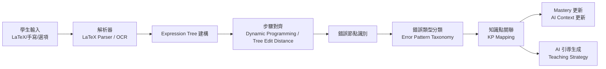

# 數學推理解析

> [!IMPORTANT]
> **狀態**：RESEARCH - 核心研究方向，架構預留，具體實作待技術驗證
> **最後更新**：2026-09-10

---

## 核心目標

將數學解題過程**結構化**、**步驟化**、**可機器理解**，支援：
1. **自動化錯誤定位** - 精確識別學生在哪一步出錯
2. **AI 引導式教學** - 根據錯誤步驟給予針對性支架
3. **模型訓練資料** - 為自有模型提供高品質 Reasoning Trace
4. **知識點掌握度計算** - 細粒度到單一操作層級

---

## Solution Steps 資料結構 (TBD-15)

### 設計原則
- 每一步驟獨立可驗證
- 包含輸入、操作、輸出完整資訊
- 關聯知識點與錯誤類型
- 支援分支/合併 (如分情況討論)

### JSON Schema
```json
{
  "solutionSteps": [
    {
      "stepId": "step_1",
      "stepNumber": 1,
      "description": "移項：將常數項移至右邊",
      "input": "2x + 6 = 14",
      "operation": {
        "type": "TRANSPOSITION",
        "description": "兩邊同減 6",
        "mathematicalRule": "等式性質：兩邊同加/減同一數",
        "operands": ["6", "14"],
        "operator": "-"
      },
      "output": "2x = 8",
      "knowledgePoints": ["TRANSPOSITION", "EQUALITY_PROPERTY"],
      "errorPatterns": [
        {
          "code": "SIGN_ERROR_TRANSPOSE",
          "description": "移項號變錯誤 (如 2x + 6 = 14 → 2x = 14 + 6)",
          "likelihood": 0.35
        },
        {
          "code": "ARITHMETIC_ERROR",
          "description": "運算錯誤 (14 - 6 算錯)",
          "likelihood": 0.15
        }
      ],
      "difficulty": 2,
      "estimatedTimeSeconds": 15
    },
    {
      "stepId": "step_2",
      "stepNumber": 2,
      "description": "兩邊除以係數",
      "input": "2x = 8",
      "operation": {
        "type": "DIVISION",
        "description": "兩邊同除以 2",
        "mathematicalRule": "等式性質：兩邊同乘/除同一非零數",
        "operands": ["2", "8"],
        "operator": "/"
      },
      "output": "x = 4",
      "knowledgePoints": ["DIVISION_PROPERTY", "COEFFICIENT_ISOLATION"],
      "errorPatterns": [
        {
          "code": "DIVISION_ERROR",
          "description": "除法運算錯誤 (8/2 算錯)",
          "likelihood": 0.1
        },
        {
          "code": "FORGET_DIVIDE_COEFFICIENT",
          "description": "忘記除以係數 (直接寫 x = 8)",
          "likelihood": 0.2
        }
      ],
      "difficulty": 1,
      "estimatedTimeSeconds": 10
    },
    {
      "stepId": "step_3",
      "stepNumber": 3,
      "description": "驗算",
      "input": "x = 4",
      "operation": {
        "type": "VERIFICATION",
        "description": "代入原方程檢驗",
        "mathematicalRule": "解的定義",
        "operands": ["2(4) + 6", "14"],
        "operator": "="
      },
      "output": "8 + 6 = 14 ✓",
      "knowledgePoints": ["VERIFICATION"],
      "errorPatterns": [],
      "difficulty": 1,
      "estimatedTimeSeconds": 10
    }
  ],
  "metadata": {
    "totalSteps": 3,
    "estimatedTotalTimeSeconds": 35,
    "overallDifficulty": 2,
    "requiredKnowledgePoints": ["TRANSPOSITION", "DIVISION_PROPERTY", "VERIFICATION"],
    "commonErrorPatterns": ["SIGN_ERROR_TRANSPOSE", "FORGET_DIVIDE_COEFFICIENT"]
  }
}
```

---

## 運算類型分類

| Operation Type | 說明 | 範例 |
|----------------|------|------|
| `DISTRIBUTION` | 分配律展開 | `2(x+3) → 2x+6` |
| `COMBINE_LIKE_TERMS` | 合併同類項 | `2x + 3x → 5x` |
| `TRANSPOSITION` | 移項 | `2x + 6 = 14 → 2x = 8` |
| `DIVISION` / `MULTIPLICATION` | 除以/乘以係數 | `2x = 8 → x = 4` |
| `FACTORIZATION` | 因式分解 | `x² - 4 → (x-2)(x+2)` |
| `SUBSTITUTION` | 代入 | `y = 2x, x = 3 → y = 6` |
| `ELIMINATION` | 消元法 | 聯立方程式消去變數 |
| `SQUARE_ROOT` | 開根號 | `x² = 9 → x = ±3` |
| `QUADRATIC_FORMULA` | 二次公式 | `ax²+bx+c=0 → x = (-b±√(b²-4ac))/2a` |
| `COMPLETING_SQUARE` | 配方法 | `x² + 6x + 9 = (x+3)²` |
| `VERIFICATION` | 驗算 | 代入檢驗 |
| `CASE_ANALYSIS` | 分情況討論 | 絕對值、參數範圍 |
| `GRAPHICAL_INTERPRETATION` | 圖形解讀 | 函數圖形、幾何作圖 |

---

## Expression Tree / Operation Tree (TBD-16)

### 目的
將數學表達式轉為**抽象語法樹 (AST)**，支援：
- 結構化比較 (學生答案 vs 標準答案)
- 自動化錯誤追蹤 (樹節點差異)
- 步驟級推理生成

### 範例：`2(x+3)=14`

```json
{
  "expressionTree": {
    "type": "EQUATION",
    "left": {
      "type": "MULTIPLICATION",
      "left": {"type": "NUMBER", "value": 2},
      "right": {
        "type": "ADDITION",
        "left": {"type": "VARIABLE", "name": "x"},
        "right": {"type": "NUMBER", "value": 3}
      }
    },
    "right": {"type": "NUMBER", "value": 14},
    "operator": "="
  },
  "operationTree": [
    {
      "step": 1,
      "operation": "DISTRIBUTION",
      "targetNode": "left",
      "before": "2 * (x + 3)",
      "after": "2*x + 2*3",
      "rule": "a(b+c) = ab + ac"
    },
    {
      "step": 2,
      "operation": "ARITHMETIC",
      "targetNode": "left.right.right",
      "before": "2*3",
      "after": "6",
      "rule": "算術運算"
    },
    {
      "step": 3,
      "operation": "TRANSPOSITION",
      "targetNode": "left",
      "before": "2x + 6 = 14",
      "after": "2x = 8",
      "rule": "等式兩邊同減 6"
    },
    {
      "step": 4,
      "operation": "DIVISION",
      "targetNode": "left",
      "before": "2x = 8",
      "after": "x = 4",
      "rule": "等式兩邊同除以 2"
    }
  ]
}
```

---

## Mathematical Reasoning Trace (TBD-17)

### 完整推理鏈路記錄格式
供模型訓練、評估、解釋使用

```json
{
  "traceId": "trace_abc123",
  "questionId": "q_linear_001",
  "studentId": "stu_xyz",
  "timestamp": "2026-09-10T10:30:00Z",
  "problem": "2(x+3)=14",
  "expectedSteps": ["ref:solutionSteps"],
  "actualTrace": [
    {
      "stepIndex": 0,
      "studentInput": "2x+6=14",
      "expectedInput": "2(x+3)=14",
      "match": true,
      "type": "INITIAL"
    },
    {
      "stepIndex": 1,
      "studentInput": "2x+3=14",
      "expectedInput": "2x+6=14",
      "match": false,
      "errorDetected": {
        "operation": "DISTRIBUTION",
        "errorType": "MISSING_MULTIPLICATION",
        "description": "分配律遺漏：2×3 未執行",
        "nodePath": "left.right.right",
        "severity": "CRITICAL"
      },
      "aiIntervention": {
        "triggered": true,
        "promptType": "SCAFFOLD_QUESTION",
        "content": "請仔細看左邊：2 乘以 (x+3)，裡面有兩項，都要乘到喔！"
      }
    },
    {
      "stepIndex": 2,
      "studentInput": "2x+6=14",
      "expectedInput": "2x+6=14",
      "match": true,
      "type": "CORRECTION"
    },
    {
      "stepIndex": 3,
      "studentInput": "2x=8",
      "expectedInput": "2x=8",
      "match": true,
      "type": "TRANSPOSITION"
    },
    {
      "stepIndex": 4,
      "studentInput": "x=4",
      "expectedInput": "x=4",
      "match": true,
      "type": "DIVISION"
    }
  ],
  "outcome": "SUCCESS_WITH_GUIDANCE",
  "totalTimeSeconds": 120,
  "hintsUsed": 1,
  "finalMasteryImpact": {
    "DISTRIBUTIVE_LAW": -5,
    "TRANSPOSITION": +2,
    "DIVISION_PROPERTY": +3
  }
}
```

---

## 學生答案解析管線



---

## 資料庫儲存對應

| 資料結構 | 對應 Table | 欄位 |
|----------|------------|------|
| Solution Steps | `Question.solutionSteps` | JSON |
| Expression Tree | `Question.expressionTree` | JSON (新增欄位) |
| Operation Tree | `Question.operationTree` | JSON (新增欄位) |
| Reasoning Trace | `QuestionAttempt.errorAnalysis` | JSON |
| Error Pattern 定義 | `KnowledgePoint.errorPatterns` | JSON |

---

## 研究待驗證項目

| 研究課題 | 狀態 | 優先級 | 備註 |
|----------|------|--------|------|
| LaTeX Parser 選型 (KaTeX / MathJax / 自建) | RESEARCH | P1 | 需支援不完整/錯誤 LaTeX |
| 手寫數學識別 (OCR) | RESEARCH | P2 | 可選，Phase 7+ |
| Tree Edit Distance 演算法優化 | RESEARCH | P1 | 步驟對齊核心 |
| 錯誤類型自動歸類模型 | RESEARCH | P1 | 微調小型分類器 |
| Reasoning Trace 格式標準化 | RESEARCH | P1 | 訓練資料標準 |

---

## 相關文檔

- [[03_Math_Teaching/Operation Decomposition|運算拆解]]
- [[03_Math_Teaching/Error Pattern|錯誤類型分類]]
- [[03_Math_Teaching/Math Curriculum|數學課綱架構]]
- [[08_Database/Schema|資料庫 Schema]]
- [[13_Decisions/TBD#TBD-15|TBD-15: Solution Steps 結構]]
- [[13_Decisions/TBD#TBD-16|TBD-16: Expression Tree]]
- [[13_Decisions/TBD#TBD-17|TBD-17: Reasoning Trace]]
- [[06_Data/Training Data|訓練資料格式]]

---

## 更新記錄

| 日期 | 版本 | 變更 | 作者 |
|------|------|------|------|
| 2026-09-10 | v1.0 | 初始研究框架 | AI 系統架構師 |