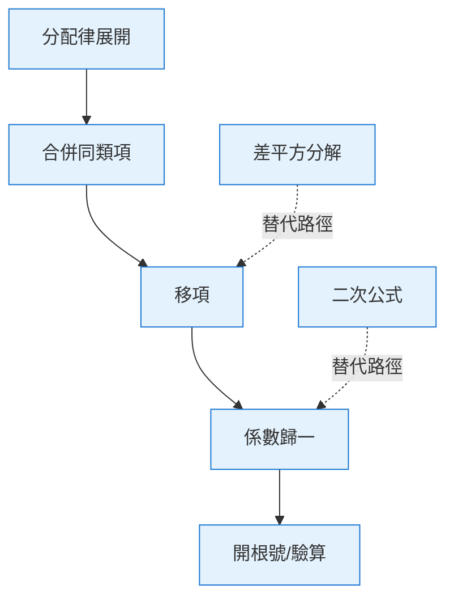

# 運算拆解

> [!IMPORTANT]
> **狀態**：RESEARCH - 核心研究方向，支援 Math Reasoning 細粒度實作
> **最後更新**：2026-09-10

---

## 核心概念

將數學運算拆解為**原子操作**，每個操作具備：
- 明確的數學定義
- 可驗證的輸入輸出
- 關聯的知識點
- 可能的錯誤模式
- 適用的教學支架

---

## 原子操作定義表

### 代數運算類

| Operation ID | 名稱 | 數學定義 | 輸入範例 | 輸出範例 | 關鍵知識點 |
|--------------|------|----------|----------|----------|------------|
| OP_ALG_001 | 分配律展開 | a(b+c) = ab + ac | 2(x+3) | 2x+6 | DISTRIBUTIVE_LAW |
| OP_ALG_002 | 合併同類項 | ax + bx = (a+b)x | 2x + 3x | 5x | COMBINE_LIKE_TERMS |
| OP_ALG_003 | 移項 (加減) | a + b = c → a = c - b | 2x + 6 = 14 | 2x = 8 | TRANSPOSITION |
| OP_ALG_004 | 係數歸一 (乘除) | ax = b → x = b/a (a≠0) | 2x = 8 | x = 4 | DIVISION_PROPERTY |
| OP_ALG_005 | 因式分解 (差平方) | a² - b² = (a-b)(a+b) | x² - 9 | (x-3)(x+3) | FACTORIZATION_DIFF_SQ |
| OP_ALG_006 | 因式分解 (完全平方) | a² ± 2ab + b² = (a±b)² | x² + 6x + 9 | (x+3)² | FACTORIZATION_PERF_SQ |
| OP_ALG_007 | 因式分解 (交叉相乘) | ax²+bx+c = (px+q)(rx+s) | 2x²+7x+3 | (2x+1)(x+3) | FACTORIZATION_CROSS |
| OP_ALG_008 | 二次公式 | ax²+bx+c=0 → x = (-b±√Δ)/2a | x²-5x+6=0 | x=2, x=3 | QUADRATIC_FORMULA |
| OP_ALG_009 | 配方法 | x²+bx = (x+b/2)² - (b/2)² | x²+6x | (x+3)²-9 | COMPLETING_SQUARE |
| OP_ALG_010 | 開根號 | x² = a → x = ±√a (a≥0) | x² = 16 | x = ±4 | SQUARE_ROOT |
| OP_ALG_011 | 絕對值去除 | \|x\| = a → x = ±a (a≥0) | \|x-2\| = 3 | x=5, x=-1 | ABSOLUTE_VALUE |
| OP_ALG_012 | 有理方程式通分 | a/b = c/d → ad = bc | x/2 = 3/4 | 4x = 6 | RATIONAL_EQUATION |
| OP_ALG_013 | 根號方程式去根 | √f(x) = g(x) → f(x) = g(x)², g(x)≥0 | √(x+1) = 3 | x+1 = 9, x≥-1 | RADICAL_EQUATION |

### 函數與圖形類

| Operation ID | 名稱 | 數學定義 | 輸入範例 | 輸出範例 | 關鍵知識點 |
|--------------|------|----------|----------|----------|------------|
| OP_FUN_001 | 函數代入 | f(x) = 表達式 → f(a) | f(x)=2x+1, x=3 | f(3)=7 | FUNCTION_EVALUATION |
| OP_FUN_002 | 線性函數圖形特徵 | y = ax+b, 斜率 a, 截距 b | y = 2x+3 | 斜率2, y截距3 | LINEAR_FUNCTION_GRAPH |
| OP_FUN_003 | 二次函數頂點式 | y = a(x-h)²+k, 頂點(h,k) | y = 2(x-1)²+3 | 頂點(1,3) | QUADRATIC_VERTEX |
| OP_FUN_004 | 二次函數判別式 | Δ = b²-4ac 判斷根數 | x²-4x+4=0 | Δ=0, 一重根 | QUADRATIC_DISCRIMINANT |
| OP_FUN_005 | 函數平移 | f(x) → f(x-h)+k | y = x² → y = (x-2)²+3 | 右移2, 上移3 | FUNCTION_TRANSLATION |
| OP_FUN_006 | 反函數求解 | y = f(x) → x = f⁻¹(y) | y = 2x+3 | x = (y-3)/2 | INVERSE_FUNCTION |

### 幾何運算類

| Operation ID | 名稱 | 數學定義 | 輸入範例 | 輸出範例 | 關鍵知識點 |
|--------------|------|----------|----------|----------|------------|
| OP_GEO_001 | 三角形內角和 | ∠A+∠B+∠C = 180° | ∠A=50°, ∠B=60° | ∠C=70° | TRIANGLE_ANGLE_SUM |
| OP_GEO_002 | 相似三角形比例 | 對應邊成比例 | △ABC ~ △DEF, AB=3, DE=6, BC=4 | EF = 8 | TRIANGLE_SIMILARITY |
| OP_GEO_003 | 勾股定理 | a²+b²=c² (直角三角形) | a=3, b=4 | c=5 | PYTHAGOREAN |
| OP_GEO_004 | 圓周角定理 | 圓周角 = 1/2 圓心角 | 圓心角 80° | 圓周角 40° | CIRCLE_ANGLE |
| OP_GEO_005 | 圓切線性質 | 切線 ⊥ 半徑 | 切點 A, 圓心 O | OA ⊥ 切線 | TANGENT_PROPERTY |
| OP_GEO_006 | 平行線性質 | 同位角相等/內錯角相等/內角互補 | 平行線切截 | 角度關係 | PARALLEL_LINES |
| OP_GEO_007 | 三角形合同判定 | SSS/SAS/ASA/AAS/HL | 兩邊夾角對應相等 | 兩三角形合同 | TRIANGLE_CONGRUENCE |

### 統計與機率類

| Operation ID | 名稱 | 數學定義 | 輸入範例 | 輸出範例 | 關鍵知識點 |
|--------------|------|----------|----------|----------|------------|
| OP_STA_001 | 平均數 | μ = Σxᵢ/n | 2,4,6,8 | 5 | MEAN |
| OP_STA_002 | 標準差 | σ = √(Σ(xᵢ-μ)²/n) | 2,4,6,8 | ≈2.236 | STD_DEV |
| OP_STA_003 | 基本機率 | P(A) = 有利情況/所有情況 | 擲骰子出 4 | 1/6 | BASIC_PROB |
| OP_STA_004 | 條件機率 | P(A\|B) = P(A∩B)/P(B) | P(A)=0.3, P(B)=0.5, P(A∩B)=0.15 | 0.5 | CONDITIONAL_PROB |
| OP_STA_005 | 貝氏定理 | P(A\|B) = P(B\|A)P(A)/P(B) | 疾病篩檢 | 後驗機率 | BAYES |
| OP_STA_006 | 期望值 | E(X) = ΣxᵢP(xᵢ) | 投資報酬率分佈 | 期望報酬 | EXPECTED_VALUE |

---

## 操作鏈與依賴關係



---

## 錯誤模式對應表 (每操作)

### OP_ALG_001: 分配律展開
| 錯誤代碼 | 錯誤描述 | 學生範例 | 機率 | 教學支架 |
|-----------|----------|----------|------|----------|
| ERR_DIST_01 | 遺漏項次乘法 | 2(x+3) = 2x+3 | 0.45 | "括號裡有兩項，都要乘到喔！" |
| ERR_DIST_02 | 符號錯誤 | -2(x-3) = -2x-6 | 0.25 | "負號也要分配進去" |
| ERR_DIST_03 | 係數遺漏 | (x+3) = x+3 (忘記隱性 1) | 0.15 | "沒寫係數代表是 1" |
| ERR_DIST_04 | 運算順序錯 | 2(x+3) = 2x+3*2 | 0.10 | "先展開再算數字" |

### OP_ALG_003: 移項
| 錯誤代碼 | 錯誤描述 | 學生範例 | 機率 | 教學支架 |
|-----------|----------|----------|------|----------|
| ERR_TRANS_01 | 移項不變號 | 2x+6=14 → 2x=14+6 | 0.50 | "過河拆橋，號要變！" |
| ERR_TRANS_02 | 只移一邊 | 2x+6=14 → 2x=8 (正確但跳過步驟) | 0.20 | "寫出移項過程比較清楚" |
| ERR_TRANS_03 | 運算錯誤 | 2x+6=14 → 2x=20 | 0.15 | "14-6 等於幾？" |
| ERR_TRANS_04 | 移項方向反 | 2x=14-6 → 2x+6=14 | 0.10 | "我們是要解 x，所以要把數字移過去" |

### OP_ALG_004: 係數歸一
| 錯誤代碼 | 錯誤描述 | 學生範例 | 機率 | 教學支架 |
|-----------|----------|----------|------|----------|
| ERR_DIV_01 | 忘記除係數 | 2x=8 → x=8 | 0.40 | "x 前面有 2，要把它拿掉怎麼做？" |
| ERR_DIV_02 | 除法運算錯 | 2x=8 → x=6 | 0.25 | "8 除以 2 等於幾？" |
| ERR_DIV_03 | 除以零 | 0x=8 → x=8/0 | 0.05 | "0 乘以任何數都是 0，這題無解喔" |
| ERR_DIV_04 | 符號錯誤 | -2x=8 → x=4 | 0.20 | "負號也要帶著除" |

---

## 教學支架模板

### 支架層級 (遞減)

```typescript
interface ScaffoldTemplate {
  operationId: string;
  errorCode: string;
  levels: {
    L1_HINT: string;           // 輕微提示
    L2_GUIDING_QUESTION: string; // 引導性問題
    L3_ANALOGY: string;        // 類比/生活例子
    L4_STEP_BY_STEP: string;   // 逐步示範
    L5_DIRECT_INSTRUCTION: string; // 直接告知 (最後手段)
  };
}
```

### 範例：ERR_DIST_01 (遺漏項次乘法)

```json
{
  "operationId": "OP_ALG_001",
  "errorCode": "ERR_DIST_01",
  "levels": {
    "L1_HINT": "括號裡面有幾項？每一項都要乘到喔！",
    "L2_GUIDING_QUESTION": "2 乘以 (x+3)，裡面有 x 和 3 兩項，請問 2 要乘給誰？",
    "L3_ANALOGY": "就像發糖果：2 個袋子，每袋裡有 1 颗巧克力和 3 顆糖，總共要發多少？",
    "L4_STEP_BY_STEP": "第一步：2 × x = 2x\n第二步：2 × 3 = 6\n第三步：合併 → 2x + 6",
    "L5_DIRECT_INSTRUCTION": "分配律：a(b+c) = ab + ac。這題 a=2, b=x, c=3，所以 2(x+3) = 2x + 6"
  }
}
```

---

## 資料庫儲存建議

### KnowledgePoint 擴充欄位
```prisma
model KnowledgePoint {
  // ... 既有欄位
  atomicOperations   String[]  @default([])  // 關聯的 Operation IDs
  scaffoldTemplates  Json?                 // 教學支架模板
}
```

### Question 解析細節
```prisma
model Question {
  // ... 既有欄位
  operationChain     Json?   // 解題所需操作鏈 [OP_ALG_001, OP_ALG_003, OP_ALG_004]
  operationDetails   Json?   // 每操作的輸入輸出、預期錯誤
}
```

---

## 研究待驗證

| 研究項目 | 狀態 | 備註 |
|----------|------|------|
| 操作顆粒度最佳化 (太細 vs 太粗) | RESEARCH | 平衡精度與複雜度 |
| 操作鏈自動生成 (從 Solution Steps) | RESEARCH | 規則引擎 / LLM 輔助 |
| 錯誤模式機率學習 (從實際資料) | RESEARCH | 貝氏更新 |
| 多語言支援 (繁中/簡中/英文) | RESEARCH | 支架模板國際化 |

---

## 相關文檔

- [[03_Math_Teaching/Math Reasoning|數學推理解析]]
- [[03_Math_Teaching/Error Pattern|錯誤類型分類]]
- [[03_Math_Teaching/Math Curriculum|數學課綱架構]]
- [[04_AI/AI Teaching Principles|AI 教學原則]]
- [[13_Decisions/TBD#TBD-15|TBD-15: Solution Steps]]
- [[13_Decisions/TBD#TBD-16|TBD-16: Expression Tree]]

---

## 更新記錄

| 日期 | 版本 | 變更 | 作者 |
|------|------|------|------|
| 2026-09-10 | v1.0 | 初始操作定義表 | AI 系統架構師 |