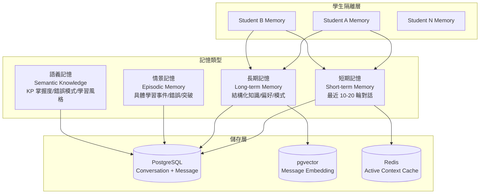
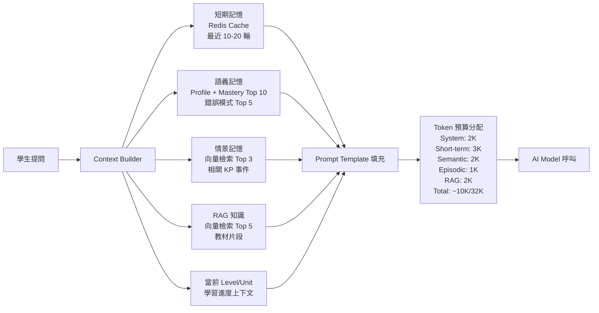

# 學生 AI 記憶系統

> [!IMPORTANT]
> **狀態**：PROPOSED - TBD-08 待決定核心策略
> **最後更新**：2026-09-10
> **核心決策**：[[13_Decisions/Decision Log#DEC-20260910-018|DEC-018]] 每個學生獨立記憶

---

## 記憶架構總覽



---

## 記憶類型詳細設計

### 1. 短期記憶 (Short-term Memory / Working Memory)

| 特性 | 設計 |
|------|------|
| **容量** | 最近 10-20 輪對話 (約 4K-8K tokens) |
| **儲存** | Redis Cache (TTL 30min 活躍期) + PostgreSQL Message 表 |
| **用途** | 當前對話連貫性、指代消解、上下文理解 |
| **存取** | 每輪對話自動載入、FIFO 淘汰 |

**資料結構**:
```json
{
  "studentId": "stu_123",
  "conversationId": "conv_456",
  "messages": [
    {"role": "user", "content": "這題怎麼解？", "timestamp": "..."},
    {"role": "assistant", "content": "我們來看看...", "timestamp": "..."}
  ],
  "summary": "學生詢問一元一次方程式 2(x+3)=14 解法，目前引導至移項步驟",
  "activeKPs": ["TRANSPOSITION", "DISTRIBUTIVE_LAW"],
  "currentPhase": "GUIDE"
}
```

### 2. 長期記憶 - 語義記憶 (Semantic Memory)

| 特性 | 設計 |
|------|------|
| **內容** | 學生畫像、KP 掌握度、錯誤模式、學習風格、偏好 |
| **儲存** | PostgreSQL (StudentLearningProfile, StudentKnowledgePoint, WrongQuestion) + 向量索引 |
| **更新** | 每次對話/作答後增量更新、每日批次重算 |
| **用途** | AI Context 注入、個人化參數、長期追蹤 |

**核心欄位** (對應資料庫):
```typescript
interface SemanticMemory {
  // 學生畫像
  profile: {
    grade: number;
    learningStyle: "VISUAL" | "VERBAL" | "KINESTHETIC" | "MIXED";
    pacePreference: "SLOW" | "NORMAL" | "FAST";
    frustrationTolerance: "LOW" | "MEDIUM" | "HIGH";
    preferredScaffoldTypes: string[]; // ["ANALOGY", "GUIDING_QUESTION", ...]
  };
  
  // KP 掌握度快照
  masterySnapshot: {
    topWeak: Array<{kpId, score, trend}>;
    topStrong: Array<{kpId, score}>;
    recentChanges: Array<{kpId, delta, reason}>;
  };
  
  // 錯誤模式
  errorPatterns: {
    frequentCodes: Array<{code, count, lastSeen}>;
    conceptualGaps: string[]; // KP IDs
    proceduralWeaknesses: string[]; // Operation IDs
  };
  
  // 學習歷程摘要
  learningJourney: {
    totalConversations: number;
    totalQuestionsAsked: number;
    topicsCovered: string[];
    milestones: Array<{date, event, kpId}>; // 如: 首次掌握分配律
  };
}
```

### 3. 長期記憶 - 情景記憶 (Episodic Memory)

| 特性 | 設計 |
|------|------|
| **內容** | 具體學習事件：重要突破、反覆卡關、精彩提問、情緒轉折 |
| **儲存** | PostgreSQL (Message.metadata + 專用 EpisodicEvent 表) |
| **索引** | 向量嵌入 (語義檢索) + 時間索引 + KP 標籤 |
| **用途** | 長期回顧、「記得上次你...」、「學習軌跡視覺化」 |

**事件類型**:
```typescript
type EpisodicEventType = 
  | "BREAKTHROUGH"      // 突然理解難點
  | "REPEATED_STRUGGLE" // 同一錯誤 3+ 次
  | "EXCELLENT_QUESTION" // 深度好問題
  | "FRUSTRATION_SPIKE" // 挫折情緒上升
  | "MILESTONE"         // 完成單元/通過測驗
  | "STRATEGY_CHANGE"   // 學習策略改變;

interface EpisodicEvent {
  id: string;
  studentId: string;
  type: EpisodicEventType;
  timestamp: DateTime;
  conversationId: string;
  messageIds: string[];
  kpIds: string[];
  description: string; // 自然語言摘要
  significance: number; // 0-1 重要性
  embedding: number[]; // 向量
}
```

---

## Context Building 管線 (每輪對話)



### Token 預算分配策略

| 記憶來源 | Token 配額 | 選擇策略 | 優先級 |
|----------|------------|----------|--------|
| System Prompt | 2,000 | 固定 | P0 |
| 短期記憶 | 3,000 | 最近 N 輪，優先保留完整輪次 | P0 |
| 語義記憶 | 2,000 | Top Weak/Strong KP + 錯誤模式摘要 | P1 |
| 情景記憶 | 1,000 | 向量相似度 Top 3 (與當前問題相關) | P2 |
| RAG 知識 | 2,000 | 向量檢索 Top 5 + 重排序 | P1 |
| 學習進度 | 500 | 當前 Level/Unit/影片進度 | P0 |
| **總計** | **~10,500** | 預留給模型生成 | - |

---

## 記憶更新機制

### 觸發時機
| 事件 | 更新範圍 | 延遲 |
|------|----------|------|
| 每輪對話結束 | 短期記憶、情景事件偵測 | 即時 (<100ms) |
| QuestionAttempt 提交 | Mastery、錯誤模式、語義記憶 | 近即時 (<1s) |
| Level 完成 | 學習軌跡、里程碑 | 即時 |
| 每日批次 | Mastery 重算、趨勢分析、聚類 | 每日 03:00 |
| 週期性 | 模型蒸餾/壓縮、舊記憶歸檔 | 每週 |

### 更新流程
```
QuestionAttempt
    ↓
錯誤分析 → Error Code 識別
    ↓
更新 StudentKnowledgePoint (Mastery 重算 TBD-02)
    ↓
更新 WrongQuestion (Upsert)
    ↓
更新 StudentLearningProfile (errorPatterns, weakAreas)
    ↓
偵測情景事件 (REPEATED_STRUGGLE / BREAKTHROUGH)
    ↓
寫入 EpisodicEvent + 向量化
    ↓
更新 Redis 短期記憶摘要
```

---

## 隱私與合規 (TBD-21)

| 原則 | 實作 |
|------|------|
| **資料最小化** | 僅保留教學必要欄位，不記錄無關個資 |
| **目的限制** | 僅用於教學個人化、品質改善、學生自查 |
| **保存期限** | 短期: 30天無活躍自動刪除；長期: 學生帳號存續期間 |
| **刪除權** | 學生可隨時要求刪除所有對話記憶 (GDPR Art.17) |
| **可攜權** | 匯出完整對話歷史 (JSON/Markdown/PDF) |
| **加密** | 靜態加密 (AES-256) + 傳輸加密 (TLS 1.3) |
| **存取控制** | 僅 AI Service + 學生本人可讀，內部人員需審計日誌 |

---

## 記憶壓縮與歸檔策略 (TBD-08 待決定)

| 策略 | 優點 | 缺點 | 適用場景 |
|------|------|------|----------|
| **全量保存** | 完整可追溯、無資訊損失 | 儲存成本高、Context 噪音多 | 隱私要求高、資料量小 |
| **LLM 摘要壓縮** | 保留語義、大幅減少 Token | 可能遺漏細節、需額外 LLM 呼叫 | 長期對話、Token 預算緊 |
| **結構化萃取** (KP/錯誤/偏好) | 極度精簡、查詢快 | 失去對話語氣/情感脈絡 | 生產環境、大規模 |
| **混合策略** (近期全量 + 歷史結構化) | 平衡 | 實作複雜 | **推薦** |

### 推薦混合策略細節
```
近期 30 天 / 最近 50 輪對話: 完整保存 (PostgreSQL + Redis)
30-180 天: LLM 生成摘要 + 關鍵事件保留
180 天以上: 僅保留結構化記憶 (Profile + Mastery + Episodic Events)
學生要求刪除: 立即硬刪除所有關聯資料
```

---

## 評測與監控

| 指標 | 目標 | 測量方式 |
|------|------|----------|
| Context 建構延遲 | < 200ms | API 計時 |
| 記憶命中率 (相關資訊在 Context 中) | > 90% | 人工抽樣評測 |
| 記憶一致性 (短期/長期無衝突) | 100% | 自動化檢查 |
| 儲存成本/學生/月 | < $0.10 | 成本追蹤 |
| 刪除請求響應時間 | < 1小時 | 合規審計 |

---

## 相關文檔

- [[04_AI/AI Teaching Principles|AI 教學原則]]
- [[04_AI/AI Model Strategy|AI 模型策略]]
- [[08_Database/Schema|資料庫 Schema: Conversation/Message/Profile]]
- [[13_Decisions/TBD#TBD-08|TBD-08: Memory 保存策略]]
- [[13_Decisions/TBD#TBD-21|TBD-21: GDPR/個資法]]
- [[11_Security/AI Data Privacy|AI 資料隱私]]

---

## 更新記錄

| 日期 | 版本 | 變更 | 作者 |
|------|------|------|------|
| 2026-09-10 | v1.0 | 初始記憶架構設計 | AI 系統架構師 |