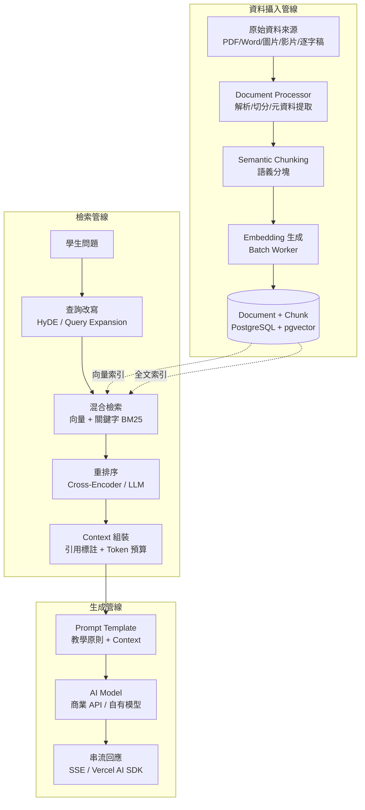
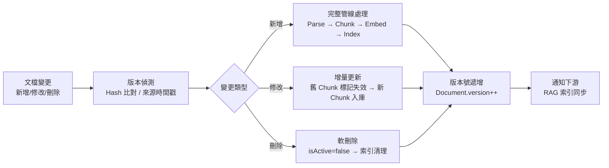

# RAG 架構設計

> [!IMPORTANT]
> **狀態**：RESEARCH - TBD-07 待決定核心技術選型
> **最後更新**：2026-09-10
> **核心決策**：[[13_Decisions/Decision Log#DEC-20260910-021|DEC-021]], [[13_Decisions/Decision Log#DEC-20260910-022|DEC-022]]
> **關鍵原則**：RAG ≠ Question Database，**完全分離**

---

## 架構總覽



---

## 關鍵設計決策

### RAG vs Question Database 分離

| 維度 | RAG Knowledge Base | Question Database |
|------|-------------------|-------------------|
| **用途** | AI 回答參考知識、教學內容解釋 | 出題、測驗、錯題記錄 |
| **資料來源** | 教科書、講義、教師解答、影片逐字稿 | 題目、選項、答案、解析、KP 標籤 |
| **結構** | Document → Chunk (語義分塊) | Question → KP Mapping → LevelQuestion |
| **檢索方式** | 向量語義檢索 + 關鍵字 | 精確 KP/難度/類型篩選 + 隨機抽樣 |
| **更新頻率** | 低 (教材版本更新) | 高 (持續新增題目、標籤修正) |
| **品質要求** | 召回率高、覆蓋面廣 | 精確度高、標籤正確、難度校準 |
| **資料表** | Document, DocumentChunk | Question, KnowledgePoint, LevelQuestion |

> **嚴禁混用**：Question 不存入 RAG，Document 不用於出題

---

## 文檔處理管線

### 支援格式與解析策略

| 格式 | 解析工具 | 輸出內容 | 特殊處理 |
|------|----------|----------|----------|
| **PDF** | PyMuPDF / pdfplumber | 文字、表格結構、圖片位置、頁碼 | 數學公式 OCR (Mathpix/自建)、版面分析 |
| **Word (.docx)** | python-docx | 標題層級、段落、表格、圖片 | 公式轉 LaTeX (OMML → LaTeX) |
| **純文字 (.txt)** | 直接讀取 | 文字 | 編碼偵測、分段 |
| **圖片 (.png/.jpg)** | PaddleOCR / Tesseract | 文字、數學公式區域 | 數學區域裁剪 → 專用 OCR |
| **影片 (.mp4)** | Whisper (large-v3) | 逐字稿 + 時間軸 | 語者分離、章節標記 |
| **LaTeX (.tex)** | 直接解析 | 結構化數學內容 | 保留原始 LaTeX |

### Semantic Chunking 策略 (TBD-07)

```typescript
interface ChunkingConfig {
  // 目標 chunk 大小 (tokens)
  targetChunkSize: 512;        // TBD: 256 / 512 / 1024
  // 重疊大小
  overlapSize: 64;             // TBD: 10-20% of target
  // 最小 chunk
  minChunkSize: 100;
  // 最大 chunk
  maxChunkSize: 1024;
  
  // 分割優先級 (由高到低)
  splitPriority: [
    "HEADING_H1",      // 一級標題
    "HEADING_H2",      // 二級標題
    "HEADING_H3",      // 三級標題
    "EXAMPLE_BLOCK",   // 例題/範例區塊
    "FORMULA_BLOCK",   // 獨立公式區塊
    "PARAGRAPH",       // 自然段落
    "SENTENCE"         // 句子 (最後手段)
  ];
  
  // 特殊規則
  rules: {
    keepFormulaWithContext: true;      // 公式保留前後文
    keepExampleComplete: true;         // 例題完整保留
    splitTableByRow: false;            // 表格整體保留
    maxChunkPerDocument: 1000;         // 單文檔最大 chunk 數
  };
}
```

### Chunk Metadata 標準

```json
{
  "chunkId": "chk_abc123",
  "documentId": "doc_textbook_math_jh_1",
  "chunkIndex": 15,
  "content": "## 1.3 一元一次方程式的解法\n\n**移項法**是解一元一次方程式最常用的方法...\n\n### 例題 1\n解方程式：2(x+3)=14\n\n**解**：\n2(x+3)=14\n2x+6=14  ← 分配律\n2x=8      ← 移項\nx=4       ← 係數歸一",
  "metadata": {
    "headingLevel": 2,
    "headingPath": ["第1章 代數基礎", "1.3 一元一次方程式的解法"],
    "knowledgePoints": ["TRANSPOSITION", "DISTRIBUTIVE_LAW", "DIVISION_PROPERTY"],
    "formulas": ["2(x+3)=14", "2x+6=14", "2x=8", "x=4"],
    "exampleId": "ex_1_3_1",
    "exampleType": "WORKED_EXAMPLE",
    "gradeLevel": 7,
    "difficulty": 2,
    "pageNumber": 45,
    "videoTimestamp": null,
    "source": "TEXTBOOK",
    "version": "2024_v1"
  },
  "embedding": "[0.123, -0.456, ...]",
  "createdAt": "2026-09-10T10:00:00Z"
}
```

---

## 檢索管線詳細設計

### 1. 查詢改寫

```typescript
interface QueryRewrite {
  // 原始學生問題
  originalQuery: "這題為什麼要先乘開括號？";
  
  // 改寫策略
  strategies: [
    "HYDE",                    // 假設性文檔嵌入
    "QUERY_EXPANSION",         // 同義詞/相關詞擴展
    "STEP_DECOMPOSITION",      // 多步驟問題分解
    "KP_EXTRACTION"            // 知識點實體抽取
  ];
  
  // 改寫結果
  rewrittenQueries: [
    "分配律 定義 數學",
    "2(x+3) 展開 步驟",
    "一元一次方程式 解法 分配律"
  ];
}
```

### 2. 混合檢索

```typescript
interface HybridSearch {
  // 向量檢索
  vectorSearch: {
    topK: 20,
    metric: "cosine",
    filter: {
      gradeLevel: { $lte: studentGrade },  // 不超過學生年級
      subject: "MATH",
      // unitCode: currentUnitCode (可選)
    }
  };
  
  // 關鍵字檢索 (BM25)
  keywordSearch: {
    topK: 20,
    fields: ["content^2", "headingPath^1.5", "formulas^1.5", "knowledgePoints^2"],
    language: "zh"
  };
  
  // 融合策略
  fusion: {
    method: "RRF",           // Reciprocal Rank Fusion
    k: 60,                   // RRF 參數
    weights: { vector: 0.6, keyword: 0.4 }
  };
}
```

### 3. 重排序

```typescript
interface RerankConfig {
  // Cross-Encoder 模型 (推薦)
  crossEncoder: {
    model: "bge-reranker-v2-m3",  // 或自建微調
    topK: 10,
    batchSize: 32
  };
  
  // 或 LLM 重排序 (成本高、品質好)
  llmRerank: {
    model: "gpt-4o-mini",  // 或小型模型
    prompt: "評分這些文檔對回答問題的相關性 1-10",
    topK: 5
  };
  
  // 最終選擇
  finalTopK: 5;
  minScoreThreshold: 0.3;
}
```

### 4. Context 組裝與引用標註

```typescript
interface ContextAssembly {
  retrievedChunks: RetrievedChunk[];
  tokenBudget: 2000;  // TBD-07
  
  assemblyStrategy: {
    // 優先級排序
    priority: ["RERANK_SCORE", "KP_RELEVANCE", "RECENCY", "AUTHORITY"];
    
    // 引用格式
    citationFormat: "[Doc: {title}, Chunk: {chunkIndex}, KP: {kpIds}]";
    
    // 截斷策略
    truncation: "HEAD_TAIL";  // 保留開頭結構 + 關鍵內容
  };
  
  output: {
    contextString: "參考資料：\n[1] 分配律定義...\n[2] 例題 2(x+3)=14...",
    citations: [
      {docId, chunkIndex, title, kpIds, relevanceScore}
    ];
  };
}
```

---

## Embedding Model 評估 (TBD-07)

| 模型 | 維度 | 語言支援 | 數學能力 | 推理速度 | License | 部署成本 |
|------|------|----------|----------|----------|---------|----------|
| **BGE-M3** | 1024 | 100+ (含中文) | 好 | 快 | MIT | 低 |
| **E5-Mistral-7B** | 4096 | 100+ | 極好 | 中 | Apache 2.0 | 中 |
| **Voyage-3-Large** | 1024 | 專注程式/數學 | 極好 | 快 | 商業 | 高 |
| **OpenAI text-embedding-3-large** | 3072 | 好 | 好 | API | 商業 | 按用量 |
| **Jina Embeddings v3** | 1024 | 89 種語言 | 好 | 快 | CC BY-NC 4.0 | 低 |

> **建議**: 起階段用 BGE-M3 (開源、免費、中文好)；Phase 9 對齊自有模型 Embedding

---

## Vector Database 選型 (TBD-07)

| 方案 | 優點 | 缺點 | 適用階段 |
|------|------|------|----------|
| **PostgreSQL + pgvector** | 已有 PG、運維簡單、ACID、混合查詢 | 向量索引效能較專用 DB 低、無分散式 | **Phase 1-8** ✅ |
| **Pinecone** | 托管、自動擴縮、混合檢索內建 | 成本高、Vendor Lock-in | Phase 9+ 如需極致效能 |
| **Weaviate** | 開源可自管、GraphQL、混合檢索強 | 運維複雜度中 | 替代方案 |
| **Milvus** | 高效能、分散式、多租戶 | 運維重、資源需求大 | 大規模 Phase 10+ |
| **Qdrant** | Rust 實作、快、Payload 過濾 | 生態較新 | 觀察中 |

> **決策**: Phase 1-8 使用 **pgvector (HNSW 索引)**，滿足 100K+ chunks 需求

---

## 增量更新與版本控制



---

## 評測指標

| 指標 | 定義 | 目標值 | 測試方法 |
|------|------|--------|----------|
| **Recall@K** | 相關文檔在 Top-K 中被召回 | @5 > 85%, @10 > 95% | 人工標註測試集 200 題 |
| **Precision@K** | Top-K 中相關文檔比例 | @5 > 60% | 同上 |
| **MRR** | 平均倒數排名 | > 0.7 | 同上 |
| **端到端延遲** | 問題 → Context 完成 | P95 < 2s | 生產監控 |
| **回答引用率** | AI 回答包含引用標註 | 100% (教學類) | 自動檢查 |
| **幻覺率** | 引用內容與回答不符 | < 2% | 人工抽樣 |

---

## 相關文檔

- [[05_RAG/RAG vs Question DB|RAG 與題庫分離]]
- [[04_AI/AI Model Strategy|AI 模型策略]]
- [[04_AI/AI Teaching Principles|AI 教學原則]]
- [[06_Data/Training Data|訓練資料]]
- [[06_Data/Data Pipeline|資料管線]]
- [[08_Database/Schema|資料庫 Schema: Document/Chunk]]
- [[13_Decisions/TBD#TBD-07|TBD-07: RAG 技術選型]]
- [[14_Research/RAG Research|RAG 研究]]
- [[14_Research/Embedding Research|Embedding 研究]]
- [[14_Research/Vector Database Research|向量資料庫研究]]

---

## 更新記錄

| 日期 | 版本 | 變更 | 作者 |
|------|------|------|------|
| 2026-09-10 | v1.0 | 初始架構設計 | AI 系統架構師 |