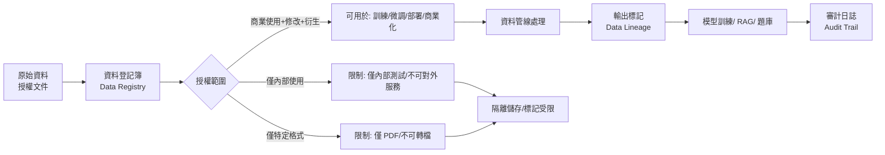

# 訓練資料總覽

> [!IMPORTANT]
> **狀態**：CONFIRMED - [[13_Decisions/Decision Log#DEC-20260910-021|DEC-021]]
> **最後更新**：2026-09-10

---

## 資料資產清單

已取得補習班授權，擁有近四年完整教學資料：

| 類別 | 年代範圍 | 科目 | 格式 | 預估量級 | 授權狀態 |
|------|----------|------|------|----------|----------|
| **課本** | 2021-2024 | 國文、英文、數學、自然、社會 | PDF | ~500 本 | ✅ 授權 |
| **習作/作業本** | 2021-2024 | 全科 | PDF | ~300 本 | ✅ 授權 |
| **歷屆試題** | 2015-2024 | 國中會考、高中學測/指考 | PDF/Word | ~2000 份 | ✅ 授權 |
| **補習班講義** | 2020-2024 | 數學為主、其他科少量 | PDF/Word | ~1000 份 | ✅ 授權 |
| **題庫** | 累積至今 | 數學為主 | JSON/Excel/Word | ~50萬 題 | ✅ 授權 |
| **教師解答** | 配合上述 | 全科 | PDF/Word/圖片 | ~10萬 份 | ✅ 授權 |
| **教學影片** | 2020-2024 | 數學為主 | MP4 | ~5000 支 (約 2000 小時) | ✅ 授權 |

**總資料量**：約 **3-5 TB** (含影片)

---

## 資料分類與用途對照

| 資料類型 | RAG 知識庫 | 題庫系統 | 模型訓練 (SFT/DPO) | 內容製作 |
|----------|------------|----------|---------------------|----------|
| 課本 | ✅ 核心來源 | ❌ | ✅ 領域知識注入 | ✅ 影片腳本參考 |
| 習作 | ✅ 練習範例 | ⚠️ 部分轉題 | ✅ 解題範例 | ❌ |
| 歷屆試題 | ✅ 真題解析 | ✅ 核心題源 | ✅ 高品質推理軌跡 | ✅ 模擬考製作 |
| 講義 | ✅ 重點整理 | ✅ 核心題源 | ✅ 教學風格學習 | ✅ 影片腳本核心 |
| 題庫 (結構化) | ❌ | ✅ 直接匯入 | ✅ SFT 題目格式 | ❌ |
| 教師解答 | ✅ 解題步驟參考 | ✅ 解析來源 | ✅ **關鍵**: Solution Steps | ❌ |
| 教學影片 | ✅ 逐字稿→Chunk | ❌ | ✅ 多模態/語音對話 | ✅ 影片切片/字幕 |

---

## 資料處理優先級

### Phase 1: 核心 MVP (數學優先)
1. **數學講義** (結構化程度高、KP 對齊清楚)
2. **數學歷屆試題** (高品質、標準答案完整)
3. **數學教師解答** (Solution Steps 來源)
4. **數學課本** (知識定義、公式、例題)

### Phase 2: 擴充深度
1. **數學習作** (補充練習題)
2. **數學教學影片逐字稿** (Whisper 轉錄後)
3. **其他科目講義/試題** (AI 問答用)

### Phase 3: 多模態/自有模型
1. **教學影片原始檔** (視覺/語音模型)
2. **手寫解答圖片** (OCR 訓練資料)
3. **互動式教學記錄** (對話式訓練)

---

## 版權與合規管理



### 授權追蹤欄位 (每筆資料)

```typescript
interface DataLicense {
  sourceId: string;           // 來源識別碼
  licenseType: "COMMERCIAL_FULL" | "INTERNAL_ONLY" | "RESTRICTED";
  grantedBy: string;          // 授權單位/人
  grantedAt: DateTime;
  expiresAt: DateTime | null; // 永久或有期
  allowedUsages: {
    training: boolean;        // 模型訓練
    fineTuning: boolean;      // 微調
    rag: boolean;             // RAG 知識庫
    questionBank: boolean;    // 題庫
    contentProduction: boolean; // 內容製作
    commercialDeployment: boolean; // 商業部署
  };
  restrictions: string[];     // 限制條款
  auditTrail: AuditEntry[];   // 使用記錄
}
```

---

## 資料品質檢核

| 檢核項目 | 標準 | 工具/方法 |
|----------|------|-----------|
| **格式一致性** | PDF 可解析、Word 結構完整、Excel 欄位對齊 | 自動化腳本 + 抽樣人工 |
| **內容完整性** | 無缺頁、無損壞、圖片可見 | Checksum + OCR 抽檢 |
| **數學公式正確性** | LaTeX/MathML 可渲染、無亂碼 | KaTeX 渲染測試 |
| **知識點標籤準確** | 人工抽樣 95%+ 準確 | 專家抽檢 + 主動學習 |
| **解答步驟完整** | 關鍵步驟無遺漏、邏輯通順 | 規則檢查 + 專家抽檢 |
| **去重複** | 同一題目/內容不重複 (內容哈希) | MinHash / SimHash |
| **隱私清洗** | 無學生個資、姓名、學號 | 正則 + NER + 人工複核 |

---

## 資料版本控制

```bash
# 目錄結構
/data/
├── raw/                    # 原始授權檔案 (唯讀)
│   ├── textbooks/
│   ├── exams/
│   ├── lecture_notes/
│   ├── question_bank/
│   ├── teacher_solutions/
│   └── videos/
├── processed/              # 處理後中間產物
│   ├── parsed_text/        # 解析純文字
│   ├── chunks/             # RAG Chunks
│   ├── questions/          # 結構化題目
│   └── solutions/          # Solution Steps
├── curated/                # 經人工審核/修正
│   ├── gold_questions/     # 黃金題庫
│   ├── gold_solutions/     # 黃金解析
│   └── sft_dataset/        # SFT 訓練集
└── lineage/                # 資料血緣
    ├── manifests/          # 批次處理記錄
    ├── checksums/          # 檢查碼
    └── licenses/           # 授權對應表
```

---

## 相關文檔

- [[06_Data/Dataset Standard|資料集標準]]
- [[06_Data/Data Format|資料格式規範]]
- [[06_Data/Data Pipeline|資料處理管線]]
- [[05_RAG/RAG Architecture|RAG 架構]]
- [[04_AI/AI Model Strategy|AI 模型策略]]
- [[03_Math_Teaching/Math Reasoning|數學推理解析]]
- [[13_Decisions/TBD#TBD-14|TBD-14: 題目格式]]
- [[13_Decisions/TBD#TBD-15|TBD-15: Solution Steps]]

---

## 更新記錄

| 日期 | 版本 | 變更 | 作者 |
|------|------|------|------|
| 2026-09-10 | v1.0 | 初始資料資產盤點 | 產品架構師 |