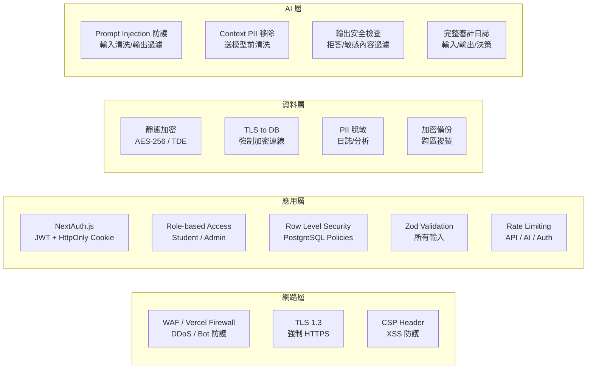

# 系統架構總覽

> [!IMPORTANT]
> **狀態**：PROPOSED - 對應 [[07_Website/Tech Stack|技術棧]]、[[08_Database/Database Architecture|資料庫架構]]
> **最後更新**：2026-09-10

---

## 高層架構圖

```mermaid
flowchart TB
    subgraph CLIENT[客戶端]
        BROWSER[瀏覽器\nNext.js React App]
        PWA[PWA / 離線支援\n未來規劃]
    end
    
    subgraph EDGE[邊緣層\nVercel Edge Network]
        EDGE_AUTH[Auth Middleware\nJWT 驗證]
        EDGE_RATE[Rate Limiting\nIP/User 限流]
        EDGE_CACHE[Static Cache\nISR / 靜態資源]
    end
    
    subgraph APP[應用層\nNext.js Server (Node.js)]
        API[API Routes / Server Actions]
        SSR[Server Components\nSSR/Streaming]
        AI_SVC[AI Service Interface]
        RAG_SVC[RAG Pipeline]
        AUTH_SVC[Auth Service\nNextAuth.js]
    end
    
    subgraph DATA[資料層]
        PG[(PostgreSQL 16\nPrimary + Replica)]
        PGB[(PgBouncer\nConnection Pool)]
        REDIS[(Redis/Upstash\nCache + Session + Queue)]
        VECTOR[(pgvector\nHNSW Index)]
        R2[(Cloudflare R2\n檔案儲存)]
        MUX[(Mux\n影片串流)]
    end
    
    subgraph AI_INFRA[AI 基建層 (Phase 9+)]
        VLLM[vLLM / TGI\n模型推理服務]
        TRAIN[訓練叢集\nDeepSpeed/FSDP]
        MLFLOW[MLflow\n實驗追蹤]
        REGISTRY[Model Registry\n版本管理]
    end
    
    subgraph OBS[觀測與運維]
        SENTRY[Sentry\n錯誤追蹤]
        GRAFANA[Grafana + Loki\n日誌/指標/告警]
        VERCEL_A[Vercel Analytics\nWeb Vitals]
        CUSTOM_D[自建儀表板\n業務指標]
    end
    
    BROWSER --> EDGE_AUTH
    BROWSER --> EDGE_RATE
    BROWSER --> EDGE_CACHE
    
    EDGE_AUTH --> API
    EDGE_RATE --> API
    EDGE_CACHE --> SSR
    
    API --> AI_SVC
    API --> RAG_SVC
    API --> AUTH_SVC
    SSR --> API
    
    API --> PG
    API --> REDIS
    RAG_SVC --> VECTOR
    RAG_SVC --> PG
    AI_SVC --> VLLM
    AI_SVC --> REDIS
    
    PG --> PGB
    VLLM --> REGISTRY
    TRAIN --> MLFLOW
    
    API --> SENTRY
    API --> GRAFANA
    BROWSER --> VERCEL_A
    CUSTOM_D --> PG
    CUSTOM_D --> REDIS
```

---

## 服務拓樸與通訊

### 同步呼叫 (Request-Response)
| 呼叫方 | 被呼叫方 | 協議 | 用途 | Timeout |
|--------|----------|------|------|---------|
| Browser | Edge/Next.js | HTTPS/HTTP2 | 頁面、API | 30s |
| API Route | PostgreSQL | TCP (PgBouncer) | CRUD | 10s |
| API Route | Redis | TCP | Cache/Session | 1s |
| API Route | pgvector | TCP | 向量檢索 | 2s |
| AI Service | vLLM/OpenAI | HTTPS | 模型推理 | 60s (streaming) |
| RAG Pipeline | pgvector | TCP | 向量檢索 | 2s |
| RAG Pipeline | Cross-Encoder | HTTP/gRPC | 重排序 | 1s |

### 非同步/事件驅動 (Event-Driven)
| 事件產生者 | 事件 | 消費者 | 用途 |
|------------|------|--------|------|
| QuestionAttempt | `attempt.created` | Mastery Worker | 增量 Mastery 計算 |
| QuestionAttempt | `attempt.created` | WrongQuestion Sync | 錯題同步 |
| AssessmentAttempt | `assessment.completed` | Profile Worker | LearningProfile 更新 |
| Document | `document.uploaded` | Doc Processor | Parse → Chunk → Embed |
| Chunk | `chunk.embedded` | Vector Sync | pgvector 索引更新 |
| User | `user.registered` | Onboarding Worker | 初始能力測驗觸發 |
| Conversation | `message.created` | Memory Worker | 短期/長期記憶更新 |

---

## 資料流向關鍵路徑

### 1. 學生提問 → AI 回應 (關鍵路徑)
```
Browser
  → POST /api/ai/chat (Server Action)
  → Auth Middleware (JWT 驗證)
  → Rate Limit Check (Redis)
  → Context Builder
      ├─ Student Profile (PG, cached in Redis)
      ├─ Mastery Top K (PG, cached)
      ├─ Wrong Questions Recent (PG)
      ├─ Conversation History (PG, last 10)
      └─ RAG Retrieval (pgvector → Rerank → Top 5)
  → Prompt Template (Teaching Strategy)
  → AI Provider (vLLM/OpenAI/Anthropic)
  → Streaming Response (SSE / Vercel AI SDK)
  → Browser Render (Markdown + LaTeX)
  → Save Message (PG, async)
  → Update Memory (Redis + PG, async)
```

**目標端到端延遲**: P50 < 3s, P95 < 10s (含串流首字 < 2s)

### 2. Level 測驗抽題 → 作答 → 結果
```
Browser
  → GET /api/levels/[id]/test/start
  → LevelQuestion 篩選 (PG)
  → 隨機抽樣 (排除近 3 次)
  → 回傳題目 (不含答案)
  
Browser 作答
  → POST /api/attempts (批次或單題)
  → 交易: QuestionAttempt + AssessmentAttempt 更新
  → 即時評分 (Server-side)
  → 觸發事件: attempt.created
      ├─ Mastery Worker (非同步)
      ├─ WrongQuestion Sync (非同步)
      └─ Profile Worker (非同步)
  → 回傳結果 (分數、解析、錯誤分析)
```

---

## 擴展性設計

### 水平擴展策略
| 服務 | 擴展方式 | 觸發條件 |
|------|----------|----------|
| Next.js (Vercel) | 自動 (Serverless) | 請求量、CPU |
| PostgreSQL | 讀寫分離 + Read Replica | CPU > 70%、連接數 > 80% |
| Redis (Upstash) | 自動分片 | 記憶體 > 80% |
| pgvector | HNSW 索引優化 + 讀副本 | 查詢 P95 > 500ms |
| vLLM (Phase 9+) | K8s HPA (佇列長度) | 佇列 > 10、GPU Util > 80% |
| Embedding Worker | K8s Deployment Replicas | 佇列積壓 > 100 |

### 無狀態設計原則
- API Routes 無本地狀態 (Session 在 Redis/JWT)
- AI Service 無狀態 (Context 每次組裝)
- Workers 透過 Redis Queue 協調
- 檔案儲存走 R2/S3 (非本地磁碟)

---

## 安全架構



---

## 災難恢復 (DR)

| 指標 | 目標 | 實作 |
|------|------|------|
| **RPO** (資料遺失容忍) | 1 小時 | WAL-G 持續備份 + pgBackRest |
| **RTO** (恢復時間目標) | 30 分鐘 | 自動化恢復腳本 + 定期演練 |
| **備份頻率** | 每日全備 + 每小時增量 | 自動化排程 |
| **跨區備份** | ap-northeast-1 → ap-southeast-1 | 跨區 WAL 流式複製 |
| **資料庫版本升級** | 藍綠部署 / pg_upgrade | 零停機遷移 |

---

## 成本優化策略

| 成本項目 | 優化手段 | 預估省幅 |
|----------|----------|----------|
| **Vercel Functions** | ISR 靜態化、Edge Functions、減少 Serverless 呼叫 | 30-50% |
| **PostgreSQL** | 讀寫分離、連線池、索引優化、歸檔冷資料 | 20-30% |
| **Redis** | TTL 精準設定、壓縮、Cluster Mode | 15-25% |
| **AI 推理 (Phase 1-8)** | Prompt 快取、請求合批、模型降級 (Haiku/Sonnet) | 40-60% |
| **AI 推理 (Phase 9+)** | 量化 (INT4)、Continuous Batching、Prefix Caching、蒸餾小模型 | 70-80% vs API |
| **檔案儲存** | R2 免費額度、生命週期規則、WebP/AVIF | 50%+ vs S3 |
| **影片串流** | Mux 自適應編碼、CDN 快取、按需轉碼 | 30% |

---

## 相關文檔

- [[07_Website/Tech Stack|技術棧決策]]
- [[08_Database/Database Architecture|資料庫架構]]
- [[08_Database/System Flowchart|系統流程圖]]
- [[08_Database/Data Flow|資料流向圖]]
- [[04_AI/AI Model Strategy|AI 模型策略]]
- [[05_RAG/RAG Architecture|RAG 架構]]
- [[11_Security/|安全專區]]
- [[12_Development/Roadmap|開發路線圖]]

---

## 更新記錄

| 日期 | 版本 | 變更 | 作者 |
|------|------|------|------|
| 2026-09-10 | v1.0 | 初始架構設計 | 系統架構師 |