# 系統完整流程圖

> [!IMPORTANT]
> **狀態**：PROPOSED - 基於 22 項核心決策設計
> **最後更新**：2026-09-10
> **用途**：新進工程師理解端到端流程、架構評審、測試場景設計

---

## 完整用戶旅程流程圖

```mermaid
flowchart TD
    %% ========== 註冊與 Onboarding ==========
    subgraph ONBOARDING[註冊與初始化流程]
        A1[訪問網站] --> A2[點擊 Google 登入]
        A2 --> A3{Google OAuth 回調}
        A3 -->|成功| A4[建立/查找 User]
        A4 --> A5{User.onboardingCompleted?}
        A5 -->|否| A6[導向 Onboarding 頁面]
        A6 --> A7[填寫個人資料\n姓名/學校/年級/班級]
        A7 --> A8[系統判斷學期\n上學期:8-1月 下學期:2-7月]
        A8 --> A9[建立 Student Profile]
        A9 --> A10[觸發初始能力測驗\n依年級決定範圍]
        A10 --> A11[學生完成測驗]
        A11 --> A12[錯誤分析與 Mastery 初始化]
        A12 --> A13[建立 StudentLearningProfile]
        A13 --> A14[User.onboardingCompleted = true]
        A14 --> A15[導向首頁]
        A5 -->|是| A15
    end

    %% ========== 首頁 ==========
    subgraph HOMEPAGE[首頁]
        A15 --> B1[首頁 Dashboard]
        B1 --> B2{用戶點擊}
        B2 -->|學習地圖| C1[學習地圖頁面]
        B2 -->|AI 問答| D1[AI 聊天頁面]
        B2 -->|個人資料| E1[個人資料頁面]
        B2 -->|錯題本| F1[錯題本頁面]
        B2 -->|學習分析| G1[學習分析頁面]
    end

    %% ========== 學習地圖 ==========
    subgraph LEARNING_MAP[學習地圖系統]
        C1 --> C2[顯示 Course 列表\n依年級/學期過濾]
        C2 --> C3[選擇 Course]
        C3 --> C4[顯示 Unit 節點圖]
        C4 --> C5[選擇 Unit]
        C5 --> C6[顯示 Level 列表\n狀態: LOCKED/AVAILABLE/IN_PROGRESS/COMPLETED]
        C6 --> C7{選擇 Level}
        C7 -->|AVAILABLE/IN_PROGRESS| C8[進入 Level 學習頁]
        C7 -->|LOCKED| C9[顯示解鎖條件\n需完成前置 Level]
        C7 -->|COMPLETED| C10[顯示複習/重考選項]
    end

    %% ========== Level 學習流程 ==========
    subgraph LEVEL_LEARNING[Level 學習流程]
        C8 --> D1[Level 頁面載入\nVideo + Cards + Test 入口]
        D1 --> D2[影片播放器開始]
        D2 --> D3{影片播放到觸發時間點}
        D3 -->|是| D4[跳出 Interactive Card]
        D4 --> D5[學生作答]
        D5 --> D6[記錄 QuestionAttempt\nCard 類型: 思考/問答/小問題/教學互動]
        D6 --> D7[即時回饋\n正確/錯誤/提示]
        D7 --> D8[標記 Card 完成]
        D8 --> D3
        D3 -->|否/影片結束| D9{影片觀看完成?\nTBD-12}
        D9 -->|否| D2
        D9 -->|是| D10[解鎖 Level 測驗入口]
        D10 --> D11[點擊開始測驗]
        D11 --> D12[Level 測驗頁面\n抽題、計時、導航]
        D12 --> D13[學生作答每一題]
        D13 --> D14[記錄 QuestionAttempt\n錯誤分析、錯誤類型標記]
        D14 --> D15[提交測驗]
        D15 --> D16[即時評分]
        D16 --> D17{分數 >= passScore?\nTBD-03}
        D17 -->|通過| D18[Level 通過!\n解鎖下一 Level\n更新 LearningProgress]
        D17 -->|不通過| D19[顯示結果\n逐題解析\n補強建議]
        D19 --> D20[學生選擇: 複習錯題 / 重看影片 / AI 輔導 / 直接重考]
        D20 --> D11
        D18 --> D21[更新 LearningProgress.status = COMPLETED]
        D21 --> D22[檢查下一 Level 是否存在]
        D22 -->|存在| D23[下一 Level 狀態 = AVAILABLE]
        D22 -->|不存在| D24[Unit 完成!\n檢查 Course 完成度]
    end

    %% ========== 能力測驗細節 ==========
    subgraph INITIAL_ASSESSMENT[初始能力測驗細節 TBD-01]
        A10 --> IA1[依學生年級決定測驗範圍\n國1: 國一內容\n國2: 國一+國二\n國3: 國一+國二+國三]
        IA1 --> IA2[從題庫篩選題目\n覆蓋該年級所有 Unit]
        IA2 --> IA3[組卷: 題數、難度分佈 TBD]
        IA3 --> IA4[測驗進行中...]
        IA4 --> IA5[每題作答記錄 QuestionAttempt]
        IA5 --> IA6[提交完成]
        IA6 --> IA7[評分 + 錯誤分析]
        IA7 --> IA8[識別弱項 Knowledge Points]
        IA8 --> IA9[初始化 StudentKnowledgePoint\nmasteryScore, confidence]
        IA9 --> IA10[建立 StudentLearningProfile\nunitMastery, errorPatterns, weakAreas]
        IA10 --> IA11[預設解鎖: 依測驗結果建議起始 Level\n但不阻擋學生進入任何 AVAILABLE Level]
    end

    %% ========== AI 問答流程 ==========
    subgraph AI_CHAT[AI 教學對話流程]
        D1 --> AI1[AI 聊天頁面載入\n載入對話列表/新建對話]
        AI1 --> AI2[學生輸入問題]
        AI2 --> AI3[Context Builder 組裝\nStudent Profile + Mastery + WrongQuestions + History + RAG]
        AI3 --> AI4[AI Service 呼叫\nProvider: OpenAI/Anthropic/Local/Mock]
        AI4 --> AI5{教學策略引擎\nDEC-016}
        AI5 -->|診斷階段| AI6[理解學生問題\n識別知識點\n評估前備知識]
        AI5 -->|引導階段| AI7[蘇格拉底式提問\n關鍵問題/類比/反例\n遞減支架]
        AI5 -->|驗證階段| AI8[評估學生回應\n正確/部分正確/錯誤/拒答]
        AI5 -->|延伸階段| AI9[完成解題\n詢問是否需要類似題\nTBD-20]
        AI6 --> AI4
        AI7 --> AI4
        AI8 --> AI4
        AI9 --> AI10{學生需要類似題?}
        AI10 -->|是| AI11[相似題生成/檢索\nKP + 程度 + 錯題 + 當前題]
        AI11 --> AI12[呈現練習題]
        AI10 -->|否| AI13[結束本輪對話]
        AI4 --> AI14[串流回應渲染\nMarkdown + LaTeX]
        AI14 --> AI15[儲存 Message\nConversation + Message]
        AI15 --> AI1
    end

    %% ========== 錯題與複習 ==========
    subgraph WRONG_QUESTION[錯題系統與複習]
        D6 -.-> WQ1[QuestionAttempt.isCorrect = false]
        D14 -.-> WQ1
        WQ1 --> WQ2[Upsert WrongQuestion\nerrorCount++, lastErrorAt=now]
        WQ2 --> WQ3[更新 StudentKnowledgePoint\nmasteryScore 重算 TBD-02]
        WQ3 --> WQ4[更新 StudentLearningProfile\nerrorPatterns, weakAreas]
        
        F1[錯題本頁面] --> F2[篩選: 單元/時間/狀態/類型]
        F2 --> F3[錯題卡片列表]
        F3 --> F4[點擊進入錯題詳情]
        F4 --> F5[顯示: 學生作答/正確解答/解析/錯誤類型/相似題]
        F5 --> F6[學生複習作答]
        F6 --> F7[記錄新 QuestionAttempt]
        F7 --> F8{複習正確?}
        F8 -->|是| F9[reviewCount++\nnextReviewAt = 間隔重複算法 TBD-19]
        F8 -->|否| F10[errorCount++\n錯誤類型統計更新]
        F9 --> F11{reviewCount 達標?}
        F11 -->|是| F12[reviewStatus = MASTERED]
        F11 -->|否| F13[reviewStatus = REVIEWING]
    end

    %% ========== RAG 知識檢索 ==========
    subgraph RAG_SYSTEM[RAG 知識增強]
        AI3 --> RAG1[查詢改寫\n學生問題 -> 檢索優化查詢]
        RAG1 --> RAG2[向量檢索\nDocumentChunk.embedding\nCosine Similarity Top-K]
        RAG2 --> RAG3[混合檢索\n關鍵字 BM25 + 向量]
        RAG3 --> RAG4[重排序\nCross-Encoder / LLM Rerank]
        RAG4 --> RAG5[Context 注入\n來源片段 + 引用標註]
        RAG5 --> AI4
    end

    %% ========== 資料流向 ==========
    subgraph DATA_FLOWS[關鍵資料流向]
        direction LR
        DF1[QuestionAttempt] --> DF2[WrongQuestion Sync]
        DF1 --> DF3[Mastery Calculation TBD-02]
        DF1 --> DF4[StudentLearningProfile Update]
        DF3 --> DF5[AI Context Injection]
        DF2 --> DF5
        DF4 --> DF5
        DF6[Document Chunk] --> DF7[Vector Index]
        DF7 --> DF5
    end

    %% ========== 樣式 ==========
    classDef onboarding fill:#e3f2fd,stroke:#1976d2,stroke-width:2px
    classDef homepage fill:#f3e5f5,stroke:#7b1fa2,stroke-width:2px
    classDef learning fill:#e8f5e9,stroke:#388e3c,stroke-width:2px
    classDef level fill:#fff3e0,stroke:#f57c00,stroke-width:2px
    classDef assessment fill:#fce4ec,stroke:#c2185b,stroke-width:2px
    classDef ai fill:#f1f8e9,stroke:#689f38,stroke-width:2px
    classDef wrong fill:#ffebee,stroke:#d32f2f,stroke-width:2px
    classDef rag fill:#e0f2f1,stroke:#00695c,stroke-width:2px
    classDef data fill:#fafafa,stroke:#616161,stroke-dasharray: 5 5

    class A1,A2,A3,A4,A5,A6,A7,A8,A9,A10,A11,A12,A13,A14,A15 onboarding
    class B1,B2,C1,C2,C3,C4,C5,C6,C7,C8,C9,C10 homepage
    class D1,D2,D3,D4,D5,D6,D7,D8,D9,D10,D11,D12,D13,D14,D15,D16,D17,D18,D19,D20,D21,D22,D23,D24 learning
    class IA1,IA2,IA3,IA4,IA5,IA6,IA7,IA8,IA9,IA10,IA11 assessment
    class AI1,AI2,AI3,AI4,AI5,AI6,AI7,AI8,AI9,AI10,AI11,AI12,AI13,AI14,AI15 ai
    class WQ1,WQ2,WQ3,WQ4,F1,F2,F3,F4,F5,F6,F7,F8,F9,F10,F11,F12,F13 wrong
    class RAG1,RAG2,RAG3,RAG4,RAG5 rag
    class DF1,DF2,DF3,DF4,DF5,DF6,DF7 data
```



---

## 關鍵決策點對照表

| 流程節點 | 對應決策 | TBD 依賴 |
|----------|----------|----------|
| A10 觸發能力測驗 | DEC-007, DEC-008 | TBD-01 |
| IA1 年級決定範圍 | DEC-007 | TBD-01 |
| IA10 不阻擋地圖 | DEC-008 | - |
| D9 影片完成判定 | DEC-010 | TBD-12 |
| D17 Level 通過條件 | DEC-011 | TBD-03 |
| D20 重考無限次 | DEC-012 | TBD-03 |
| D12 抽題演算法 | DEC-013 | TBD-03 |
| WQ1 雙層錯題 | DEC-014 | - |
| WQ2 Mastery 更新 | DEC-017 | TBD-02 |
| AI5 教學策略 | DEC-016 | TBD-04, TBD-08 |
| AI3 Context 組裝 | DEC-017, DEC-018 | TBD-08 |
| RAG1-5 知識檢索 | DEC-021 | TBD-07 |

---

## 狀態機定義

### LearningProgress.status
```
LOCKED → AVAILABLE (前置 Level COMPLETED)
AVAILABLE → IN_PROGRESS (學生開始影片)
IN_PROGRESS → COMPLETED (影片完成 + 測驗通過)
COMPLETED → MASTERED (Mastery 達標 + 複習完成) - 可選
任何狀態 → IN_PROGRESS (重新學習)
```

### WrongQuestion.reviewStatus
```
NEW → REVIEWING (學生開始複習)
REVIEWING → MASTERED (複習達標 TBD-19)
REVIEWING → REVIEWING (複習失敗，重新排程)
任何狀態 → ARCHIVED (學生手動歸檔)
```

### Conversation.status
```
ACTIVE (正常對話)
ARCHIVED (學生歸檔，保留歷史)
DELETED (學生刪除，軟刪除)
```

---

## 測試場景對應

| 場景 ID | 描述 | 涉及流程節點 | 驗收標準 |
|---------|------|--------------|----------|
| S01 | 新用戶完整 Onboarding | A1-A15, IA1-IA11 | 註冊→資料→測驗→首頁 完整可跑通 |
| S02 | 學習地圖導航 | C1-C10 | Course/Unit/Level 三層正確顯示與跳轉 |
| S03 | Level 完整學習通過 | D1-D24 | 影片→卡片→測驗→通過→解鎖下一關 |
| S04 | Level 失敗重考 | D11-D20-D11 | 失敗後可無限重考，抽題不重複 |
| S05 | 跳過能力測驗 | A5-A15 (skip IA) | 未測驗也能進入地圖，預設 Level 1 AVAILABLE |
| S06 | AI 引導式教學 | AI1-AI15 | AI 不給答案，確實引導 5-8 輪 |
| S07 | AI 個人化差異 | AI3-AI5 | 同一題不同程度學生得不同引導 |
| S08 | 錯題自動同步 | D6/D14 → WQ1-WQ4 | 作答錯誤自動建立/更新 WrongQuestion |
| S09 | 錯題複習流程 | F1-F13 | 間隔重複排程正確運作 |
| S10 | RAG 引用來源 | RAG1-RAG5 | AI 回答附上可點擊來源片段 |

---

## 相關文檔

- [[00_Home/Project Dashboard|專案儀表板]]
- [[08_Database/Database Architecture|資料庫架構]]
- [[08_Database/ER Diagram|ER Diagram]]
- [[08_Database/Data Flow|資料流向圖]]
- [[12_Development/Roadmap|開發路線圖]]
- [[13_Decisions/Decision Log|核心決策]]
- [[13_Decisions/TBD|待決定項目]]

---

## 更新記錄

| 日期 | 版本 | 變更 | 作者 |
|------|------|------|------|
| 2026-09-10 | v1.0 | 初始流程圖 | 系統架構師 |