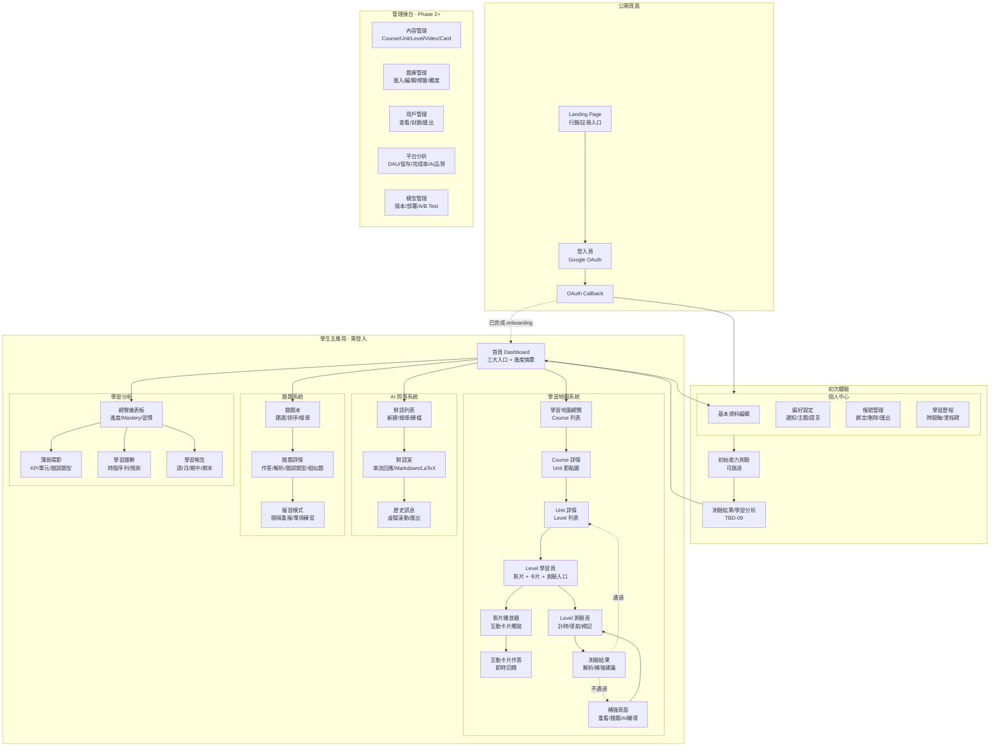

# 網站地圖

> [!IMPORTANT]
> **狀態**：PROPOSED - TBD-10 待決定首頁完整導航
> **最後更新**：2026-09-10
> **設計原則**：Mobile First、學生為中心、三大核心入口、漸進式揭露

---

## 整體資訊架構



---

## 頁面詳細規格

### 1. Landing Page (公開)
| 區塊 | 內容 | CTA |
|------|------|-----|
| Hero | 品牌標語、核心價值、學生見證 | 「免費開始學習」 |
| Features | AI 個人化教學、互動影片、錯題分析、學習地圖 | - |
| Demo | 實際操作錄影/GIF | - |
| Pricing | 免費方案 vs 付費方案 (TBD-05) | 「選擇方案」 |
| Footer | 關於我們、隱私權、服務條款、聯絡 | - |

### 2. 登入頁
- 僅 Google OAuth 按鈕
- 簡單說明：安全、快速、無需記密碼
- 已註冊用戶直接登入，新用戶自動建立帳號

### 3. 個人資料建立 (Onboarding Step 1)
| 欄位 | 類型 | 驗證 | 必填 |
|------|------|------|------|
| 姓名 | Text | 1-20 字、中英文數字 | ✅ |
| 學校 | Search/Select | 學校資料庫 / 手動輸入 | ✅ |
| 年級 | Radio Group | 國一~高三 (G7-G12) | ✅ |
| 班級 | Text | 1-3 字 | ❌ |
| 學期 | Auto | 依當月自動判斷 (可手動覆蓋) | ✅ |

### 4. 初始能力測驗 (Onboarding Step 2)
- 進度條顯示
- 題目逐題呈現 (TBD-01 參數)
- 可跳過按鈕 (永遠可見)
- 提交後顯示載入動畫 → 結果頁

### 5. 首頁 Dashboard
```typescript
interface HomepageLayout {
  // 頂部：歡迎 + 目前年級/學期
  header: {
    greeting: string;           // "早安，小明！"
    gradeSemester: string;      // "國二上學期"
    streakDays: number;         // 連續學習天數
  };
  
  // 三大核心入口 (TBD-10 可能擴充)
  mainActions: [
    {label: "學習地圖", icon: "map", href: "/map", badge: "3/12 Units"},
    {label: "AI 問答", icon: "message-circle", href: "/chat", badge: null},
    {label: "個人資料", icon: "user", href: "/profile", badge: null}
  ];
  
  // 進度摘要卡片
  progressCards: [
    {title: "目前 Level", value: "L2-3", subtitle: "一元一次方程式 進階應用"},
    {title: "Mastery 平均", value: "68%", subtitle: "較上週 +5%"},
    {title: "待複習錯題", value: "12", subtitle: "3 題急需複習"},
  ];
  
  // 快速行動
  quickActions: [
    {label: "繼續學習", href: "/level/current"},
    {label: "複習錯題", href: "/wrong-questions?filter=due"},
    {label: "問 AI 老師", href: "/chat/new"}
  ];
}
```

### 6. 學習地圖 - 三層導航
| 層級 | 視覺化 | 互動 |
|------|--------|------|
| Course 列表 | 卡片網格 | 點擊進入 Course |
| Unit 節點圖 | D3.js/React Flow 連線圖 | 滑鼠懸停預覽、點擊進入 Unit |
| Level 列表 | 卡片列表 (含狀態圖示) | 點擊進入 Level 學習頁 |

**Level 狀態圖示**:
- 🔒 LOCKED (灰色鎖)
- 📍 AVAILABLE (藍色圓點)
- ▶️ IN_PROGRESS (黃色播放)
- ✅ COMPLETED (綠色勾)
- ⭐ MASTERED (金星星)

### 7. Level 學習頁
```typescript
interface LevelPageLayout {
  // 頂部：Level 標題、進度條、返回地圖
  header: LevelHeader;
  
  // 主區：影片播放器 (佔 60-70% 寬度)
  videoPlayer: {
    video: Video;
    progress: number;           // 觀看進度 0-1
    cards: InteractiveCard[];   // 時間軸標記
    onCardTrigger: (card) => openCardModal(card);
  };
  
  // 側邊/底部：Level 測驗入口 (固定)
  testEntrance: {
    status: "LOCKED" | "AVAILABLE" | "COMPLETED";
    attempts: number;
    bestScore: number;
    onStart: () => navigateToTest();
  };
  
  // 底部：學習目標、關鍵知識點
  footer: {
    objectives: string[];
    keyKnowledgePoints: KP[];
  };
}
```

### 8. 互動卡片 Modal
| 卡片類型 | UI 形式 | 回饋機制 |
|----------|---------|----------|
| 思考問題 | 開放式文字輸入 | AI 即時評論 + 引導 |
| 問答 | 選擇題/填空 | 即時對錯 + 解析 |
| 小問題 | 簡短計算/判斷 | 即時對錯 + 提示 |
| 教學互動 | 拖拉/點擊/繪圖 | 視覺化回饋 |

### 9. AI 聊天室
- 左側：對話列表 (可摺疊)
- 右側：當前對話
  - 訊息氣泡 (Markdown + KaTeX 渲染)
  - 程式碼區塊高亮
  - 圖片預覽
  - 串流動畫
- 底部：輸入區 (支援 LaTeX 快捷鍵、語音輸入未來)

### 10. 錯題本
- 篩選器：單元、時間範圍、複習狀態、錯誤類型
- 列表卡片：題目縮圖、錯誤次數、最後錯誤時間、複習狀態標籤
- 點擊進入詳情：並排顯示學生作答 vs 標準解答、錯誤類型標記、相似題按鈕

---

## 響應式斷點

| 斷點 | 範圍 | 版面調整 |
|------|------|----------|
| **Mobile** | < 640px | 單欄、底部導航列、Modal 全螢幕、影片播放器置頂 |
| **Tablet** | 640-1024px | 兩欄 (側邊欄可摺疊)、影片+測驗並排 |
| **Desktop** | > 1024px | 三欄 (左導航+主內容+右側邊欄)、完整功能 |
| **Wide** | > 1440px | 最大寬度 1280px 置中、留白呼吸 |

---

## 無障礙設計 (WCAG 2.1 AA)

- 語義化 HTML、ARIA 標籤
- 鍵盤完整可操作 (Tab 順序、Focus 可見)
- 色彩對比度 ≥ 4.5:1
- 縮放 200% 不遺失功能
- 影片字幕、逐字稿
- 錯誤訊息清晰、提供修正建議

---

## 相關文檔

- [[07_Website/Architecture Overview|系統架構]]
- [[07_Website/Tech Stack|技術棧]]
- [[02_Features/Homepage|首頁設計]]
- [[02_Features/Learning Map|學習地圖]]
- [[02_Features/Level System|Level 系統]]
- [[02_Features/AI Chat|AI 問答]]
- [[02_Features/Wrong Question System|錯題系統]]
- [[13_Decisions/TBD#TBD-10|TBD-10: 首頁 Button]]
- [[13_Decisions/TBD#TBD-09|TBD-09: 學習分析名稱]]

---

## 更新記錄

| 日期 | 版本 | 變更 | 作者 |
|------|------|------|------|
| 2026-09-10 | v1.0 | 初始網站地圖 | 產品架構師 |