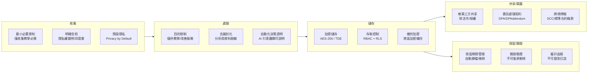
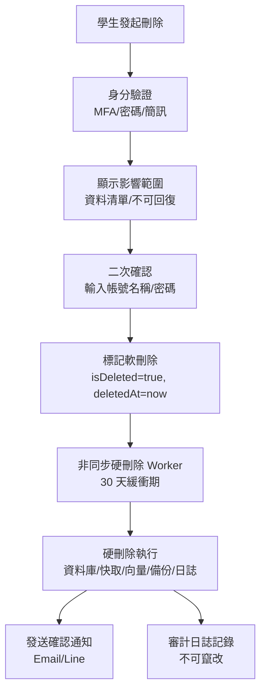

# 學生資料安全

> [!IMPORTANT]
> **狀態**：RESEARCH - 法務/安全專家需審核
> **最後更新**：2026-09-10
> **法規依據**：個人資料保護法 (台灣)、GDPR (歐盟)、兒童線上隱私保護法 (COPPA, 美國)

---

## 資料分類與保護等級

| 資料類別 | 範例 | 敏感度 | 加密 | 存取控制 | 保留期限 |
|----------|------|--------|------|----------|----------|
| **身分識別資料 (PII)** | 姓名、Email、學校、年級、班級 | 高 | 靜態加密 + 傳輸加密 | 最小權限、RLS | 帳號存續期間 |
| **認證資料** | Google ID、OAuth Token、Session | 極高 | 雜湊/加密、HSM | 僅認證服務 | 登出即撤銷 |
| **學習行為資料** | 影片觀看、卡片作答、測驗紀錄 | 中 | 靜態加密 | 教學服務、分析服務 | 5 年 / 學生要求刪除 |
| **錯題與 Mastery** | 學生作答、錯誤分析、掌握度分數 | 中高 | 靜態加密 | 教學服務、AI 服務 | 5 年 / 學生要求刪除 |
| **AI 對話內容** | 問題、回答、推理過程 | 高 | 靜態加密 + 向量化 | AI 服務、學生本人 | 2 年 / 學生要求刪除 |
| **分析報告** | 學習趨勢、弱項、預測 | 中 | 靜態加密 | 學生、家長(授權)、教師(授權) | 3 年 |

---

## 資料全生命週期保護



---

## 加密實作規格

### 靜態加密
| 層級 | 技術 | 金鑰管理 |
|------|------|----------|
| **資料庫 (PostgreSQL)** | TDE (Transparent Data Encryption) / pg_tde | AWS KMS / GCP KMS / HashiCorp Vault |
| **檔案儲存 (R2/S3)** | SSE-S3 / SSE-KMS | AWS KMS / Customer Managed Key |
| **Redis** | TLS 傳輸 + 磁碟加密 (Redis Enterprise) | 託管服務商管理 |
| **向量資料庫 (pgvector)** | 同 PostgreSQL TDE | 同資料庫 |

### 傳輸加密
| 通訊路徑 | 協定 | 憑證管理 |
|----------|------|----------|
| **Client ↔ Vercel Edge** | TLS 1.3 | Vercel 管理 (自動續簽) |
| **Vercel ↔ PostgreSQL** | TLS 1.2+ (require_secure_transport) | 憑證輪換 90 天 |
| **Vercel ↔ Redis** | TLS 1.2+ | Upstash/Valkey 管理 |
| **Vercel ↔ AI Provider** | TLS 1.3 | 提供商管理 |
| **服務間 (內部)** | mTLS / SPIFFE | SPIRE / Istio / Linkerd |

### 欄位級加密 (極敏感欄位)
```typescript
// Prisma 中間件 / 應用層加密
interface EncryptedFields {
  // 學生個資
  student.name: string;           // AES-256-GCM
  student.school: string;
  student.className: string;
  
  // AI 對話內容 (可選，效能考量)
  message.content: string;        // 機密度高時啟用
  
  // 金鑰派生
  // 使用 HKDF 從 Master Key 派生每欄位/每租戶金鑰
}
```

---

## 存取控制矩陣

| 角色 | 學生基本資料 | 學習紀錄 | 錯題/Mastery | AI 對話 | 分析報告 | 系統管理 |
|------|--------------|----------|--------------|---------|----------|----------|
| **學生 (本人)** | R/W (部分) | R | R | R/W | R | - |
| **家長 (授權)** | R (限姓名/年級) | R | R | - | R | - |
| **AI 服務** | R (必要欄位) | R | R/W | R/W | - | - |
| **教學服務** | R | R/W | R/W | - | R | - |
| **分析服務** | - | R (去識別) | R (去識別) | - | R/W | - |
| **管理員** | R (審計) | R (審計) | R (審計) | R (審計/法務) | R | R/W |
| **資料庫管理員** | - | - | - | - | - | R/W (結構) |

### Row Level Security (PostgreSQL RLS) 範例
```sql
-- 學生只能存取自己的資料
CREATE POLICY student_own_data ON students
  FOR ALL TO student_role
  USING (user_id = current_setting('app.current_user_id')::uuid);

-- AI 服務角色可讀取學習資料 (需驗證)
CREATE POLICY ai_service_read ON question_attempts
  FOR SELECT TO ai_service_role
  USING (student_id IN (
    SELECT student_id FROM students 
    WHERE user_id = current_setting('app.current_user_id')::uuid
  ));

-- 管理員審計存取 (需 MFA、審計日誌)
CREATE POLICY admin_audit ON students
  FOR SELECT TO admin_role
  USING (current_setting('app.audit_mode') = 'true');
```

---

## 去識別化與匿名化

### 分析用資料集處理流程
```
原始資料 (含 PII)
    ↓
移除直接識別碼 (姓名、Email、學校、精確地址)
    ↓
泛化準識別碼
  - 年齡 → 年齡段 (13-15, 16-18)
  - 地區 → 縣市
  - 時間 → 週/月
    ↓
K-匿名化 (k ≥ 5)
  - 確保每組準識別碼組合 ≥ 5 筆
    ↓
L-多樣性 (l ≥ 3)
  - 敏感屬性 (錯誤類型、Mastery) 在每組中至少 l 種值
    ↓
差分隱私 (ε = 0.5-1.0)
  - 聚合統計加入拉普拉斯雜訊
    ↓
發布版資料集
```

### 合成資料生成 (模型訓練用)
- 使用 CTGAN / TVAE 生成合成學習行為資料
- 保持統計分布、相關性
- 零真實學生資料洩漏風險

---

## 個人權利實作

| 權利 | 實作方式 | SLA |
|------|----------|-----|
| **查詢權** | 學生後台「我的資料」頁面、API `/api/me/data` | 即時 |
| **複製/可攜權** | 一鍵匯出 JSON/CSV/PDF、API `/api/me/export` | 24 小時 |
| **更正權** | 後台編輯、API PATCH `/api/me` | 即時 |
| **刪除權 (被遺忘權)** | 設定頁「刪除帳號」、API DELETE `/api/me`、確認流程 | 30 天 (依法規) |
| **限制處理權** | 隱私設定頁關閉特定處理 (如 AI 訓練、分析) | 即時 |
| **反對權** | 隱私設定頁拒絕行銷/分析 | 即時 |
| **撤回同意** | 隱私設定頁撤回特定同意項目 | 即時 |

### 刪除流程


---

## 資料外洩應變計畫

### 事件分級
| 等級 | 定義 | 回應時限 | 通報對象 |
|------|------|----------|----------|
| **L1 (低)** | 非敏感資料少量洩漏、無 PII | 24 小時內 | 內部安全小組 |
| **L2 (中)** | PII 洩漏 < 100 筆、無金融/健康資料 | 4 小時內 | 法務、主管機關 (視法規) |
| **L3 (高)** | 大規模洩漏、敏感資料、系統入侵 | 1 小時內 | 全員召集、主管機關、受影響用戶、媒體 |

### 關鍵動作清單 (L3)
1. **遏制**: 隔離受影響系統、撤銷憑證、關閉入口
2. **評估**: 確認洩漏範圍、資料類型、影響用戶數
3. **通報**: 72 小時內通報主管機關 (GDPR/個資法)、通知受影響用戶
4. **補救**: 重置憑證、強制登出、提供信用監控服務
5. **複盤**: 根因分析、改善措施、文檔更新、演練

---

## 相關文檔

- [[11_Security/Authentication Security|認證安全]]
- [[11_Security/Authorization|授權控制]]
- [[11_Security/AI Data Privacy|AI 資料隱私]]
- [[11_Security/Secrets Management|密鑰管理]]
- [[04_AI/Student Memory|學生記憶系統]]
- [[13_Decisions/TBD#TBD-21|TBD-21: GDPR/個資法]]

---

## 更新記錄

| 日期 | 版本 | 變更 | 作者 |
|------|------|------|------|
| 2026-09-10 | v1.0 | 初始資料安全設計 | 系統架構師 |