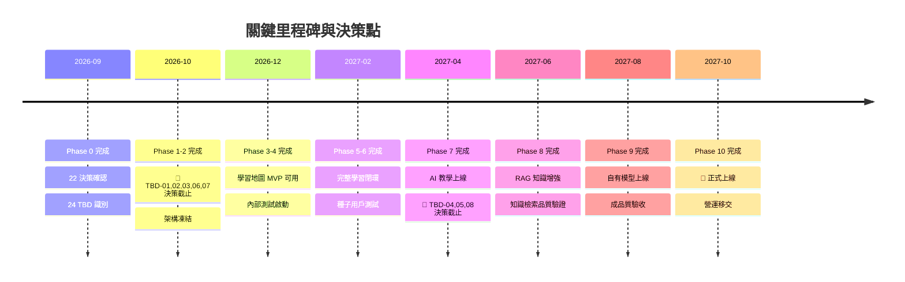

# 開發路線圖

> [!IMPORTANT]
> **狀態**：PROPOSED - 依據目前決策制定，TBD 確認後可能調整
> **最後更新**：2026-09-10
> **原則**：階段式交付，每階段可驗證核心價值，風險前置

---

## 階段總覽

| 階段 | 名稱 | 核心交付 | 預估工時 | 關鍵依賴 | 狀態 |
|------|------|----------|----------|----------|------|
| Phase 0 | 專案規劃 | 完整規格文檔、架構決策、Vault 建立 | 1 週 | - | ✅ 完成 |
| Phase 1 | 網站骨架 | Next.js 專案、UI 元件庫、設計系統、CI/CD | 3 週 | Phase 0 | 🔄 進行中 |
| Phase 2 | 認證系統 | Google OAuth、User/Student 建立、Session 管理 | 2 週 | Phase 1 | ⏳ 等待 |
| Phase 3 | 學生系統 | 個人資料、年級/學期、首頁 Layout | 2 週 | Phase 2 | ⏳ 等待 |
| Phase 4 | 學習地圖 | Course/Unit/Level、影片播放器、Interactive Cards、進度解鎖 | 6 週 | Phase 3, TBD-01, TBD-03 | ⏳ 等待 |
| Phase 5 | 題庫與測驗 | 題庫匯入、Level 測驗、初始能力測驗 | 4 週 | Phase 4, TBD-03 | ⏳ 等待 |
| Phase 6 | 錯題與 Mastery | QuestionAttempt、WrongQuestion、Mastery、學習分析 | 4 週 | Phase 5, TBD-02 | ⏳ 等待 |
| Phase 7 | AI 聊天 | AI Service、對話系統、引導式教學、個人化適應 | 5 週 | Phase 6, TBD-04, TBD-08 | ⏳ 等待 |
| Phase 8 | RAG 系統 | 文檔管線、Embedding、Vector DB、檢索增強生成 | 4 週 | Phase 7, TBD-07 | ⏳ 等待 |
| Phase 9 | 自有模型 | 模型評測、Fine-tuning、部署優化 | 8 週 | Phase 8, TBD-06 | ⏳ 等待 |
| Phase 10 | 生產上線 | 效能調優、安全審計、監控、正式發布 | 4 週 | Phase 9 | ⏳ 等待 |

**總預估**：~43 週 (約 10.5 個月)

---

## 詳細任務分解

### Phase 0: 專案規劃 ✅
- [x] 專案啟動會議
- [x] 核心決策確認 (22 項)
- [x] TBD 識別與優先級排序 (24 項)
- [x] Obsidian Vault 建立
- [x] 架構文檔初版 (DB、API、系統流程)
- [x] 技術棧確認與 PoC 驗證

### Phase 1: 網站骨架 (3 週) 🔄

#### Week 1: 專案初始化
- [ ] `npx create-next-app@latest` with TypeScript, Tailwind, ESLint, Prettier
- [ ] 目錄結構規劃 (app router, components, lib, hooks, types)
- [ ] Git 設定、分支策略、Commit Message 規範
- [ ] CI/CD: GitHub Actions (lint, typecheck, test, build, deploy preview)
- [ ] 環境變數管理 (`.env.example`, `.env.local`, 1Password/Infisical 整合)

#### Week 2: UI 元件庫與設計系統
- [ ] 設計 Token 定義 (色彩、字體、間距、圓角、陰影、動畫)
- [ ] 基礎元件: Button, Input, Card, Modal, Toast, Tooltip, Dropdown, Avatar, Badge, Spinner, Skeleton
- [ ] 複合元件: VideoPlayer, CardContainer, ProgressRing, LevelCard, MapNode
- [ ] 深色模式支援 (CSS variables + Tailwind dark mode)
- [ ] 響應式斷點與容器查詢
- [ ] Storybook 建立與視覺回歸測試 (Chromatic)

#### Week 3: 核心佈局與工具
- [ ] App Layout: Header, Sidebar, Footer, Mobile Navigation
- [ ] 認證相關頁面骨架: Login, Callback, Onboarding
- [ ] 國際化 (i18n) 架構 (next-intl / next-i18next) - 預留繁中/簡中/英文
- [ ] API Client 封裝 (TanStack Query / SWR + Axios/Fetch)
- [ ] 錯誤邊界、全域錯誤處理、Sentry 整合
- [ ] 測試環境: Vitest + React Testing Library + Playwright E2E

**Phase 1 驗收標準**:
- `npm run dev` 正常啟動
- `npm run build` 零錯誤
- `npm run test` 全綠
- Storybook 所有元件可視化
- Preview 部署成功 (Vercel/Netlify)

---

### Phase 2: 認證系統 (2 週)

#### Week 4: Google OAuth
- [ ] Google Cloud Console 專案建立、OAuth Consent Screen 設定
- [ ] NextAuth.js (Auth.js) 整合: Google Provider、JWT Strategy
- [ ] Callback 處理、Session 管理、Token 刷新
- [ ] Middleware 保護路由 (學生頁面需登入)
- [ ] 登入/登出/註冊流程 E2E 測試

#### Week 5: User/Student 建立
- [ ] Prisma Schema: User, Student 模型
- [ ] 註冊後自動建立 Student Profile (預設值)
- [ ] `onboarding_completed` 旗標控制流程
- [ ] Session 中攜帶 `studentId`、`grade`、`semester`
- [ ] 刪除帳號 / 撤銷授權 流程

**Phase 2 驗收標準**:
- Google 登入成功建立 User + Student
- Session 在瀏覽器關閉後持久化
- 受保護路由正確導向登入頁
- 無安全漏洞 (CSRF, Session Fixation, Token Leakage)

---

### Phase 3: 學生系統 (2 週)

#### Week 6: 個人資料與年級/學期
- [ ] 個人資料頁面: 姓名、學校、年級、班級、學期
- [ ] 年級選擇器 (國1-3、高1-3)
- [ ] 學期自動判斷邏輯 (上學期 8-1 月 / 下學期 2-7 月)
- [ ] 資料驗證 (Zod Schema) 與伺服器端驗證
- [ ] 資料變更 Audit Log

#### Week 7: 首頁 Layout
- [ ] 三大入口: 學習地圖、AI 問答、個人資料 (TBD-10 待確認)
- [ ] 學習進度摘要卡片 (目前 Level、Mastery 總覽、連續天數)
- [ ] 快速行動區 (繼續學習、複習錯題、問 AI)
- [ ] 空狀態設計 (新用戶引導)
- [ ] 響應式斷點: Mobile (<640px), Tablet (640-1024px), Desktop (>1024px)

**Phase 3 驗收標準**:
- 學生可完整編輯個人資料
- 年級/學期正確判斷並鎖定 (可修改但需確認)
- 首頁三大入口可點擊導向正確頁面
- Mobile/Tablet/Desktop 三斷點無版面破裂

---

### Phase 4: 學習地圖 (6 週) - **核心 MVP**

#### Week 8-9: Course/Unit/Level 架構
- [ ] Prisma: Course, Unit, Level, Video, InteractiveCard 模型
- [ ] 種子資料腳本 (數學課綱匯入)
- [ ] 學習地圖頁面: 視覺化節點圖 (D3.js / React Flow / Canvas)
- [ ] Level 狀態: Locked / Available / In Progress / Completed / Mastered
- [ ] 解鎖邏輯: 前置 Level 通過 → 解鎖下一 Level

#### Week 10-11: 影片播放器
- [ ] Mux / Video.js / 自建 Player 整合
- [ ] 影片進度追蹤 (10秒間隔 heartbeat)
- [ ] 時間點觸發 Interactive Card (Video Timeupdate Event)
- [ ] 播放速度、畫質切換、全螢幕、字幕
- [ ] 觀看完成判定 (TBD-12 待確認)

#### Week 12-13: Interactive Cards
- [ ] Card 類型系統: ThoughtQuestion / QnA / MiniProblem / TeachingInteraction
- [ ] Card 編輯器 (後台內容團隊用)
- [ ] 學生作答介面、即時回饋、提示機制
- [ ] 作答記錄寫入 QuestionAttempt
- [ ] 卡片完成狀態追蹤

#### Week 13-14: 進度追蹤與解鎖
- [ ] Level 完成度計算 (影片 % + 卡片完成數 + 測驗)
- [ ] 解鎖動畫與慶祝回饋
- [ ] 學習路徑視覺化 (已走過/當前/未來)
- [ ] 繼續學習深連結 (分享/通知導向具體 Level)

**Phase 4 驗收標準**:
- 完整走完一個 Course (含 3-5 Units, 12-20 Levels)
- 影片播放、卡片互動、進度記錄無誤
- 解鎖邏輯正確 (含跳過能力測驗的預設解鎖)
- 效能: 地圖渲染 < 1s, 影片啟動 < 2s

---

### Phase 5: 題庫與測驗 (4 週)

#### Week 15-16: 題庫系統
- [ ] Prisma: Question, KnowledgePoint, QuestionKnowledgePoint, LevelQuestion
- [ ] 題目匯入管線: JSON/CSV/Excel → 標準化 → 資料庫
- [ ] 題目編輯器 (支援 LaTeX/MathML、圖片上傳、選項管理)
- [ ] Knowledge Point 體系建立 (三層: Domain > Topic > Skill)
- [ ] 難度校準 (IRT 前置資料收集)

#### Week 17-18: 測驗系統
- [ ] Level 測驗介面: 計時、進度、導航、標記複習
- [ ] 抽題演算法: 依 LevelQuestion 定義篩選 + 隨機 + 重考去重
- [ ] 即時評分、解析顯示、錯誤類型標記
- [ ] 結果頁: 分數、逐題解析、知識點掌握度變化、補強建議
- [ ] 初始能力測驗: 依年級動態組卷、TBD-01 參數套用

**Phase 5 驗收標準**:
- 題庫可匯入 1000+ 題無效能問題
- Level 測驗抽題符合定義分布
- 能力測驗依年級正確覆蓋範圍
- 重考不出現相同題目 (近 3 次)

---

### Phase 6: 錯題與 Mastery (4 週)

#### Week 19-20: QuestionAttempt + WrongQuestion
- [ ] QuestionAttempt 完整記錄 (學生、題目、答案、正確性、時間、提示、嘗試次數)
- [ ] WrongQuestion 自動同步機制 (觸發器/應用層)
- [ ] 錯題本頁面: 篩選 (科目/單元/時間/狀態)、排序、搜尋
- [ ] 錯題詳情: 學生作答、正確解答、解析、錯誤類型、相似題
- [ ] 複習模式: 間隔重複 (TBD-19)、錯誤類型專項

#### Week 21-22: Mastery 系統
- [ ] Mastery 模型: StudentKnowledgePoint (studentId, kpId, masteryScore, confidence, updatedAt)
- [ ] 計算引擎: TBD-02 公式實作 (離線批次/即時增量)
- [ ] Mastery 視覺化: 雷達圖、熱力圖、趨勢線
- [ ] AI Context 注入介面: 取得學生 Top Weak/Strong KPs
- [ ] 學習分析儀表板: 整體進度、薄弱環節、學習習慣、預測

**Phase 6 驗收標準**:
- 所有作答自動產生 Attempt + 同步 WrongQuestion
- Mastery 分數即時更新 (或每日批次)
- 錯題本複習流程順暢
- 學習分析提供可執行洞察

---

### Phase 7: AI 聊天 (5 週)

#### Week 23-24: AI Service Infrastructure
- [ ] AI Service Interface 定義 (Provider Pattern: OpenAI / Anthropic / Local / Mock)
- [ ] Prompt 模板系統 (Jinja2 / Handlebars / 自訂)
- [ ] Context Builder: Student Profile + Mastery + WrongQuestions + History + RAG
- [ ] Token 計費與限流 (Credits TBD-05)
- [ ] 串流回應 (SSE / Vercel AI SDK)

#### Week 25-26: 對話系統
- [ ] Prisma: Conversation, Message 模型
- [ ] 對話列表、新建、重命名、刪除、歸檔
- [ ] 訊息渲染: Markdown、LaTeX、代碼高亮、圖片
- [ ] 歷史載入分頁、虛擬滾動
- [ ] 匯出對話 (Markdown/PDF)

#### Week 27: 引導式教學 Prompt
- [ ] 教學策略狀態機: Diagnose → Scaffold → Guide → Verify → Extend
- [ ] 學生回應分類器: 正確/部分正確/錯誤/拒答/離題
- [ ] 動態提示生成: 關鍵問題、類比、反例、遞減支架
- [ ] 完成判定與類似題推薦觸發 (TBD-20)

#### Week 28: 個人化適應
- [ ] 年級適應: 用語難度、步驟細緻度、先備知識假設
- [ ] 程度適應: Mastery 弱項重點補強、強項加速
- [ ] 歷程適應: 避免重複教學、呼應先前錯誤
- [ ] 風格適應: 鼓勵型/嚴謹型/蘇格拉底型 (學生偏好學習)

**Phase 7 驗收標準**:
- AI 不直接給答案，確實引導學生思考
- 同一題目不同程度學生獲得差異化引導
- 對話歷史完整保存且可檢索
- 平均對話輪數 5-8 輪完成教學目標

---

### Phase 8: RAG 系統 (4 週)

#### Week 29-30: 文檔處理管線
- [ ] 文檔解析: PDF (PyMuPDF/pdfplumber), Word (python-docx), 圖片 (OCR), 影片 (Whisper)
- [ ] Chunking 策略: 語義分塊 (標題/段落/公式/例題)、TBD-07 參數
- [ ] Metadata 提取: 知識點、年級、難度、來源、版本
- [ ] 增量更新: 文檔版本控管、向量同步

#### Week 31-32: Embedding + Vector DB + Retrieval
- [ ] Embedding Model 部署 (TBD-07 決策)
- [ ] Vector DB 部署與索引建立
- [ ] 檢索策略: 向量相似度 + 關鍵字混合 + 重排序
- [ ] 查詢改寫: 學生問題 → 檢索優化查詢 (HyDE / Query Expansion)
- [ ] 引用標註: 回答附上來源片段連結

**Phase 8 驗收標準**:
- 教材文檔全量向量化 (< 24h)
- 檢索召回率 @10 > 85% (人工標註測試集)
- 端到端延遲 < 3s (P95)
- 回答可追溯至來源文檔

---

### Phase 9: 自有模型 (8 週)

#### Week 33-36: 模型評測與選型
- [ ] 評測基準建立: 數學推理 (GSM8K, MATH, 台版模擬題)、中文教學對話、安全性
- [ ] 候選模型部署 (vLLM / TGI / Ollama)
- [ ] 量化測試: FP16 / INT8 / INT4 / GPTQ / AWQ 效能與品質
- [ ] 成本模型: GPU 型號、數量、推理吞吐、單次對話成本

#### Week 37-42: Fine-tuning 管線
- [ ] 訓練資料製備: SFT 資料 (指令微調)、DPO/RM 資料 (偏好對齊)
- [ ] LoRA / QLoRA / Full Fine-tuning 實驗
- [ ] 分散式訓練 (DeepSpeed / FSDP / Megatron)
- [ ] 評估循環: Checkpoint 評測 → 選最佳 → 合併 → 量化 → 部署

#### Week 43-44: 部署與推理優化
- [ ] 生產部署: Kubernetes + KServe / Triton / vLLM
- [ ] 持續批次 (Continuous Batching)、Prefix Caching
- [ ] 自動擴縮容 (HPA based on queue length)
- [ ] 觀測性: Latency P50/P95/P99, Throughput, GPU Util, Error Rate
- [ ] A/B Test 框架: 自有模型 vs 商業 API

**Phase 9 驗收標準**:
- 自有模型數學推理準確率 ≥ GPT-4o-mini
- 中文教學對話品質達商業級
- 單次對話成本 < 商業 API 30%
- 支援 100 併發用戶

---

### Phase 10: 生產上線 (4 週)

#### Week 45-46: 效能調優
- [ ] 前端: Bundle 分析、Code Splitting、預載策略、圖片優化
- [ ] 後端: 查詢優化、索引、Connection Pool、快取 (Redis)
- [ ] AI: KV Cache、投機解碼、批次推理
- [ ] 負載測試: k6 / Locust 模擬 1000 併發

#### Week 47: 安全審計
- [ ] 依賴掃描 (Snyk/Dependabot)
- [ ] SAST/DAST (CodeQL, OWASP ZAP)
- [ ] 滲透測試 (內部/外包)
- [ ] 個資法/GDPR 合規檢查 (TBD-21)
- [ ] 資料備份與災難恢復演練

#### Week 48: 監控與發布
- [ ] 監控儀表板: 業務指標 (DAU, 完成率, AI 滿意度) + 系統指標
- [ ] 告警規則: 錯誤率、延遲、成本異常、GPU 故障
- [ ] 藍綠部署 / Canary Release 流程
- [ ] 正式上線檢核表
- [ ] 上線後 48h 戰室值守

**Phase 10 驗收標準**:
- 所有 SLO 達成 (可用性 99.9%, P95 延遲 < 2s)
- 零嚴重安全漏洞
- 成本在預算內
- 團隊具備運維能力

---

## 里程碑與決策點

---

## 風險登記冊

| 風險 | 機率 | 影響 | 緩解策略 | 觸發條件 |
|------|------|------|----------|----------|
| TBD-01/02/03 未按時決定 | 高 | 高 | 先做可配置參數化架構，預設值可覆寫 | Phase 4 開始前未決 |
| 開源模型數學能力不足 | 中 | 高 | 並行評測 5+ 模型、準備商業 API 兜底 | Phase 9 評測階段 |
| 訓練資料版權爭議 | 低 | 極高 | 法務審查每一份授權、建立資料溯源 | Phase 8 文檔管線 |
| RAG 檢索品質不佳 | 中 | 高 | 持續建構評測集、人工標註、迭代優化 | Phase 8 起持續 |
| GPU 成本超支 | 中 | 中 | 量化、蒸餾、快取、請求合併、預算告警 | Phase 9 部署後 |
| 團隊擴充不及 | 低 | 中 | 外包非核心 (UI、資料標註)、顧問支援 | 關鍵路徑延遲 |

---

## 資源需求估算

| 角色 | Phase 1-3 | Phase 4-6 | Phase 7-8 | Phase 9-10 |
|------|-----------|-----------|-----------|------------|
| 全端工程師 | 2 | 2 | 2 | 2 |
| 後端/AI 工程師 | 1 | 1 | 2 | 3 |
| ML Engineer | 0 | 0 | 1 | 3 |
| 教學專家 (兼任) | 0.5 | 1 | 1 | 0.5 |
| 產品經理 | 1 | 1 | 1 | 1 |
| UX/設計師 | 1 | 0.5 | 0.5 | 0 |
| DevOps | 0.5 | 0.5 | 1 | 1 |
| QA | 0 | 0.5 | 1 | 1 |

**GPU 預算** (Phase 9): 8x H100 3個月 ≈ $50k-80k (依雲端供應商)

---

## 相關文檔

- [[00_Home/Project Dashboard|專案儀表板]] - 總覽與快速連結
- [[13_Decisions/TBD|待決定事項]] - 關鍵阻擋項目
- [[13_Decisions/Decision Log|決策日誌]] - 架構決策依據
- [[08_Database/Database Architecture|資料庫架構]] - 各階段 Schema 演進
- [[07_Website/Architecture Overview|系統架構]] - 技術棧與服務拓樸

---

## 更新記錄

| 日期 | 版本 | 變更 | 核准 |
|------|------|------|------|
| 2026-09-10 | v1.0 | 初始版本，基於 22 項決策與 24 項 TBD | 產品架構師 |