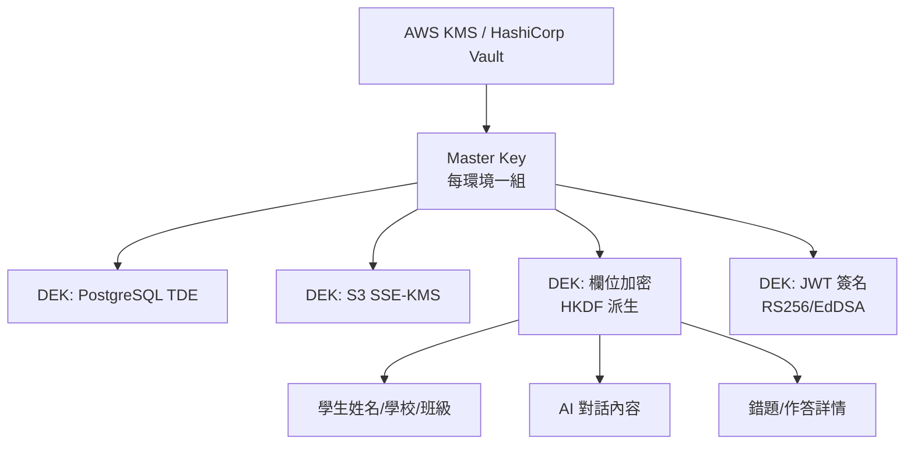

# 認證與安全研究

> [!IMPORTANT]
> **狀態**：RESEARCH - 安全架構支撐
> **最後更新**：2026-09-10

---

## 研究目標

建立生產級認證授權與資料安全體系，符合：
- 個人資料保護法 (台灣)
- GDPR (歐盟)
- 兒童線上隱私保護法 (COPPA, 美國)
- OWASP ASVS Level 2

---

## 認證架構研究

### NextAuth.js v5 (Auth.js) 深度分析

#### 核心優勢
- Next.js 原生整合、App Router / Pages Router 雙支援
- Edge Runtime 相容、效能佳
- 內建 OAuth 2.0 / OIDC / Email / Credentials 提供者
- 類型安全、TypeScript 第一優先
- 活躍社群、企業級採用案例多

#### 架構選型: JWT vs Database Session

| 方案 | 優點 | 缺點 | 適用場景 |
|------|------|------|----------|
| **JWT (Stateless)** | 無需資料庫查詢、橫向擴展容易、Edge 友善 | 無法即時撤銷、Token 體積大、敏感資料不可放入 | 微服務、高併發、無狀態需求 |
| **Database Session (Stateful)** | 即時撤銷、Token 體積小、支援裝置管理 | 需資料庫查詢、擴展需連線池、Edge 不支援 | 傳統 Web App、需即時控制 |
| **混合方案** | JWT 短效 (15min) + Redis Session 長效 (30天) | 複雜度較高 | **推薦生產環境** |

#### 推薦配置 (混合方案)
```typescript
// lib/auth/config.ts
export const authConfig = {
  session: {
    strategy: "jwt",
    maxAge: 30 * 24 * 60 * 60,      // 30 天
    updateAge: 24 * 60 * 60,        // 24 小時刷新一次
  },
  
  jwt: {
    // 使用非對稱加密 (RS256/EdDSA)
    signingKey: process.env.AUTH_JWT_PRIVATE_KEY,
    verificationKey: process.env.AUTH_JWT_PUBLIC_KEY,
    maxAge: 15 * 60,                // Access Token 15 分鐘
  },
  
  // Redis 儲存 Refresh Token / Session 中繼資料
  callbacks: {
    async jwt({ token, account, user, trigger }) {
      if (account) {
        // 初次登入：存入 userId, studentId, role, deviceId
        token.userId = user.id;
        token.studentId = user.studentId;
        token.role = user.role;
        token.deviceId = generateDeviceId();
      }
      if (trigger === "update") {
        // 定期刷新：驗證學生是否仍存在、未被封鎖
        const student = await getStudent(token.studentId);
        if (!student || student.isBlocked) throw new Error("SESSION_REVOKED");
      }
      return token;
    },
    async session({ session, token }) {
      session.user.id = token.sub;
      session.user.studentId = token.studentId;
      session.user.role = token.role;
      return session;
    },
  },
  
  // 裝置指紋 + 異地登入偵測
  events: {
    async signIn({ user, isNewUser }) {
      await recordLoginEvent(user.id, {
        ip: request.ip,
        userAgent: request.headers.get("user-agent"),
        deviceFingerprint: request.headers.get("x-device-fingerprint"),
        location: await getGeoLocation(request.ip),
      });
    },
  },
};
```

### Google OAuth 2.0 實作細節

#### 安全強化清單
```typescript
GoogleProvider({
  clientId: process.env.AUTH_GOOGLE_ID,
  clientSecret: process.env.AUTH_GOOGLE_SECRET,
  authorization: {
    params: {
      scope: "openid email profile",
      access_type: "offline",           // 取得 Refresh Token
      prompt: "consent",                // 強制顯示同意畫面
      hd: undefined,                    // 不限制網域 (教育機構可限定)
    },
  },
  // PKCE 強制啟用 (NextAuth 內建)
  // State 參數防 CSRF (內建)
  // Nonce 防重放攻擊 (內建)
})
```

#### Token 管理
| Token 類型 | 儲存位置 | 過期 | 更新機制 |
|------------|----------|------|----------|
| **Access Token (Google)** | 伺服器端加密儲存 | 1 小時 | 自動刷新 (offline access) |
| **Refresh Token (Google)** | 伺服器端加密儲存 (AES-256) | 永久 (除非撤銷) | 定期輪換、異常撤銷 |
| **應用 JWT (Access)** | HttpOnly Cookie | 15 分鐘 | 自動刷新 (滑動窗口) |
| **應用 Refresh Token** | HttpOnly Cookie (Strict Path) | 30 天 | 登入時簽發、登出撤銷 |

---

## 授權控制研究 (RBAC + ABAC)

### 角色定義 (Phase 1)
| 角色 | 權限範圍 | 繼承 |
|------|----------|------|
| **STUDENT** | 自己的學習資料、對話、錯題、進度 | 基礎 |
| **ADMIN** | 所有學生資料、系統設定、內容管理、分析報表 | STUDENT + 管理權限 |

### 預留擴充 (Phase 2+ B2B)
| 角色 | 權限範圍 |
|------|----------|
| **TEACHER** | 所屬班級學生進度、作業分派、報表 |
| **ORG_ADMIN** | 機構內所有師生、帳務、設定 |
| **SUPER_ADMIN** | 平台級設定、跨機構、審計 |

### 授權實作模式
```typescript
// Next.js Middleware + API Route 保護
// middleware.ts
export async function middleware(request: NextRequest) {
  const token = await getToken({ req: request });
  
  // 公開路由放行
  if (isPublicPath(request.nextUrl.pathname)) return NextResponse.next();
  
  // 未認證導向登入
  if (!token) return redirectToSignIn(request);
  
  // API 路由權限檢查
  if (request.nextUrl.pathname.startsWith("/api/")) {
    const requiredRole = getRequiredRole(request.nextUrl.pathname);
    if (!hasRole(token.role, requiredRole)) {
      return NextResponse.json({error: "FORBIDDEN"}, {status: 403});
    }
  }
  
  // 學生資料隔離 (RLS 輔助)
  if (request.nextUrl.pathname.includes("/student/")) {
    const targetStudentId = extractStudentId(request.nextUrl.pathname);
    if (token.role === "STUDENT" && token.studentId !== targetStudentId) {
      return NextResponse.json({error: "FORBIDDEN"}, {status: 403});
    }
  }
  
  return NextResponse.next();
}
```

### PostgreSQL RLS (Row Level Security) 範例
```sql
-- 學生只能存取自己的資料
CREATE POLICY student_own_data ON students
  FOR ALL TO student_role
  USING (user_id = current_setting('app.current_user_id')::uuid);

-- AI 服務角色可讀取學習資料 (需驗證)
CREATE POLICY ai_service_read ON question_attempts
  FOR SELECT TO ai_service_role
  USING (student_id IN (
    SELECT student_id FROM students 
    WHERE user_id = current_setting('app.current_user_id')::uuid
  ));

-- 管理員審計存取 (需 MFA、審計日誌)
CREATE POLICY admin_audit ON students
  FOR SELECT TO admin_role
  USING (current_setting('app.audit_mode') = 'true');
```

---

## 資料安全研究

### 加密策略

| 層級 | 技術 | 金鑰管理 | 適用資料 |
|------|------|----------|----------|
| **傳輸加密** | TLS 1.3 | 憑證自動輪換 (Vercel/Let's Encrypt) | 所有網路傳輸 |
| **靜態加密 (DB)** | PostgreSQL TDE / pg_tde | AWS KMS / GCP KMS / HashiCorp Vault | 所有資料表 |
| **靜態加密 (檔案)** | SSE-S3 / SSE-KMS | AWS KMS | R2/S3 物件 |
| **欄位級加密** | AES-256-GCM (應用層) | HKDF 派生自 Master Key | PII、對話內容、敏感欄位 |
| **向量資料** | pgvector + TDE | 同 DB | Embedding 向量 |

### 金鑰管理架構


### 金鑰輪換策略
| 金鑰類型 | 輪換週期 | 方式 | 緊急撤銷 |
|----------|----------|------|----------|
| **Master Key (KMS)** | 90 天 | KMS 自動輪換、新舊並行 24h | 立即停用、重新加密 |
| **JWT 簽名金鑰** | 90 天 | 新舊並行 24h、JWKS 自動更新 | 立即輪換、清空 Redis Session |
| **資料加密金鑰 (DEK)** | 1 年 | 重新加密受影響資料 (背景任務) | 標記失效、拒絕解密 |
| **資料庫憑證** | 30 天 | 自動輪換、連線池無感更新 | 立即撤銷、強制重連 |

---

## 隱私合規研究

### 法規對應表

| 法規 | 適用範圍 | 核心要求 | 我方對應 |
|------|----------|----------|----------|
| **個人資料保護法 (台灣)** | 台灣用戶 | 告知、同意、查詢/刪除/複製、安全維護、跨境傳輸限制 | 隱私權聲明、同意管理、資料主體權利 API、TDE、國內資料中心 |
| **GDPR (歐盟)** | 歐盟用戶 | 合法依據、DPIA、DPO、72h 通報、被遺忘權、資料可攜權 | 同意/合法利益、DPIA 報告、SCC、72h 流程 |
| **COPPA (美國)** | 13 歲以下兒童 | 家長可驗證同意、資料最小化、刪除權、無行為廣告 | 年齡驗證、家長同意流程、兒童資料特殊標記、無廣告 |
| **學生線上隱私保護法 (SOPIPA, 加州)** | 學生資料 | 禁止建立廣告畫像、禁止出售資料、安全銷毀 | 無廣告模型、不出售資料、刪除流程 |

### DPIA (隱私影響評估) 關鍵發現

| 風險項目 | 風險等級 | 現有控制 | 剩餘風險 | 追加措施 |
|----------|----------|----------|----------|----------|
| AI 對話含敏感個資 (姓名、學校、弱項) | 高 | Context 最小化、遮罩、RLS | 中 | 定期滲透測試、自動化洩漏掃描 |
| 學生學習行為畫像被濫用 | 高 | 目的限制、存取控制、去識別化分析 | 低 | 定期權限審查、目的綁定審查 |
| AI 模型記憶學生資料 | 高 | 零保留 API / 本地模型、不微調學生資料 | 低 | 定期模型審計、紅隊測試 |
| 向量資料庫可被反轉重建原文 | 中 | 僅存公共知識、不存學生資料 | 低 | 向量加密、存取審計 |
| 內部人員存取濫用 | 高 | RLS、審計日誌、最小權限、資料遮罩 | 中 | 定期權限審查、異常存取告警 |

---

## 安全開發生命週期 (SDL)

| 階段 | 安全活動 | 工具/產出 |
|------|----------|-----------|
| **需求/設計** | 威脅建模 (STRIDE)、DPIA | 威脅模型文檔、DPIA 報告 |
| **開發** | 安全編碼規範、Code Review Checklist、SAST | ESLint 安全規則、PR 模板、GitHub CodeQL |
| **測試** | DAST、IAST、依賴掃描、滲透測試、Fuzzing | OWASP ZAP、Snyk、Dependabot、年度滲透測試 |
| **部署** | IaC 掃描、密鑰注入、最小權限、不可變部署 | tfsec/checkov、1Password/Infisical、GitOps |
| **營運** | 監控告警、事件回應、定期滲透測試、紅隊演練 | Sentry/Grafana/PagerDuty、年度紅隊演練 |

---

## 事件回應流程

### 安全事件分級
| 等級 | 定義 | 回應時限 | 通報對象 |
|------|------|----------|----------|
| **L1 (低)** | 非敏感資料少量洩漏、無 PII | 24 小時內 | 內部安全小組 |
| **L2 (中)** | PII 洩漏 < 100 筆、無金融/健康資料 | 4 小時內 | 法務、主管機關 (視法規) |
| **L3 (高)** | 大規模洩漏、敏感資料、系統入侵 | 1 小時內 | 全員召集、主管機關、受影響用戶、媒體 |

### 關鍵動作清單 (L3)
1. **遏制**: 隔離受影響系統、撤銷憑證、關閉入口
2. **評估**: 確認洩漏範圍、資料類型、影響用戶數
3. **通報**: 72 小時內通報主管機關 (GDPR/個資法)、通知受影響用戶
4. **補救**: 重置憑證、強制登出、提供信用監控服務
5. **複盤**: 根因分析、改善措施、文檔更新、演練

---

## 相關文檔

- [[11_Security/Authentication Security|認證安全]]
- [[11_Security/Student Data Security|學生資料安全]]
- [[11_Security/AI Data Privacy|AI 資料隱私]]
- [[11_Security/Security Research Index|安全研究索引]]
- [[13_Decisions/TBD#TBD-21|TBD-21: GDPR/個資法]]
- [[13_Decisions/TBD#TBD-22|TBD-22: Rate Limiting]]
- [[13_Decisions/TBD#TBD-23|TBD-23: Secrets Management]]

---

## 更新記錄

| 日期 | 版本 | 變更 | 作者 |
|------|------|------|------|
| 2026-09-10 | v1.0 | 初始認證安全研究 | 系統架構師 |