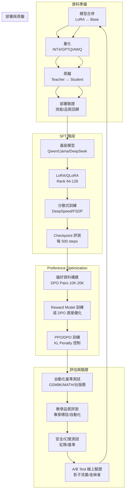

# Fine-tuning 研究

> [!IMPORTANT]
> **狀態**：RESEARCH - Phase 9 核心技術支撐
> **最後更新**：2026-09-10
> **對應決策**：[[13_Decisions/TBD#TBD-06|TBD-06: 模型選型/微調方法]]

---

## 研究目標

建立從基座模型到生產級教學模型的完整 Fine-tuning 管線，包含：
1. SFT (Supervised Fine-Tuning) 資料構建與訓練
2. Preference Optimization (DPO/PPO) 對齊教學風格
3. 持續學習與蒸餾策略
2. 評估體系與自動化驗證

---

## 管線總覽



---

## 階段 1: SFT (Supervised Fine-Tuning)

### 資料構建策略

| 資料來源 | 數量目標 | 構建方式 | 品質控制 |
|----------|----------|----------|----------|
| **教學對話** | 5,000-10,000 | 種子 500 (專家) → LLM 生成 → 專家審核 20% | 雙盲評分、一致性檢查 |
| **解題推理** | 10,000-20,000 | 現有題庫 + Solution Steps → 格式化 | 步驟邏輯驗證、錯誤模式覆蓋 |
| **知識問答** | 5,000 | RAG 檢索片段 → 變為教學問答 | 事實準確性檢查、引用完整性 |
| **總計** | **20,000-35,000** | | |

### 資料格式標準 (ShareGPT / ChatML)
```json
{
  "conversations": [
    {"from": "system", "value": "你是資深數學老師，採用蘇格拉底式引導教學..."},
    {"from": "human", "value": "老師，2(x+3)=14 怎麼解？"},
    {"from": "gpt", "value": "好問題！我們一步步來。左邊 2(x+3) 括號裡有 x 和 3 兩項..."}
  ],
  "metadata": {
    "grade_level": 8,
    "knowledge_points": ["DISTRIBUTIVE_LAW", "TRANSPOSITION"],
    "teaching_phase": "GUIDE",
    "scaffold_types": ["GUIDING_QUESTION", "CONCEPT_CLARIFICATION"],
    "quality_score": 0.95,
    "source": "expert_written|llm_generated|expert_reviewed"
  }
}
```

### 訓練超參數參考 (7B/8B 模型)

| 參數 | LoRA/QLoRA | Full Fine-tuning | 備註 |
|------|------------|------------------|------|
| **Learning Rate** | 2e-4 | 1e-5 | LoRA 需較大 LR |
| **Batch Size (Global)** | 128-256 | 64-128 | 梯度累積達成 |
| **Max Length** | 32K (目標 128K) | 32K | 視 GPU 記憶體 |
| **Epochs** | 3-5 | 1-2 | 早停機制 |
| **Optimizer** | AdamW (β1=0.9, β2=0.95) | 同 | weight_decay=0.01 |
| **Scheduler** | Cosine + Warmup 10% | 同 | min_lr = 0.1 * max_lr |
| **LoRA Rank** | 64-128 | - | alpha = 2*rank |
| **LoRA Target** | q_proj, v_proj, k_proj, o_proj, gate_proj, up_proj, down_proj | - | 全注意力+FFN |
| **Quantization** | QLoRA: NF4 + Double Quant | - | 4-bit 訓練 |
| **Gradient Checkpointing** | ✅ | ✅ | 省記憶體 |
| **Flash Attention 2** | ✅ | ✅ | 加速 2-3x |

### 分散式訓練架構
```yaml
# 7B 模型 LoRA (單節點 4-8 GPU)
trainer: "deepspeed"
zero_stage: 2
offload_optimizer: "cpu"  # 記憶體不足時
offload_param: "cpu"
gradient_accumulation_steps: 8
per_device_train_batch_size: 2

# 70B 模型 Full/LoRA (多節點 8-16 GPU)
trainer: "deepspeed"
zero_stage: 3
zero3_init_flag: true
cpu_offload: true
nvme_offload: true  # 需 NVMe
```

---

## 階段 2: Preference Optimization (DPO / PPO)

### 偏好資料構建

| 來源 | 數量 | 構建方式 | 品質 |
|------|------|----------|------|
| **專家標註** | 2,000 pairs | 教師對同一問題多個回答排序 | Gold |
| **AI 回饋** | 8,000 pairs | GPT-4o/Claude 判勝負 + 人工抽樣校準 10% | Silver |
| **學生隱性回饋** | 持續 | 對話輪數、完成率、滿意度、重問率 | Bronze (線上學習) |
| **合成對比** | 5,000 pairs | 同一 Prompt 生成 Good/Poor 回答對 | Silver |

### DPO 訓練參數
```python
# DPO 超參數
beta = 0.1          # KL penalty 強度 (0.1-0.5)
lr = 5e-6           # 比 SFT 小 10-20x
batch_size = 64     # pair batch
max_length = 4096   # prompt + chosen + rejected
loss_type = "sigmoid"  # 或 "hinge" / "ipo"
label_smoothing = 0.1
```

### PPO 訓練參數 (若選用)
```python
# PPO 超參數
kl_penalty = 0.1      # KL 散度懲罰
clip_range = 0.2      # PPO clip
lr = 1e-6             # Actor LR
critic_lr = 5e-6      # Critic LR
gae_lambda = 0.95
entropy_coef = 0.01
```

---

## 階段 3: 持續學習與蒸餾

### 知識蒸餾策略
```
Teacher: 72B/70B (SFT+DPO 後)
Student: 7B/14B (目標部署模型)

蒸餾目標:
├── Logits Distillation (Soft Labels)
│   ├── Temperature: 2.0-4.0
│   └── Loss: KL(Student || Teacher) * T^2
├── Hidden States Distillation
│   ├── Layer-wise MSE (每 2 層對齊 1 層)
│   └── Attention Map Distillation
└── Feature Distillation
    ├── Embedding Layer 對齊
    └── Output Projection 對齊

訓練配置:
- Loss = α * CE(Hard) + β * KL(Soft) + γ * MSE(Hidden)
- α=1.0, β=2.0, γ=0.5 (需調參)
- Data: SFT 資料 + 額外無標註資料 (Self-training)
```

### 線上持續學習
```python
# 每日增量更新管線
daily_pipeline:
  1. 收集前一天高品質對話 (滿意度 > 4.5、完成、無安全問題)
  2. 格式化為 SFT 格式 → 加入 Replay Buffer (保留 10% 原始 SFT 資料)
  3. 微調 LoRA (lr=1e-5, steps=100-500)
  4. 自動評測 (GSM8K + 教學基準 + 安全)
  5. 通過 → 合併 LoRA → 部署新版本
  5. 失敗 → 回滾、告警、人工介入

安全機制:
- Elastic Weight Consolidation (EWC) 防止災難性遺忘
- 最大參數變化閾值 (L2 norm < threshold)
- 性能回退自動回滾
```

---

## 評估體系

### 離線評估 (每 Checkpoint)

| 評測類別 | 基準/方法 | 通過標準 | 權重 |
|----------|-----------|----------|------|
| **數學推理** | GSM8K (8-shot) | ≥ 85% | 25% |
| | MATH Dataset (4-shot) | ≥ 45% | 20% |
| | 台版學測/指考模擬題 (0-shot) | ≥ 70% | 20% |
| **教學品質** | 專家標註 200 條對話 (盲測) | 平均分 ≥ 4.2/5 | 20% |
| **指令遵循** | IFEval / MT-Bench | 符合率 ≥ 90% | 10% |
| **安全/幻覺** | TruthfulQA / 紅隊提示詞 | 拒答率 ≥ 95%、幻覺 ≤ 3% | 5% |

### 線上評估 (A/B Test)
```yaml
ab_test:
  traffic_split: 10% (新版本) vs 90% (舊版本)
  metrics:
    - 教學完成率 (對話達成目標)
    - 學生滿意度 (對話後評分)
    - 平均引導輪數 (5-8 輪為佳)
    - 錯誤診斷準確率
    - 安全事件率 (必須為 0)
  duration: 1-2 週
  decision: 
    - 全指標無劣化 + 關鍵指標顯著提升 → 全量釋出
    - 任何安全指標惡化 → 立即回滾
```

---

## 基建與工具鏈

| 類別 | 工具選擇 | 理由 |
|------|----------|------|
| **訓練框架** | DeepSpeed + Megatron-LM / FSDP / Axolotl | 成熟、支援 ZeRO-3、LoRA、量化 |
| **實驗追蹤** | MLflow / Weights & Biases | 參數/指標/模型版本管理 |
| **資料版控** | DVC / LakeFS | 資料集版本、血緣、重現性 |
| **模型註冊** | MLflow Model Registry / Hugging Face Hub | 版本管理、階段標記、部署觸發 |
| **超參數搜尋** | Optuna / Ray Tune | 自動化調參 |
| **分散式協調** | Ray / Kubernetes (Kubeflow) | 多節點調度、容錯 |
| **推理優化** | vLLM / TensorRT-LLM / ONNX Runtime | 生產級推理引擎 |
| **量化工具** | AutoGPTQ / AutoAWQ / llama.cpp (GGUF) | PTQ 量化標準化 |

---

## 風險與緩解

| 風險 | 機率 | 影響 | 緩解 |
|------|------|------|------|
| **災難性遺忘** | 高 | 高 | LoRA/QLoRA、EWC、Replay Buffer、小 LR |
| **獎勞模型偏誤** (DPO) | 中 | 高 | 多樣化偏好資料、人工校準、Ensemble RM |
| **訓練不穩定** (Loss spike) | 中 | 中 | Gradient Clipping、LR Warmup、Loss 監控告警 |
| **GPU OOM** | 高 | 中 | 梯度累積、Offload、Activation Checkpointing、QLoRA |
| **評測指標不反映實際教學** | 中 | 高 | 專家評測權重高、線上 A/B Test 必須通過 |
| **版本管理混亂** | 低 | 高 | MLflow + DVC + GitOps、不可變模型註冊 |

---

## 里程碑時間表

| 里程碑 | 目標日期 | 交付物 |
|--------|----------|--------|
| **資料管線就緒** | 2026-11-01 | 20K+ SFT 樣本、品質報告 |
| **首輪 SFT 完成** | 2026-12-01 | SFT 模型、評測報告 |
| **DPO 對齊完成** | 2026-12-31 | 對齊模型、偏好資料報告 |
| **蒸餾驗證完成** | 2027-01-31 | 7B/14B 部署模型、效能報告 |
| **線上 A/B Test 通過** | 2027-02-28 | 生產就緒模型 |
| **生產部署** | 2027-03-15 | vLLM/TGI 部署、監控就緒 |

---

## 相關文檔

- [[14_Research/AI Model Research|AI 模型研究]]
- [[14_Research/Open-source Model License Research|License 研究]]
- [[14_Research/Deployment Research|部署研究]]
- [[04_AI/AI Model Strategy|AI 模型策略]]
- [[13_Decisions/TBD#TBD-06|TBD-06: 模型選型/微調]]

---

## 更新記錄

| 日期 | 版本 | 變更 | 作者 |
|------|------|------|------|
| 2026-09-10 | v1.0 | 初始 Fine-tuning 研究框架 | AI 系統架構師 |