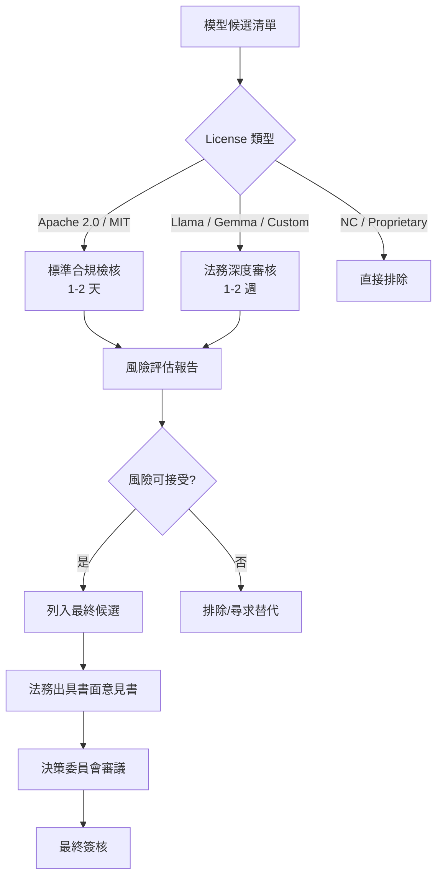

# 開源模型 License 研究

> [!IMPORTANT]
> **狀態**：RESEARCH - TBD-06 法務合規支撐
> **最後更新**：2026-09-10
> **核心目的**：確保選用模型可合法用於商業微調、蒸餾、部署、再分發

---

## License 分類與比較

### 寬鬆型 (Permissive) - 推薦優先
| License | 代表模型 | 商業使用 | 修改/微調 | 蒸餾 | 再分發 | 專利授予 | 關鍵義務 |
|---------|----------|----------|-----------|------|--------|----------|----------|
| **Apache 2.0** | Qwen、Yi、InternLM、BGE、E5 | ✅ | ✅ | ✅ | ✅ | ✅ | 保留版權/許可證/狀態變更/NOTICE |
| **MIT** | Phi-3、部分小模型 | ✅ | ✅ | ✅ | ✅ | ❌ | 保留版權/許可證 |
| **BSD-3** | 部分資料集/工具 | ✅ | ✅ | ✅ | ✅ | ❌ | 保留版權/許可證/不背書 |

### 條件型 (Conditional) - 需法務審核
| License | 代表模型 | 商業使用 | 修改/微調 | 蒸餾 | 再分發 | 關鍵限制 |
|---------|----------|----------|-----------|------|--------|----------|
| **Llama Community License** | Llama 3/3.1 | ✅ (條件) | ✅ | ❌ (限制) | ✅ (條件) | 月活>7億需額外授權、不得改進其他 LLM、需註明來源 |
| **Gemma License** | Gemma 2 | ✅ | ✅ | ✅ (條件) | ✅ | 不得訓練非 Gemma 模型、需註明來源 |
| **DeepSeek License** | DeepSeek V2/V2.5 | ✅ | ✅ | ✅ | ✅ | 需註明來源、不得用於軍事/違法/監控 |
| **NVIDIA License** | Nemotron | 需確認 | 需確認 | 需確認 | 需確認 | 需審核具體條款 |

### 限制型 (Restrictive) - 暫不考慮
| License | 代表模型 | 問題 |
|---------|----------|------|
| **RAIL / OpenRAIL** | BLOOM、Stable Diffusion | 使用限制條款複雜、需個案評估 |
| **CC-BY-NC** | 部分學術模型 | 禁止商業使用 |
| **Custom/Proprietary** | GPT、Claude、Gemini (API) | 僅限 API 使用、不可自建/微調/權重獲取 |

---

## 關鍵條款深度解析

### Llama Community License (Llama 3.1) - 關鍵風險點

```markdown
## 條款 1: 許可範圍
- 授予: 非排他性、全球、免費、不可撤銷
- 覆蓋: 使用、複製、修改、創建衍生作品、分發
- 條件: 遵守本許可證條款

## 條款 2: 限制 (關鍵)
### 2.1 用量限制
"如果您或您的關聯實體在曆月內的月活躍用戶超過 7 億...
您必須向 Meta 申請額外授權"
→ **風險**: 我們規模遠小於 7 億，目前不觸發，但需監控

### 2.2 禁止改進其他 LLM
"您不得使用 Llama Materials 或任何衍生作品來訓練、改進、
或以其他方式增強任何 Llama 以外的大型語言模型"
→ **重大風險**: 
- Fine-tuning Llama → 得到 Fine-tuned Llama ✅ (屬於衍生作品)
- Fine-tuned Llama → 蒸餾到 Qwen/其他架構 ❌ (改進其他 LLM)
- 使用 Llama 生成的資料訓練其他模型 ❌

### 2.3 註明義務
- 保留版權、商標、專利、免責聲明
- 在衍生作品中包含許可證副本
- 顯著位置註明 "Built with Llama"

## 條款 3: 專利授予
- 授予必要專利權利
- 若提起專利訴訟，許可終止

## 條款 4: 終止
- 違反條款自動終止
- 30 天內治癒可恢復 (首次違規)
```

**法務結論**: Llama 可用於**內部微調部署**，但**蒸餾到其他架構、用 Llama 資料訓練其他模型有法律風險**。需法務出具書面意見。

---

### Apache 2.0 (Qwen、Yi、BGE、E5) - 安全選擇

```markdown
## 核心權利
- 永久、全球、免費、非排他、不可撤銷
- 使用、複製、修改、衍生、分發、再授權
- 專利授予 (貢獻者授予)

## 義務
1. 保留版權聲明
2. 保留許可證副本
3. 保留專利/商標/歸屬聲明 (NOTICE 檔案)
4. 修改檔案需標記變更
5. 不得使用貢獻者名稱背書 (無明確許可)

## 專利終止條款
- 若對軟體提起專利侵權訴訟 → 專利授予自動終止
- 標準開源專利防禦機制

## 商業友善度: ⭐⭐⭐⭐⭐
- 無用量限制
- 無架構限制
- 無蒸餾限制
- 標準企業級開源許可
```

---

## 模型權重 vs 架構 vs 訓練資料 - 法律邊界

| 組成部分 | 版權保護 | License 適用 | 我方風險 |
|----------|----------|--------------|----------|
| **模型架構代碼** (PyTorch/HF) | ✅ (代碼) | Apache 2.0 / MIT | 低 (標準開源) |
| **模型權重** (參數檔案) | ⚠️ (爭議中) | 模型 License | **核心風險** |
| **Tokenizer** (vocab/merges) | ✅ (資料) | 模型 License | 中 |
| **訓練資料** (Common Crawl 等) | ⚠️ (資料庫權) | 各自 License | 需確認來源合法 |
| **微調後權重** (衍生作品) | ✅ (衍生) | 繼承原 License | 遵循原條款 |

> **關鍵認知**: 模型權重在多數司法管轄區被視為「資料」而非「代碼」，版權狀態尚有爭議。License 通常以合約方式規範權重使用。

---

## 商業化合規檢核表

| 檢核項目 | Qwen 2.5 | Llama 3.1 | DeepSeek V2.5 | Yi 1.5 | Gemma 2 |
|----------|----------|-----------|---------------|--------|---------|
| **商業部署** | ✅ | ✅ (含條件) | ✅ | ✅ | ✅ |
| **微調** | ✅ | ✅ | ✅ | ✅ | ✅ |
| **蒸餾到其他架構** | ✅ | ❌ (風險) | ✅ | ✅ | ⚠️ (條件) |
| **權重再分發** | ✅ | ✅ (條件) | ✅ | ✅ | ✅ |
| **API 服務化** | ✅ | ✅ | ✅ | ✅ | ✅ |
| **需註明來源** | ✅ | ✅ | ✅ | ✅ | ✅ |
| **專利風險** | 低 | 中 (專利終止) | 低 | 低 | 低 |
| **法務建議** | **首選** | 需書面意見 | 備選 | 備選 | 需審核 |

---

## 法務審核流程



### 法務意見書必要內容
1. **License 適用性分析**: 模型權重、架構、Tokenizer 各組成部分
2. **商業化風險等級**: 低/中/高 + 具體條款引用
3. **蒸餾/微調/再分發** 法律可行性
4. **專利風險** 評估
5. **跨境使用** (台灣部署、全球用戶) 合規性
5. **建議修改/補充條款** (如與供應商簽署附加協議)
6. **結論**: 建議採用 / 有條件採用 / 不建議

---

## 供應商/社群支援度評估

| 維度 | Qwen (阿里雲) | Llama (Meta) | DeepSeek | Yi (零一萬物) | Gemma (Google) |
|------|---------------|--------------|----------|---------------|----------------|
| **官方技術支援** | 商業支援可購 | 無 (社群) | 商業支援可購 | 商業支援可購 | 無 (社群) |
| **社群活躍度** | 極高 (中文社區) | 極高 (全球) | 高 (技術圈) | 中高 | 中 |
| **Issue 回應速度** | 快 (官方團隊) | 中 (社群) | 快 | 中 | 中 |
| **文檔完整度** | 完善 (中英雙語) | 完善 | 良好 | 良好 | 完善 |
| **生態工具支援** | vLLM/TGI/llama.cpp 全支援 | 全支援 | 全支援 | 全支援 | 全支援 |
| **長期維護承諾** | 明確 (阿里戰略) | 明確 (Meta 戰略) | 明確 | 明確 | 明確 |

---

## 決策建議

### 第一梯隊 (無條件推薦)
1. **Qwen 2.5 系列** - Apache 2.0、中文最強、生態完善、商業最友善
2. **Yi 1.5** - Apache 2.0、長 Context、中文好、零一萬物支援

### 第二梯隊 (條件採用)
3. **DeepSeek V2.5** - 商業友善 License、MoE 架構高效、數學最強、需確認蒸餾條款
4. **Gemma 2** - Google 出品、License 條件需法務確認蒸餾限制

### 第三梯隊 (需法務書面意見)
5. **Llama 3.1** - 僅限內部微調部署，**嚴禁蒸餾到其他架構、用其資料訓練其他模型**

---

## 相關文檔

- [[14_Research/AI Model Research|AI 模型研究]]
- [[04_AI/AI Model Strategy|AI 模型策略]]
- [[13_Decisions/TBD#TBD-06|TBD-06: 模型選型]]

---

## 更新記錄

| 日期 | 版本 | 變更 | 作者 |
|------|------|------|------|
| 2026-09-10 | v1.0 | 初始 License 研究 | AI 系統架構師 |