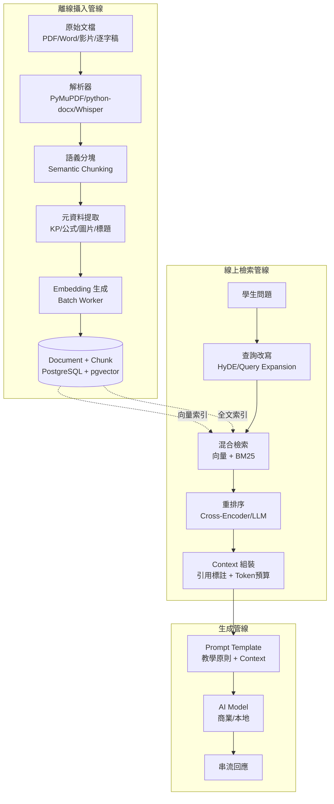
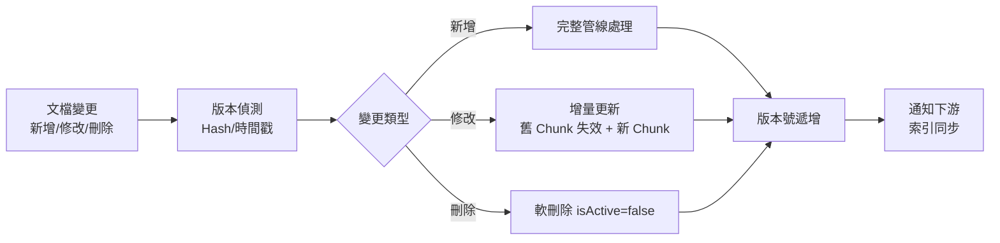

# RAG 研究

> [!IMPORTANT]
> **狀態**：RESEARCH - TBD-07 核心支撐
> **最後更新**：2026-09-10
> **對應決策**：[[13_Decisions/TBD#TBD-07|TBD-07: RAG 技術選型]]

---

## 研究目標

建立生產級 RAG 系統，支援 AI 教學時的知識檢索與引用，核心指標：
- **召回率 @10** ≥ 85% (人工標註測試集)
- **端到端延遲** P95 < 2s
- **回答引用率** 100% (教學類問題)
- **幻覺率** < 2%

---

## 管線架構



---

## 關鍵技術選型 (TBD-07)

### Embedding Model 評估

| 模型 | 維度 | 語言 | 數學能力 | 推理速度 | License | 部署成本 | 狀態 |
|------|------|------|----------|----------|---------|----------|------|
| **BGE-M3** | 1024 | 100+ (中文強) | 好 | 快 | MIT | 低 | 🔥 首選 |
| **E5-Mistral-7B** | 4096 | 100+ | 極好 | 中 | Apache 2.0 | 中 | 備選 |
| **Voyage-3-Large** | 1024 | 專注程式/數學 | 極好 | 快 | 商業 | 高 | 觀察 |
| **text-embedding-3-large** | 3072 | 好 | 好 | API | 商業 | 按用量 | 兜底 |
| **Jina v3** | 1024 | 89 語言 | 好 | 快 | CC BY-NC 4.0 | 低 | 觀察 |

> **決策建議**: 起階段用 **BGE-M3** (開源、免費、中文好、支援多語言/程式碼/長文本)；Phase 9 對齊自有模型 Embedding。

### Vector Database 選型

| 方案 | 優點 | 缺點 | 適用階段 |
|------|------|------|----------|
| **PostgreSQL + pgvector** | 已有 PG、運維簡單、ACID、混合查詢 SQL、HNSW/IVFFlat | 向量索引效能較專用 DB 低、無分散式 | **Phase 1-8** ✅ |
| **Pinecone** | 托管、自動擴縮、混合檢索內建、Metadata 過濾 | 成本高、Vendor Lock-in、資料出境 | Phase 9+ 如需極致效能 |
| **Weaviate** | 開源可自管、GraphQL、混合檢索強、多模組 | 運維複雜度中、資源需求較大 | 替代方案 |
| **Milvus** | 高效能、分散式、多租戶、GPU 加速 | 運維重、資源需求大、學習曲線陡 | 大規模 Phase 10+ |
| **Qdrant** | Rust 實作、快、Payload 過濾、二進制量化 | 生態較新、企業版收費 | 觀察中 |

> **決策**: Phase 1-8 使用 **pgvector (HNSW 索引)**，滿足 100K+ chunks 需求。

### Chunking 策略

```typescript
interface ChunkingConfig {
  targetChunkSize: 512;        // tokens (TBD: 256/512/1024)
  overlapSize: 64;             // 10-20%
  minChunkSize: 100;
  maxChunkSize: 1024;
  
  splitPriority: [
    "HEADING_H1", "HEADING_H2", "HEADING_H3",
    "EXAMPLE_BLOCK", "FORMULA_BLOCK", 
    "PARAGRAPH", "SENTENCE"
  ];
  
  rules: {
    keepFormulaWithContext: true;
    keepExampleComplete: true;
    splitTableByRow: false;
  };
}
```

### Chunk Metadata 標準
```json
{
  "chunkId": "chk_abc123",
  "documentId": "doc_textbook_math_jh1_ch1",
  "chunkIndex": 15,
  "content": "## 1.3 整數的乘法\n\n**乘法法則**...",
  "metadata": {
    "headingLevel": 2,
    "headingPath": ["第1章 整數與基本運算", "1.3 整數的乘法"],
    "knowledgePoints": ["INTEGER_MULTIPLICATION_RULES", "SIGN_RULES"],
    "formulas": ["(-3) × (+5) = -15"],
    "examples": [{"exampleId": "ex_1_3_1", "type": "WORKED_EXAMPLE"}],
    "pageNumber": 23,
    "difficulty": 2
  }
}
```

---

## 檢索管線詳細設計

### 1. 查詢改寫
```typescript
interface QueryRewrite {
  originalQuery: "這題為什麼要先乘開括號？";
  strategies: ["HYDE", "QUERY_EXPANSION", "KP_EXTRACTION"];
  rewrittenQueries: [
    "分配律 定義 數學",
    "2(x+3) 展開 步驟",
    "一元一次方程式 解法 分配律"
  ];
}
```

### 2. 混合檢索
```typescript
interface HybridSearch {
  vectorSearch: {
    topK: 20,
    metric: "cosine",
    filter: {gradeLevel: {$lte: studentGrade}, subject: "MATH"}
  };
  keywordSearch: {
    topK: 20,
    fields: ["content^2", "headingPath^1.5", "formulas^1.5", "knowledgePoints^2"];
  };
  fusion: {
    method: "RRF",
    k: 60,
    weights: {vector: 0.6, keyword: 0.4}
  };
}
```

### 3. 重排序
```typescript
interface RerankConfig {
  crossEncoder: {model: "bge-reranker-v2-m3", topK: 10, batchSize: 32};
  // 或 LLM 重排序
  llmRerank: {model: "gpt-4o-mini", prompt: "評分相關性 1-10", topK: 5};
  finalTopK: 5;
  minScoreThreshold: 0.3;
}
```

### 4. Context 組裝
```typescript
interface ContextAssembly {
  tokenBudget: 2000;
  priority: ["RERANK_SCORE", "KP_RELEVANCE", "RECENCY", "AUTHORITY"];
  citationFormat: "[Doc: {title}, Chunk: {chunkIndex}, KP: {kpIds}]";
  truncation: "HEAD_TAIL";
}
```

---

## 評測指標

| 指標 | 定義 | 目標值 | 測試方法 |
|------|------|--------|----------|
| **Recall@K** | 相關文檔在 Top-K 被召回 | @5 > 85%, @10 > 95% | 人工標註 200 題測試集 |
| **Precision@K** | Top-K 中相關文檔比例 | @5 > 60% | 同上 |
| **MRR** | 平均倒數排名 | > 0.7 | 同上 |
| **端到端延遲** | 問題 → Context 完成 | P95 < 2s | 生產監控 |
| **回答引用率** | AI 回答包含引用標註 | 100% (教學類) | 自動檢查 |
| **幻覺率** | 引用內容與回答不符 | < 2% | 人工抽樣 |

---

## 文檔處理管線細節

### PDF 解析挑戰與對策
| 挑戰 | 對策 |
|------|------|
| 多欄排版閱讀順序 | Layout Analyzer (DeepLayout / LayoutLM) + XY-cut 重建 |
| 數學公式識別 | 公式區域偵測 → Mathpix / Nougat / 自建 LaTeX OCR |
| 表格結構保留 | Table Transformer → Markdown/HTML 表格輸出 |
| 掃描版畫質差 | 影像前處理 (去噪、二值化、去傾斜、超解析) |
| 圖片/圖形處理 | 圖片提取 + 向量化描述 (BLIP-2 / GPT-4V) → 文字描述存入 Chunk |

### 影片逐字稿處理
```python
# Whisper Large-v3 + 語者分離 + 章節切分
video_pipeline:
  1. Whisper Large-v3 轉錄 (支援時間戳、標點、語言偵測)
  2. 語者分離 - 教師/學生/旁白
  3. 章節切分 - 依標題/主題/知識點
  4. 知識點標註 - 規則 + LLM
  5. 切分為 Chunk - 保持語義完整性
```

---

## 增量更新與版本控制



---

## 風險與緩解

| 風險 | 機率 | 影響 | 緩解 |
|------|------|------|------|
| 檢索品質不佳 | 中 | 高 | 持續建構評測集、人工標註、迭代優化 Chunking/Rerank |
| 延遲超標 | 中 | 中 | 快取熱點查詢、非同步預取、模型量化、索引優化 |
| 幻覺/引用錯誤 | 中 | 高 | 強制引用格式、輸出過濾、人工審核機制 |
| 文檔版本衝突 | 低 | 中 | 版本號、Hash 比對、冲突解決策略 |
| 向量索引重建時間過長 | 低 | 中 | 增量索引、分片並行、非高峰時段 |

---

## 相關文檔

- [[05_RAG/RAG Architecture|RAG 架構設計]]
- [[05_RAG/RAG vs Question DB|RAG 與題庫分離]]
- [[04_AI/AI Model Strategy|AI 模型策略]]
- [[14_Research/Embedding Research|Embedding 研究]]
- [[14_Research/Vector Database Research|向量資料庫研究]]
- [[13_Decisions/TBD#TBD-07|TBD-07: RAG 技術選型]]

---

## 更新記錄

| 日期 | 版本 | 變更 | 作者 |
|------|------|------|------|
| 2026-09-10 | v1.0 | 初始 RAG 研究框架 | AI 系統架構師 |