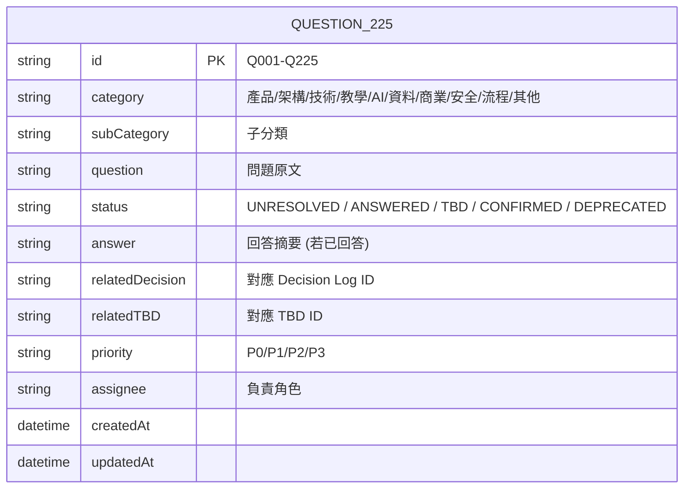

# 225 題原始問題索引

> [!WARNING]
> **狀態**：原始資料備份區
> **最後更新**：2026-09-10
> **重要說明**：原始 225 題完整內容目前**無法取得**，本文件為索引架構佔位

---

## ⚠️ 關鍵聲明

> **不要自行虛構 225 題內容**
> 
> 若無法取得原始完整問題，請保持此索引為空架構，待補充。

---

## 索引結構設計

---

## 分類統計 (預期)

| 分類 | 預估數量 | 說明 |
|------|----------|------|
| **產品策略** | ~30 | 定位、用戶、商業模式、路線圖 |
| **系統架構** | ~25 | 技術棧、資料庫、API、基建 |
| **教學設計** | ~35 | 課綱、Level、卡片、測驗、錯題、Mastery |
| **AI 教學** | ~30 | 引導式、個人化、記憶、關鍵句、相似題 |
| **模型訓練** | ~20 | 基座選擇、Fine-tuning、資料、部署 |
| **RAG/知識庫** | ~15 | 文檔處理、Embedding、檢索、生成 |
| **資料工程** | ~20 | 管線、格式、品質、版本、血緣 |
| **安全隱私** | ~20 | 認證、授權、加密、合規、AI 隱私 |
| **開發流程** | ~15 | CI/CD、測試、部署、監控、團隊 |
| **其他/雜項** | ~15 | 法規、預算、招募、廠商選擇 |

---

## 狀態追蹤表 (範本)

| ID | 分類 | 問題摘要 | 狀態 | 對應決策/TBD | 負責人 | 截止 |
|----|------|----------|------|--------------|--------|------|
| Q001 | 產品 | 產品核心價值主張是什麼？ | CONFIRMED | DEC-001 | 產品 | - |
| Q002 | 產品 | 目標用戶細分？ | CONFIRMED | DEC-001 | 產品 | - |
| Q003 | 架構 | 資料庫選型 PostgreSQL vs MySQL？ | CONFIRMED | - | 架構師 | - |
| Q004 | 教學 | Level 幾層結構？ | CONFIRMED | DEC-009 | 教學 | - |
| Q005 | AI | AI 是否直接給答案？ | CONFIRMED | DEC-016 | AI | - |
| Q006 | 模型 | 自訓練 vs 商業 API？ | CONFIRMED | DEC-019, DEC-020 | AI | - |
| Q007 | 教學 | 能力測驗題數多少？ | TBD | TBD-001 | 教學+數據 | 2026-09-20 |
| Q008 | 模型 | 開源模型 License 怎麼選？ | RESEARCH | TBD-006 | AI+法務 | 2026-10-15 |
| ... | ... | ... | ... | ... | ... | ... |

---

## 已知對應關係 (基於 22 項決策 + 24 項 TBD)

### 已確認決策對應 (22 項)
- DEC-001 → Q: B2C vs B2B 定位
- DEC-002 → Q: 註冊是否要選補習班
- DEC-003 → Q: 是否建補習班後台
- DEC-004 → Q: 是否建教師後台
- DEC-005 → Q: 第一階段做哪些科目
- DEC-006 → Q: 其他科目怎麼處理
- DEC-007 → Q: 能力測驗時機
- DEC-008 → Q: 能力測驗是否阻擋地圖
- DEC-009 → Q: 學習地圖幾層結構
- DEC-010 → Q: Level 內容包含什麼
- DEC-011 → Q: Level 通過條件
- DEC-012 → Q: Level 可否重考
- DEC-013 → Q: Level 怎麼出題
- DEC-014 → Q: 錯題怎麼記錄
- DEC-015 → Q: 是否建錯題庫
- DEC-016 → Q: AI 教學方式
- DEC-017 → Q: AI 怎麼個人化
- DEC-018 → Q: 學生對話記憶隔離
- DEC-019 → Q: 模型自訓練 vs API
- DEC-020 → Q: 開源模型選擇
- DEC-021 → Q: 訓練資料來源
- DEC-022 → Q: 第一階段核心科目

### 待決定 TBD 對應 (24 項)
- TBD-01 → Q: 能力測驗具體參數
- TBD-02 → Q: Mastery 計算公式
- TBD-03 → Q: Level 測驗參數
- TBD-04 → Q: AI 關鍵句觸發
- TBD-05 → Q: Credits/定價制度
- TBD-06 → Q: 模型選型/GPU/成本
- TBD-07 → Q: RAG 技術選型
- TBD-08 → Q: AI Memory 保存策略
- TBD-09 → Q: 學習分析頁名稱
- TBD-10 → Q: 首頁 Button 數量
- TBD-11 至 TBD-24 → 對應各細節問題

---

## 後續行動

1. **取得原始 225 題檔案** (若存在)
2. **匯入索引系統** (可考慮 Notion/Airtable/Excel)
3. **逐題標記狀態** (UNRESOLVED/ANSWERED/TBD/CONFIRMED/DEPRECATED)
4. **建立雙向連結** 決策/TBD ↔ 原始問題
5. **定期檢視** 確保無遺漏、狀態同步

---

## 相關文檔

- [[13_Decisions/Decision Log|決策日誌]]
- [[13_Decisions/TBD|待決定事項]]
- [[13_Decisions/Deprecated Decisions|已取消決策]]

---

## 更新記錄

| 日期 | 版本 | 變更 | 作者 |
|------|------|------|------|
| 2026-09-10 | v1.0 | 建立索引架構 | 產品架構師 |